# Use QuickSQL and Data Workshop

## Introduction

Memorizing the SQL to create and maintain database objects can be difficult. However, there are tools that can generate the code for you based on a shorthand syntax or a graphical user interface. In this lab, you will create database objects using Quick SQL and then view the objects in Database Actions. Then you will then use Data Workshop page to load data from a file into your workspace.

Estimated Time: 45 minutes

### Objectives

- Create database objects using Quick SQL
- Load data using Data Workshop page.


## Task 1: Create database objects using Quick SQL

1. Return to your APEX Workspace and click **'⌄'** next to **SQL Workshop** tab, then click **Utilities** and then select **Quick SQL**.

   

2. Copy the following SQL shorthand code and paste it into the left pane in Quick SQL.

    ```
    <copy>
    departments /insert 4
      name /nn
      location
      country
      employees /insert 14
        name /nn vc50
        email /lower
        cost center num
        date hired
        job vc255

    view emp_v departments employees
     </copy>
    ```
    *Note that the Indentation from the code you copied should be similar to the one we have in the screenshot below*
3. Review the shorthand code. How many tables will be created and how are they related? What types of columns and constraints will be created for the tables? Note that the **Help** button provides details on the shorthand syntax along with several examples of its usage.

    When ready, in the Quick SQL (left pane) toolbar, click **Generate SQL**.

   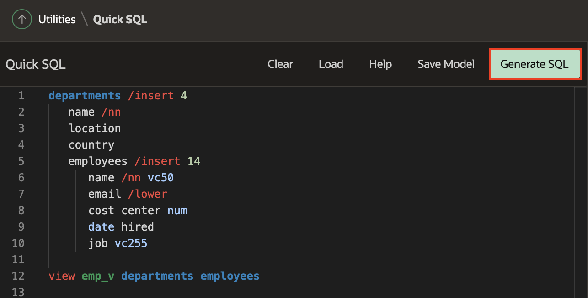

4. Review the SQL that is generated in the right-hand pane, then click **Settings** to make some changes to the resulting code.

   It is important to save the SQL Shorthand as a script so that it can be run in your database.
   In the SQL (right pane) toolbar, click **Save SQL Script**.  

   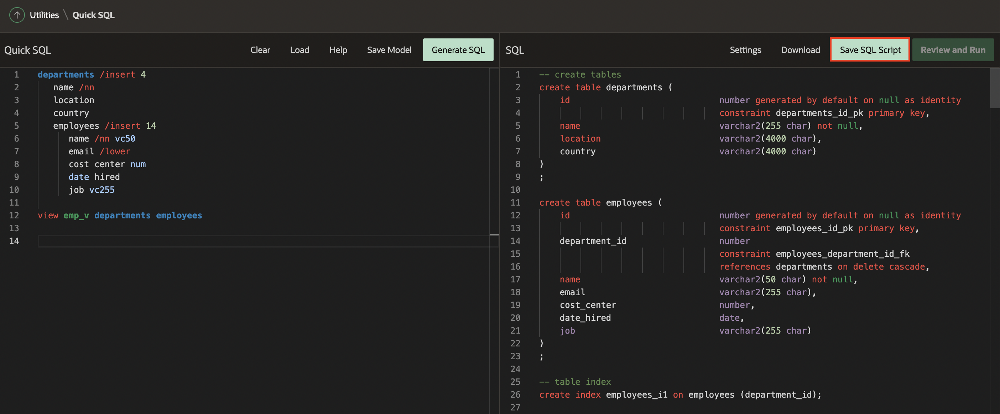

5. In the Save Script dialog, for Script Name enter **Employee Department Details**, and click **Save Script**.

    

6. Now that you saved the script you can run it to create the specified database objects.

    In the SQL (right pane) toolbar, click **Review and Run**.

    

7.  In the Script Editor page toolbar, click **Run**.

    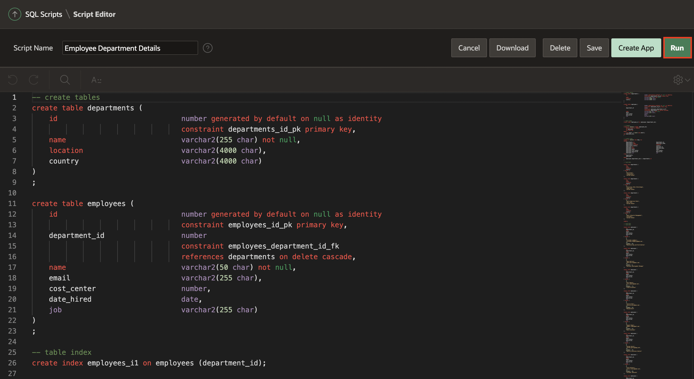

8. On the Run Script page, click **Run Now**.

    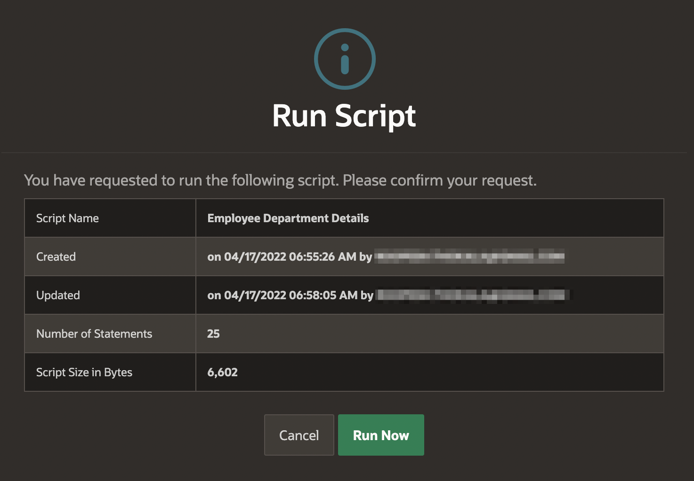

9. The Results page shows the results of running the script. Scroll to the bottom to see a summary. You should not see any errors.

    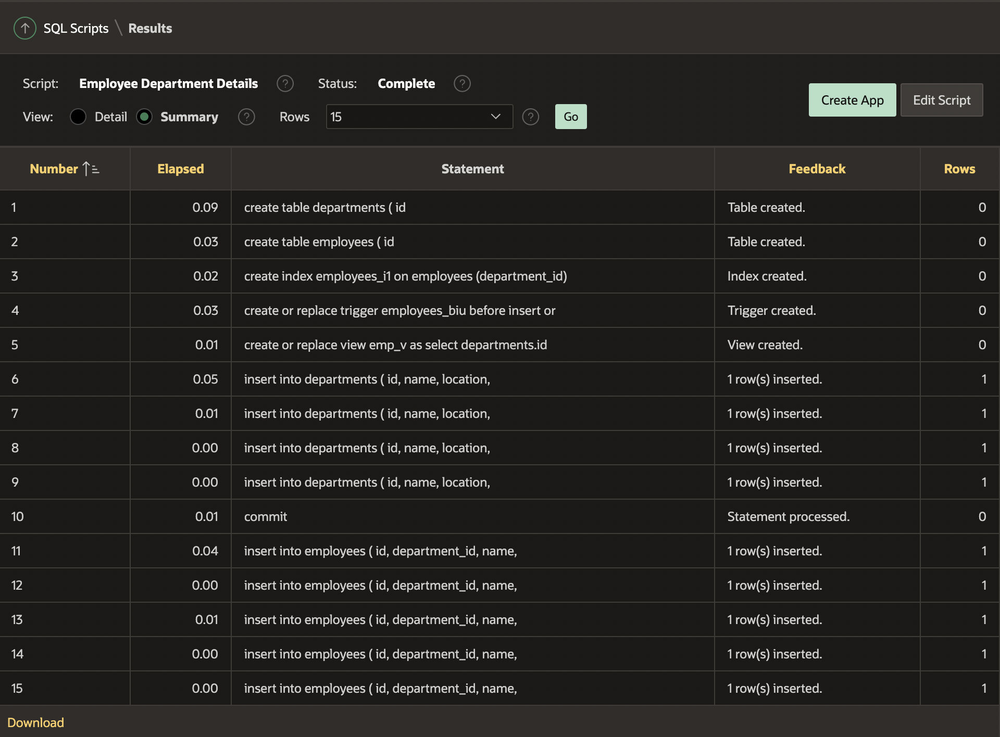

10. To view the database objects that were created, click the arrow  **'⌄'** in the **SQL Workshop** tab and then select **Object Browser**.

    

11. Select the **EMPLOYEES** table and review its columns.

    

12. Click the **Data** tab to see the data that was loaded.

    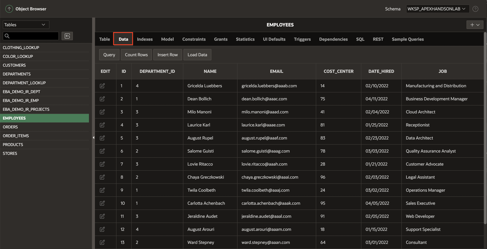

## Task 2: Load data using the Data Workshop Utility

In this step, you will learn how to create a table and Load data using the Data Workshop utility.

1. On the Workspace home page, click the **'⌄'** next to **SQL Workshop** tab, then click **Utilities** and then select **Data Workshop**.

   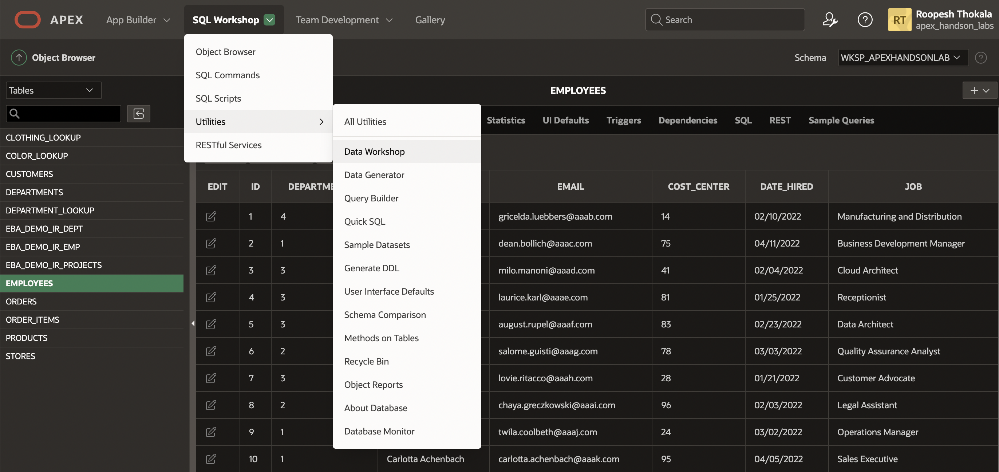

2. Under Get Started, click **Load Data**. The Load Data Wizard appears.

   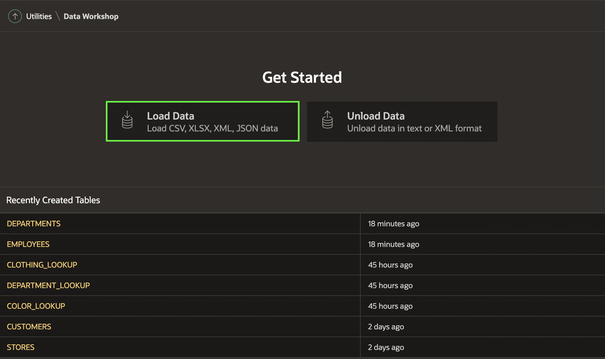

3. Under Upload a File, Click **Choose File**.

   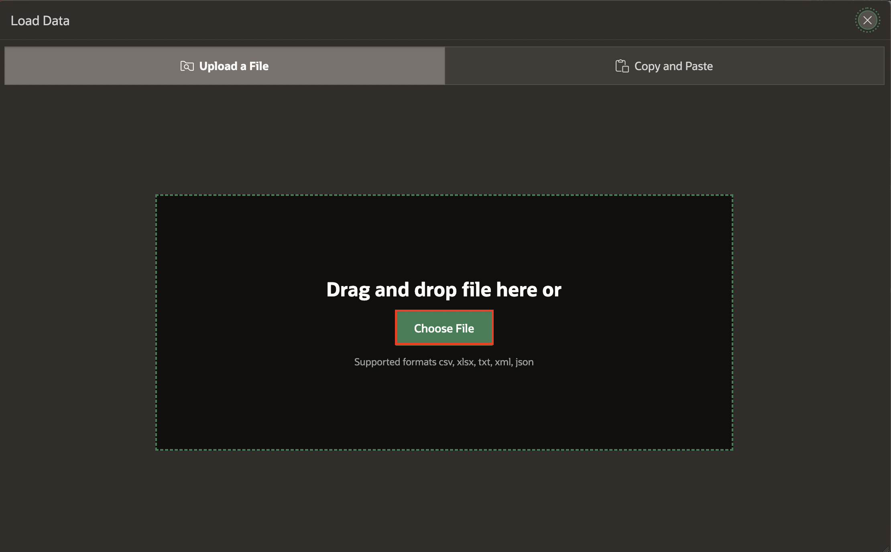

4. Download [projects.csv](projects.csv) and select the file.

   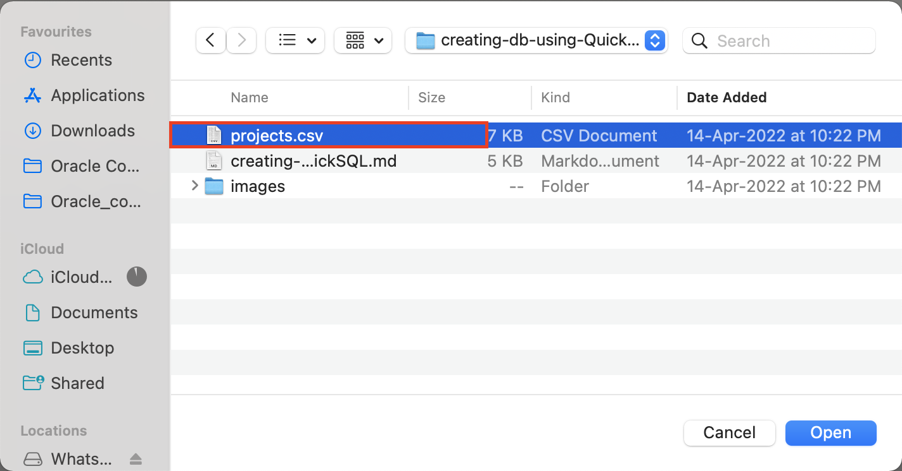

  *Note: If the uploaded XLSX file contains multiple worksheets, Load Data wizard picks the first sheet by default. To load another sheet, pick it from the Select Sheet select list. The First lines contains headers checkbox works similar to CSV files. The same is true for the Configure dialog, the behaviour is the same as it is for CSV files. Uploading XLSX files is limited to 20MB for each file.*

5. Under **Load Data**, Edit the Table Name field and provide an appropriate name. In this lab, you will set the Table Name as **Projects**. Then Click **Load Data**

   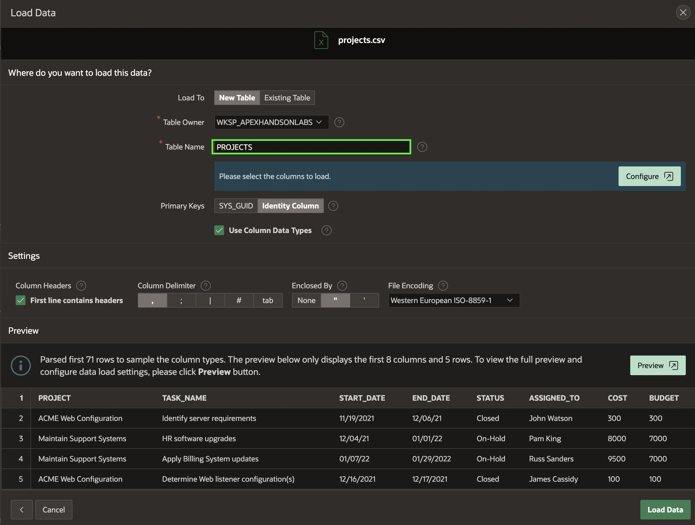

6. Once Data Loading is finished, a success message is displayed. If some rows cannot be loaded to the target table, they will be stored to the error table and error table is displayed. Then click **View Table**.

   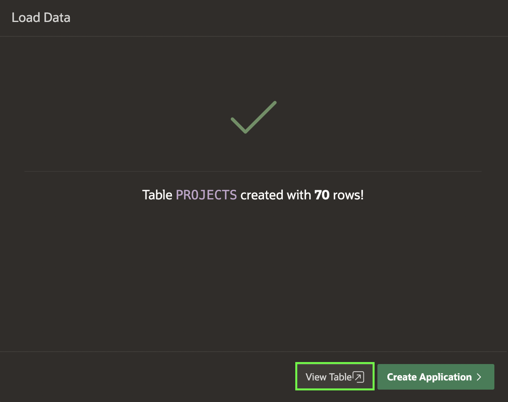

7. Select the **PROJECTS** table and review its columns.

    

8. Click the **Data** tab to see the data that was loaded.

    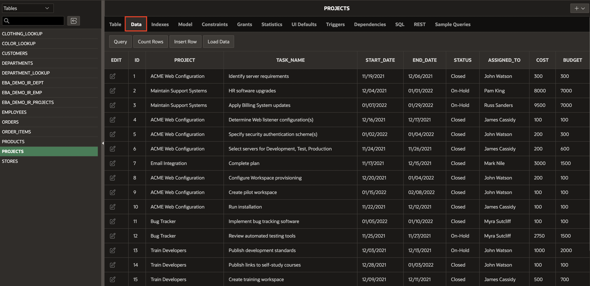

## Summary

This completes the Lab. At this point, you know how to use Quick SQL to generate database objects using a SQL shorthand. You also know how to use Data Workshop utility to load data.

## Acknowledgements
* **Author** - Roopesh Thokala, Product Manager
* **Contributors** -
- **Last Updated By/Date** - Roopesh Thokala, Product Manager, March 2022
