# Creating an App from a Spreadsheet

In this lab, you will learn how to create an APEX application using data imported from a spreadsheet.

## Introduction
Now that you are logged into your workspace, you can start creating APEX applications. In this lab, you will build a simple application based on a spreadsheet. Keep in mind that APEX is great for a variety of apps, from simple ones like this to large, sophisticated apps based on local database objects, REST enabled SQL objects, and even REST APIs.

While APEX developers spend the majority of their time in the App Builder, you should also investigate the SQL Workshop, where you can create and maintain database objects, Team Development, where you can track large APEX development projects, and the App Gallery, which contains numerous productivity and sample apps that can be installed within minutes.

Estimated Time: 5 minutes

## Task 1: Loading Projects data  

1.  From your APEX workspace home page, click **App Builder**.

2.  Click **Create a New App**.

    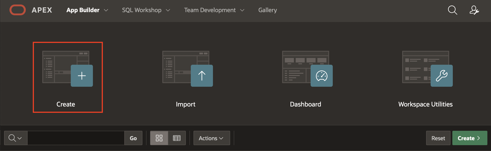

3.  Click **From a File**.

    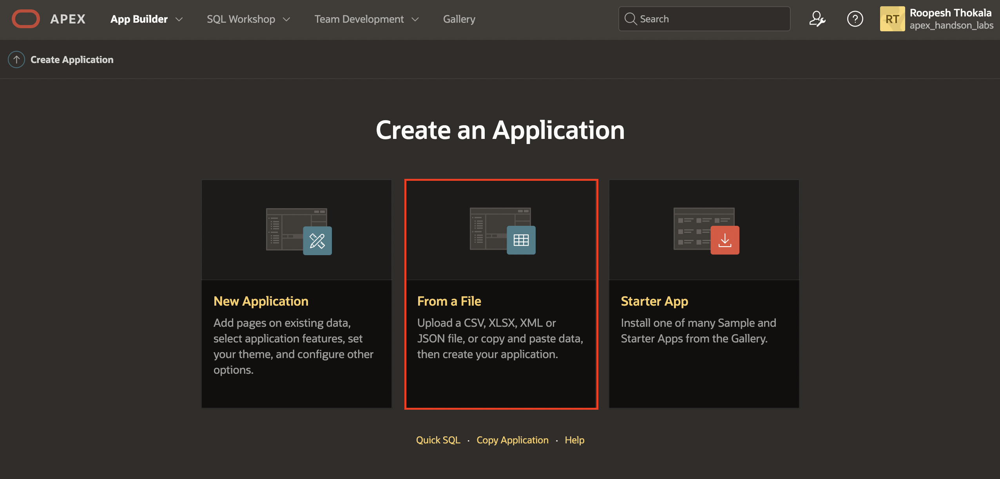

    When creating an application from a file, APEX allows you to upload CSV, XLSX, XML, or JSON files and then build apps based on their data. Alternatively, you can also copy and paste CSV data or load sample data.

4.  Within the Load Data wizard, click the **Choose File** button.

    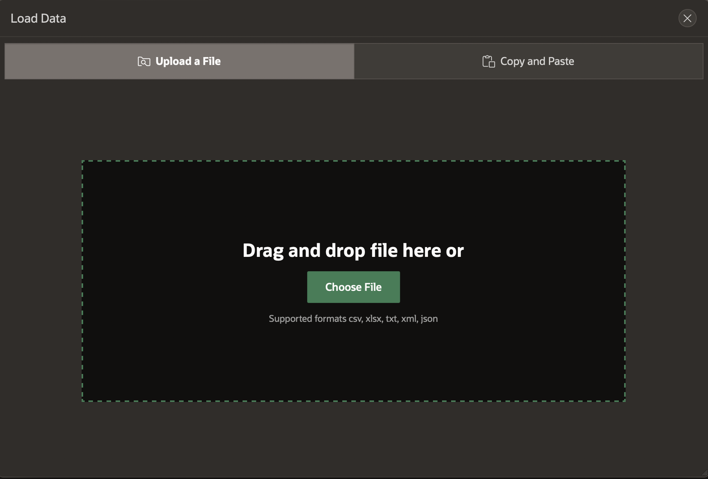

5. Select **demo_projects.csv** file from your local System

    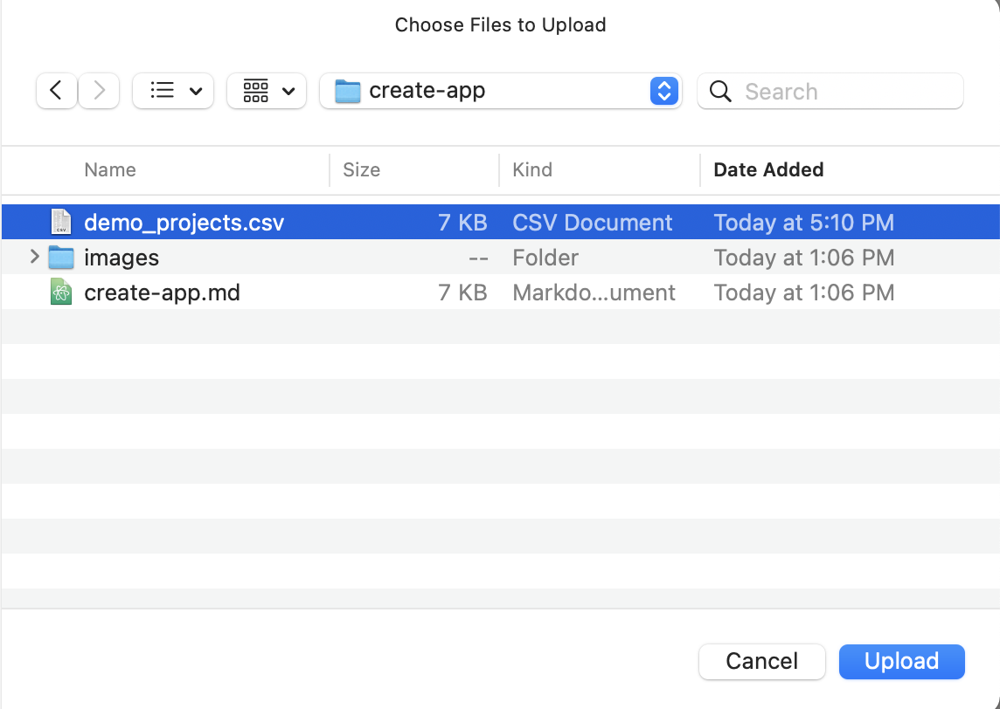

6.  Review the parsed data. Enter **DEMO_PROJECTS** for Table Name and Click **Load Data**.

    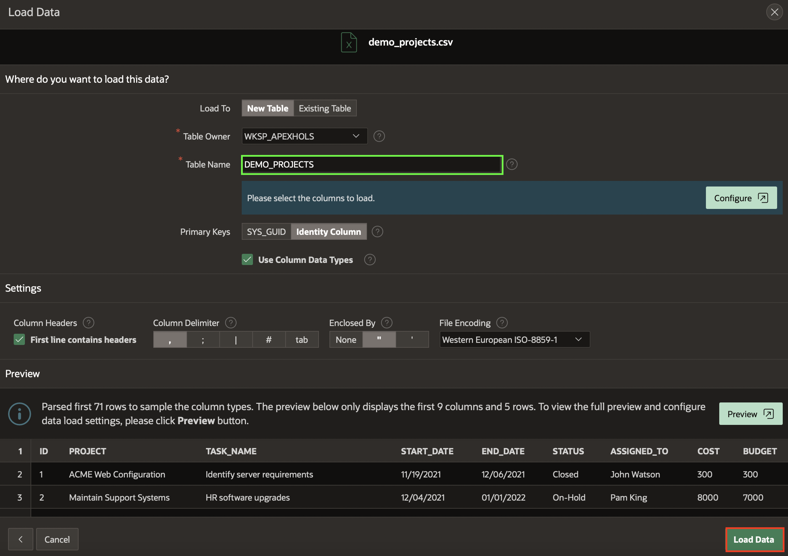

    After clicking **Load Data** you will see a spinner until the wizard finishes loading the data. Continue to Part 2 at that point.

## Task 2: Creating an application

The Data Load wizard has created a new table and populated that table with the records from the sample data. Now you can create an app based on this new table.

1.  In the Load Data dialog, verify that 73 rows have been loaded into the **DEMO_PROJECTS** table, then click **Create Application**.

    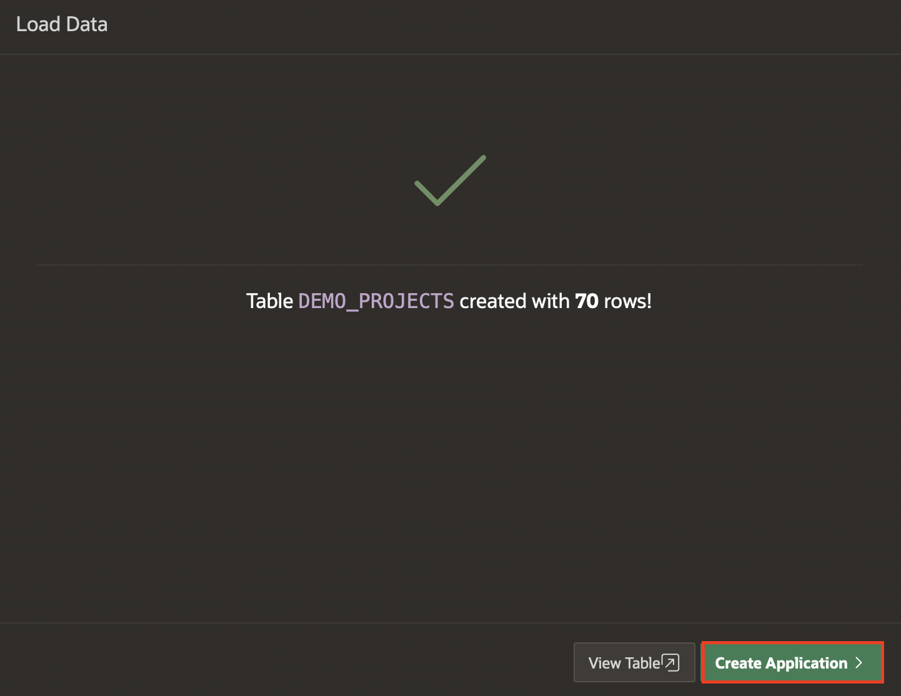

[//]: # (click **Create Application**. )
[//]: # (images/continue-to-create-application-wizard.png " ")
[//]: # (Remove Steps 2 and 3)
2. Now you are going to remove the below Pages from the Create Application Page.  
  - Demo Projects Search  
  - Demo Projects Report  
  - Calendar

  On the Create Application page, Click on **Edit** button next to **Demo Projects Search**.

  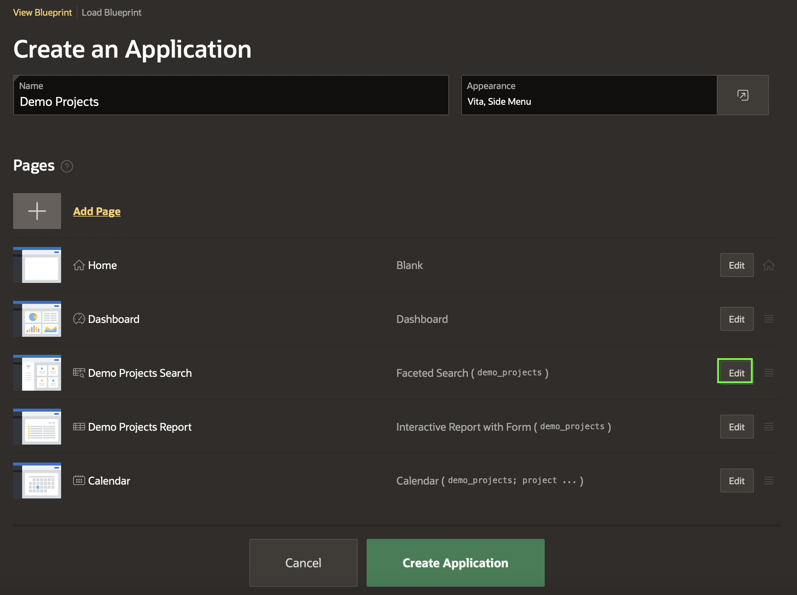

3. In the Add Faceted Search Page, Click on **Delete** Button and then Confirm it by Clicking **OK**.

  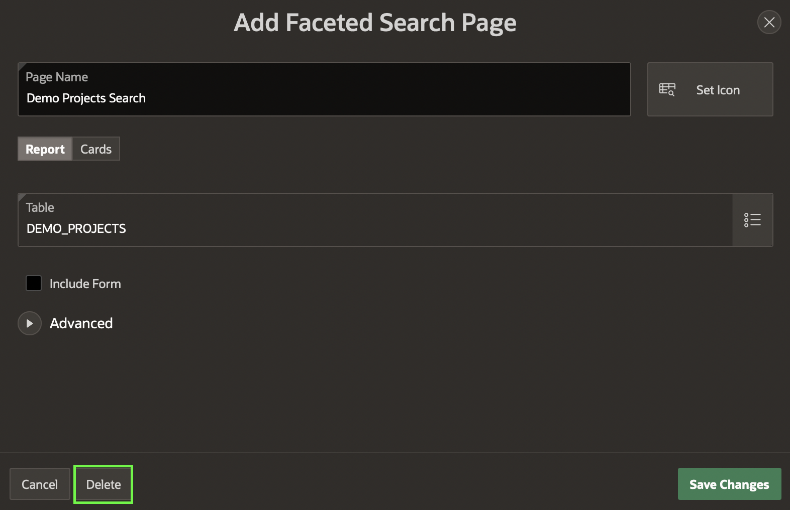

  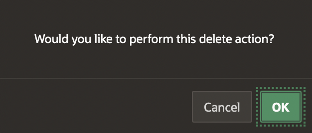

Repeat the steps for **Demo Projects** and **Calendar**.

4. Then click **Create Application**.

    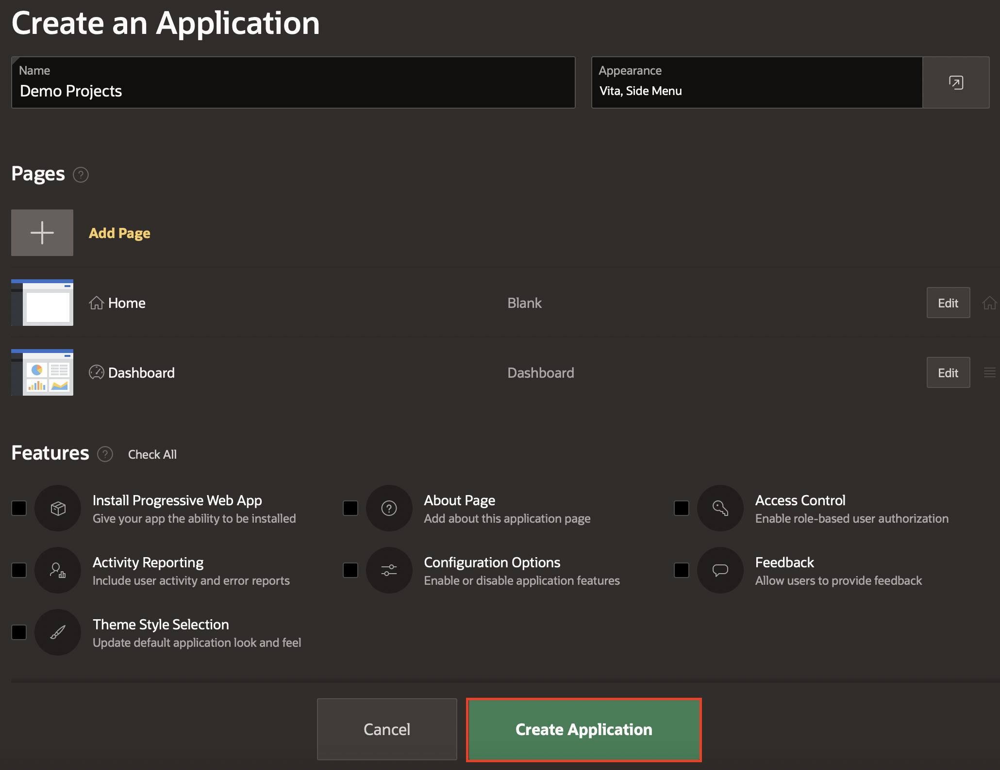

    When the wizard finishes creating the application, you will be redirected to the application's home page in the App Builder.

## Task 3: Configuring Progressive Web App Attributes

1. Navigate to the Edit Application Definition page. From the Application home page, you can access the Edit Application Definition page using **Shared Components**.

    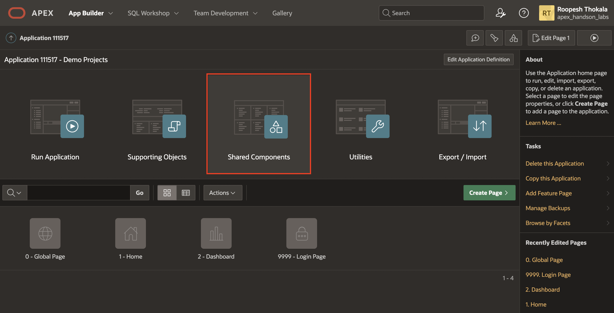

2. Under Shared Components, Select Data Load definitions

    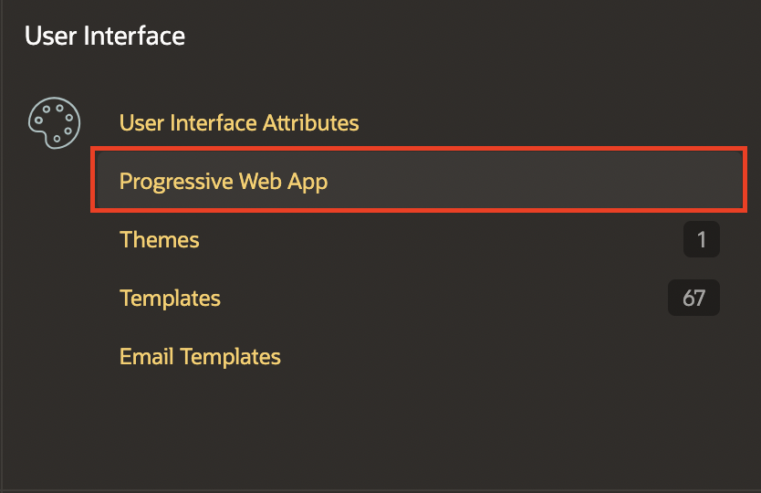

3. Now, Select **Definition** Tab and Navigate to **Progressive Web App** and Then Set **Installable** to **Yes**.

    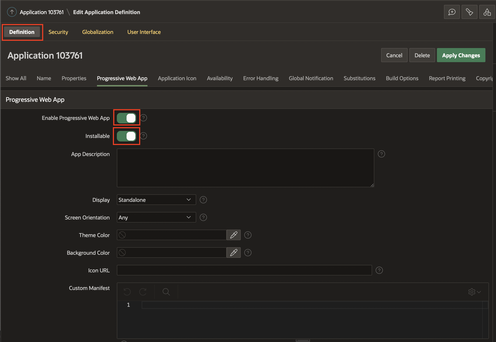

## Task 4: Running and exploring the new app

1.  Click **Run Application**. This will open the runtime application in a new browser tab, allowing you to see how end users will view the app.

    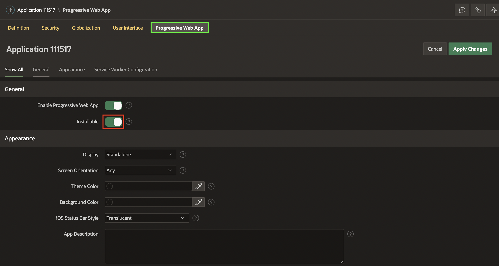

2.  Enter your user credentials and click **Sign In**.

    *Note: Use the same Username and Password you used to sign into the APEX Workspace.*

    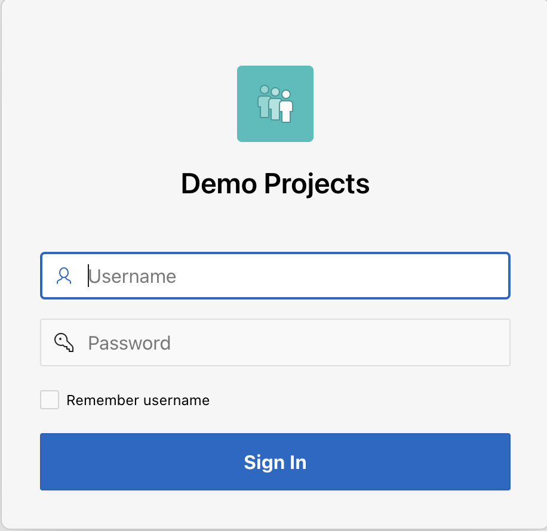

3. Click on the **Install App** Icon on Top Right of the page to install Application to your local System.
    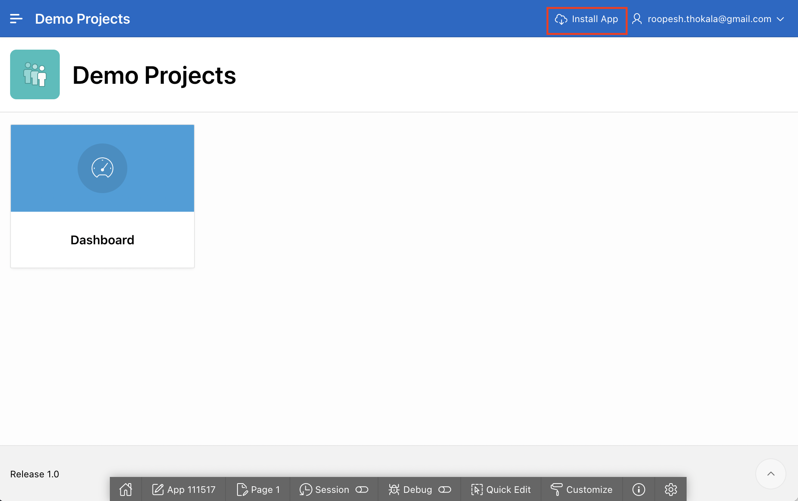

## **Summary**

You now know how to create an application from a spreadsheet by either dragging and dropping a file or loading sample data for training purposes.

## **Acknowledgements**

 - **Author** -  Roopesh Thokala, Product Manager
 - **Contributors** - Roopesh Thokala, Product Manager
 - **Last Updated By/Date** - Roopesh Thokala, Product Manager, March 2022
