# Adding Validations and Processes to the Shopping Cart Page

## Introduction

In this lab, you will create a new page to review the items added to the Shopping Cart.

Once you have finished the workshop and updated all the products as described in the steps, your page will look like the following image:


Customers will be able to:
- Review the items in the shopping cart
- Edit the quantity of the items
- Remove an item
- Clear the shopping cart
- Proceed to checkout

Estimated Time: 20 minutes

Watch the video below for a quick walk through of the lab.

[](youtube:Cvl9xMAqnm8)

### Objectives
In this lab, you will:
- Create Application Processes, and Dynamic Actions to manage the Shopping Cart

## Task 1: Create Validations to the Page
1. Navigate to the **App Builder**. Then Click on **Online Shopping Application**.

    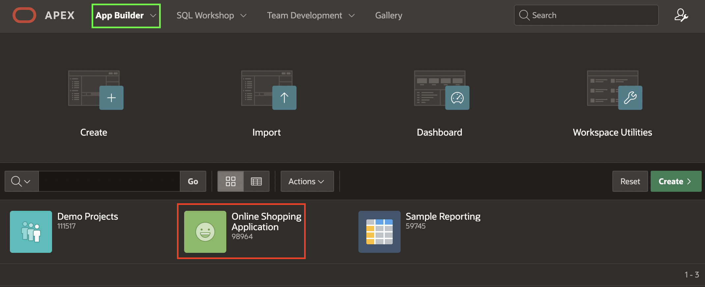

2. Now you select **Shopping Cart** under **Page Icons**.

    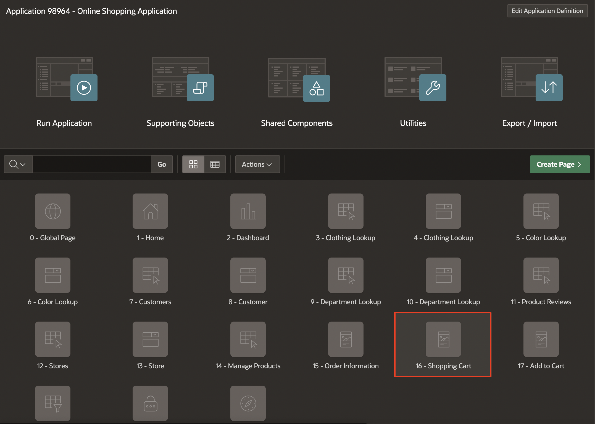

3. In the Rendering tree (left pane), click **Processing** tab.
4. Over **Validating**, right-click **Create Validation**.

     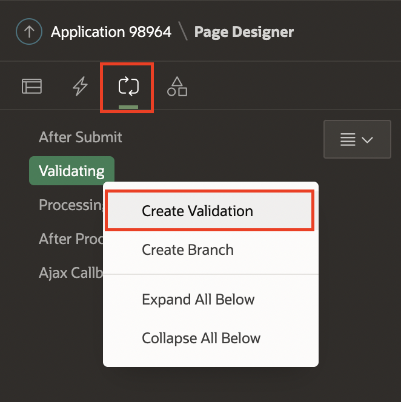  

5. Create three validations for the following items: Name, Email, and Store

    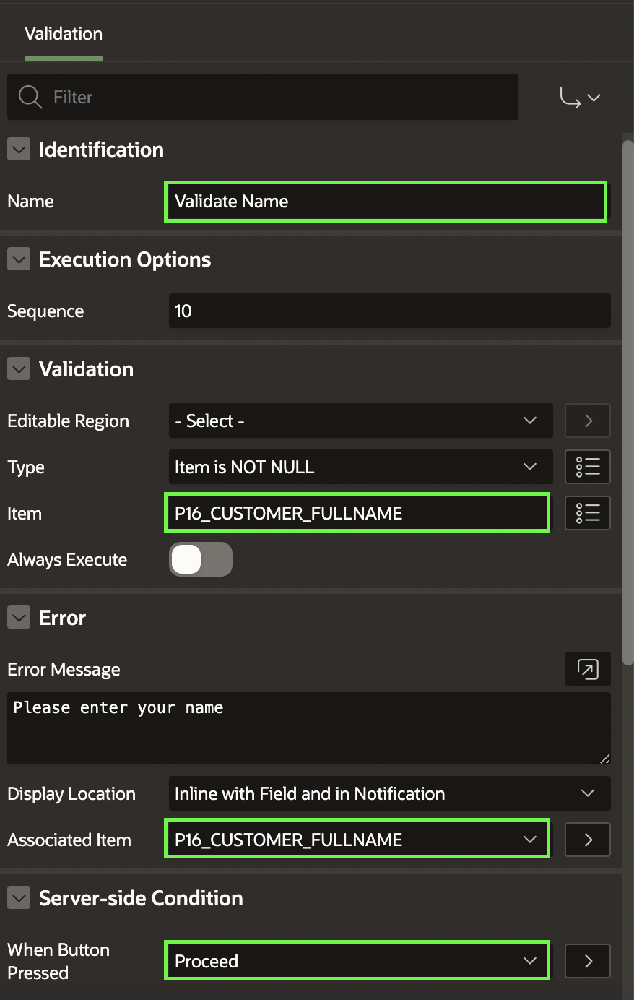

    | Name |  Type (under Validation) | Item |
    | --- |  --- | --- |
    | Validate Name | Item is NOT NULL | P16\_CUSTOMER\_FULLNAME |
    | Validate Email | Item is NOT NULL | P16\_CUSTOMER\_EMAIL |
    | Validate Store | Item is NOT NULL | P16_STORE |

    Under Error:

    | Error Message | Display Location | Associated Item |
    | --- |  --- | --- |
    | Please enter your name | Inline with Field and in Notification | P16\_CUSTOMER\_FULLNAME |
    | Please enter your email address | Inline with Field and in Notification | P16\_CUSTOMER\_EMAIL |
    | Please select a store | Inline with Field and in Notification | P16_STORE |

     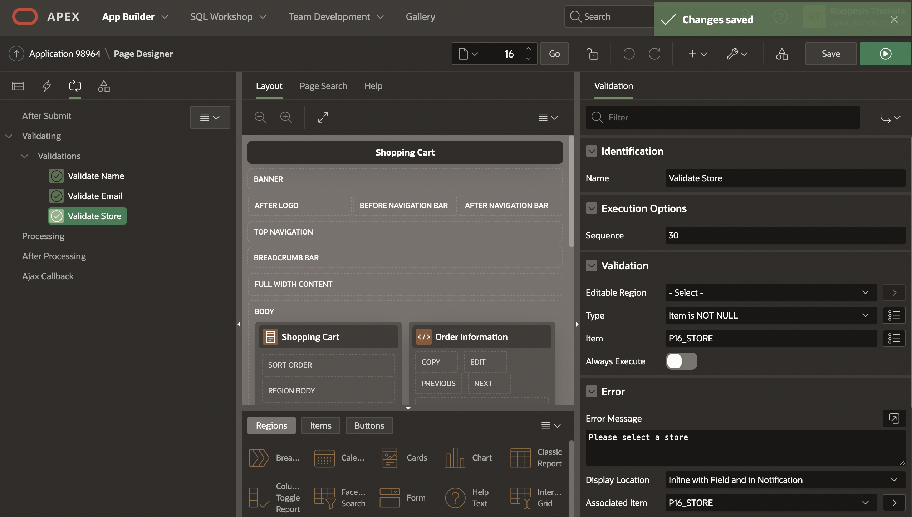

     As these validations only apply when user proceeds to checkout, let's create that condition.
     Under Server-side Condition, set the following:

    | Name  | When Button Pressed |
    | ---   |  --- |
    | Validate Name  | Proceed |
    | Validate Email | Proceed |
    | Validate Store | Proceed |   

     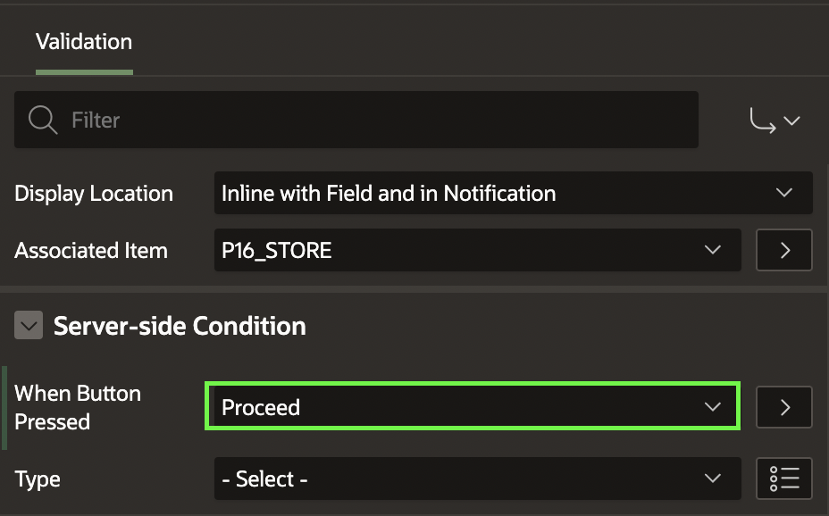       

## Task 2: Add a Process to Create the Order

1. On the **Processing** tab (left pane).
2. Right-click **Processing** and click **Create Process**.

     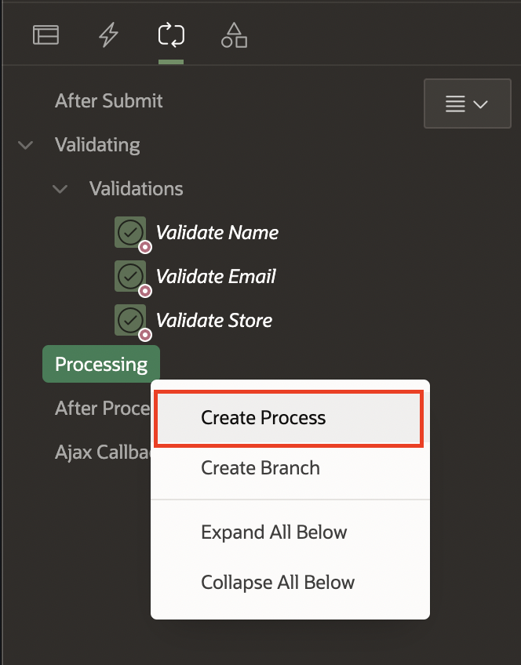

3. In the Property Editor, enter the following:
     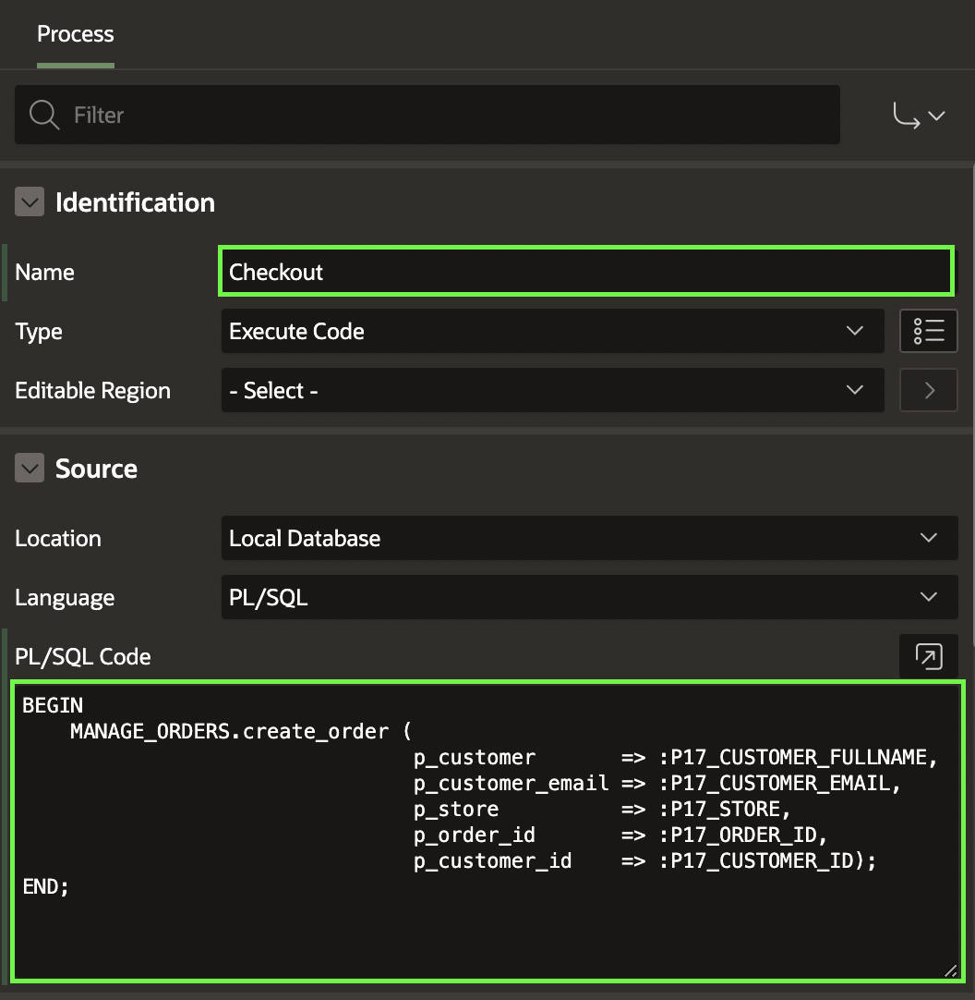   
    - For Name - enter **Checkout**
    - For Type -select **Execute Code**
    - For PL/SQL Code - enter the following PL/SQL code:

        ```
        <copy>
        BEGIN
            MANAGE_ORDERS.create_order (
                                        p_customer       => :P16_CUSTOMER_FULLNAME,
                                        p_customer_email => :P16_CUSTOMER_EMAIL,
                                        p_store          => :P16_STORE,
                                        p_order_id       => :P16_ORDER_ID,
                                        p_customer_id    => :P16_CUSTOMER_ID);   
        END;                                    
        </copy>
        ```

    - For Success Message, enter **Order successfully created: &P16\_ORDER\_ID.**
    - Under Server-side condition, for When Button Pressed, select **Proceed**

  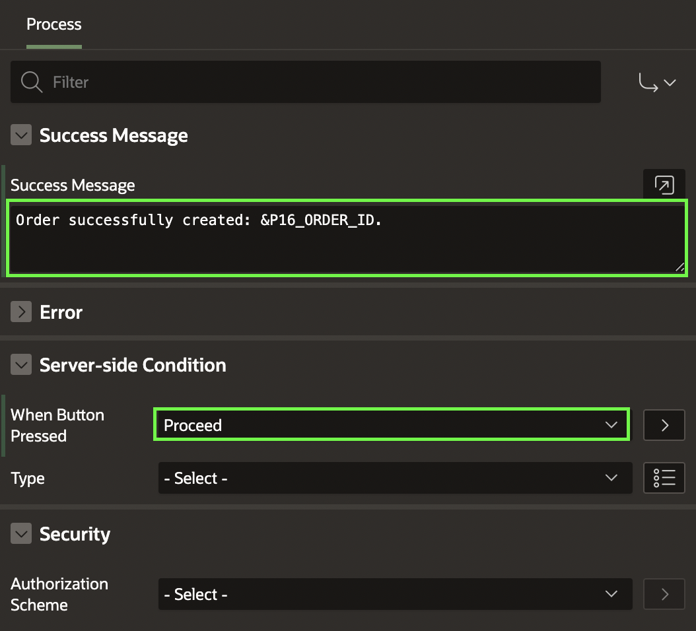

## Task 3: Add Process to Clear the Shopping Cart

1. On the **Processing** tab (left pane).
2. Right-click **Processing** and click **Create Process**.
3. Create a second process to clear the shopping cart. In the Property Editor, enter the following:
    - For Name - enter **Clear Shopping Cart**
    - For Type - select **Execute Code**
    - For PL/SQL Code - enter the following PL/SQL code:

    ```
    <copy>
    BEGIN
        manage_orders.clear_cart;
    END;
    </copy>
    ```

    - Under Server-side condition, for When Button Pressed, select **Clear**.

  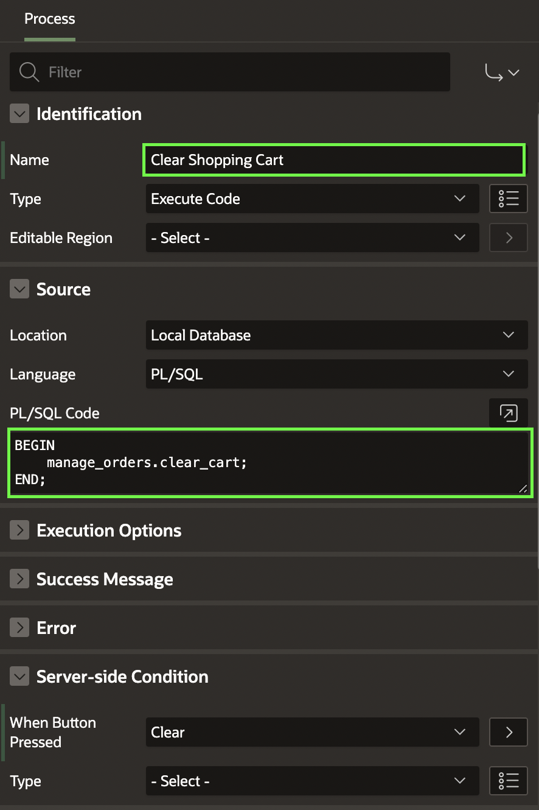

## Task 4: Add Branches to the Page

1. On the **Processing** tab (left pane).
2. Right-click **After Processing** and click **Create Branch**.

     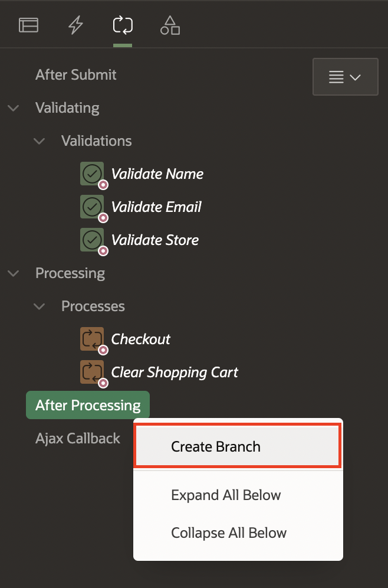  

3. In the Property Editor, enter the following:     
    - For Name - enter **Go to Orders**
    - Navigate to Target attribute and click **No Link Defined**.
        - For Type - select **Page in this application**
        - For Page - enter **16**
        - For Set Items - enter:

            | Name | Value  |
            | --- |  --- |
            | P16_ORDER | &P16\_ORDER\_ID. |

        - For Clear Cache - enter **16**.
        - Click **OK**.
    - Under Server-side condition, for When Button Pressed, select **Proceed**.

  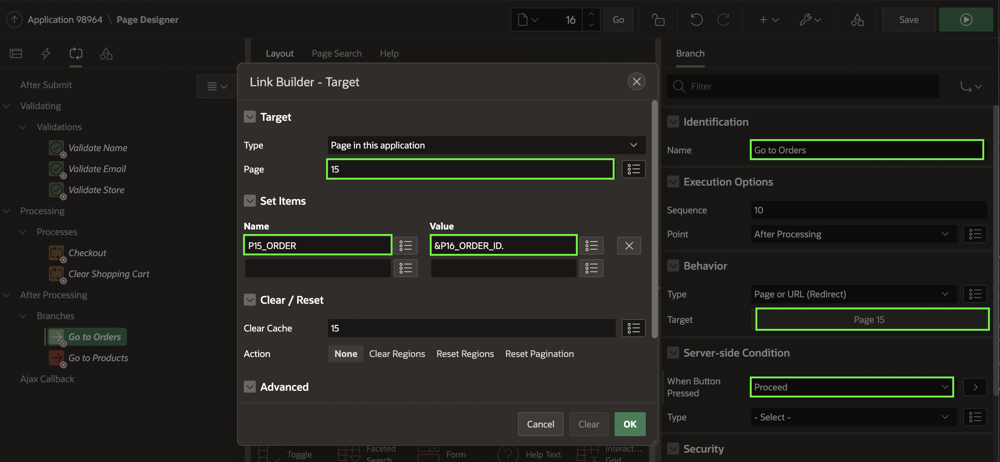

4. Create a second branch when the user clears the shopping cart. Right-click on **After Processing** and click **Create Branch**.
5. In the Property Editor, enter the following:
    - For Name - enter **Go to Products**
    - Navigate to Target attribute and click **No Link Defined**
        - For Type - select **Page in this application**
        - For Page - enter **1**
        - For Clear Cache - enter **1**
        - Click **OK**
    - Under Server-side condition, for When Button Pressed, select **Clear**

## Task 5: Add Dynamic Actions
In this task, you will create a dynamic actions to:
- Update the badge and icon shown in the navigation bar after the customer has added / edited / removed a product from the shopping cart.
- Refresh the shopping cart region.

1. Navigate to **Dynamic Actions** tab (left pane).

     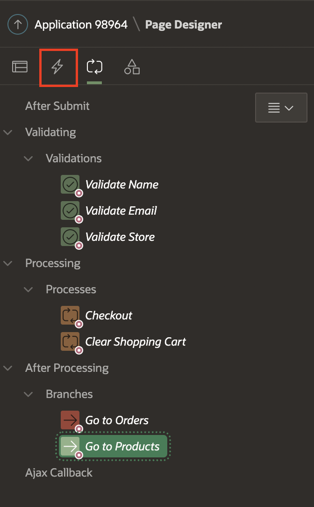  

2. Right-click **Dialog Closed** and click **Create Dynamic Action**.

     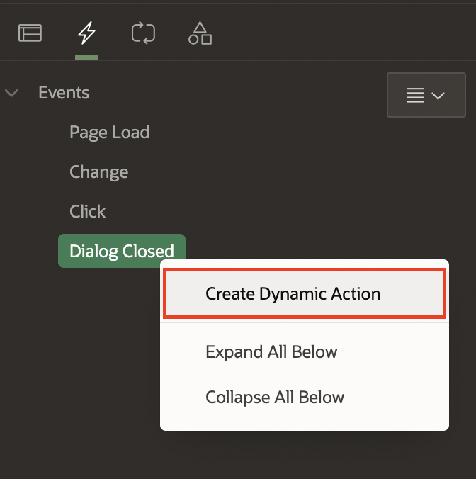  
3. In the Property Editor, enter the following:    
    - Under Identification section:
        - For Name - enter **Update Shopping Cart Header**
    - Under When section:        
        - For Event - select **Dialog Closed**
        - For Selection Type - select **Region**
        - For Region - select **Shopping Cart**     
    - Under Client-side Condition:
        - For Type - select **JavaScript expression**
        - For JavaScript Expression, enter the following:

            ```
            <copy>
            parseInt(this.data.P17_SHOPPING_CART_ITEMS) > 0
            </copy>
            ```

  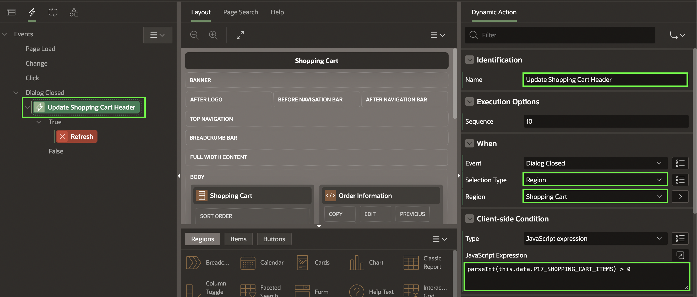

4. Navigate to **Refresh** Action.
    - Under Identification section:
        - For Action - select **Execute JavaScript Code**
    - Under Settings section:        
        - For Code - enter the following JavaScript Code:

            ```
            <copy>
            // Update Badge Text
            apex.jQuery(".js-shopping-cart-item .t-Button-badge").text(this.data.P17_SHOPPING_CART_ITEMS);

            // Update Icon
            apex.jQuery(".js-shopping-cart-item .t-Icon").removeClass('fa-cart-empty').addClass('fa-cart-full');
            </copy>
            ```

  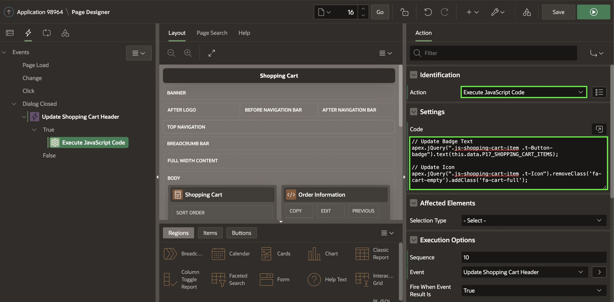

5. Create a second action. In the Dynamic Actions tab (left pane), navigate to **True** under **Update Shopping Cart Header** Dynamic Action.

     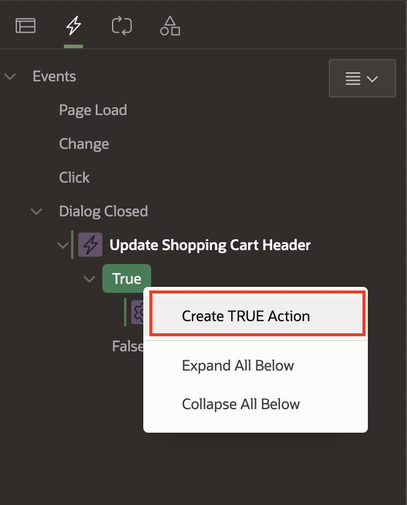
6. In the Property Editor, enter the following:  
    - Under Identification section:
        - For Action - select **Refresh**
    - Under Affected Elements section:          
        - For Selection Type - select **Region**
        - For Region - select **Shopping Cart**          
7. Create an opposite action. In the Dynamic Actions tab (left pane), navigate to **Execute JavaScript Code** action.
8. Right-click  **Execute JavaScript Code** action and click **Create Opposite Action**.

     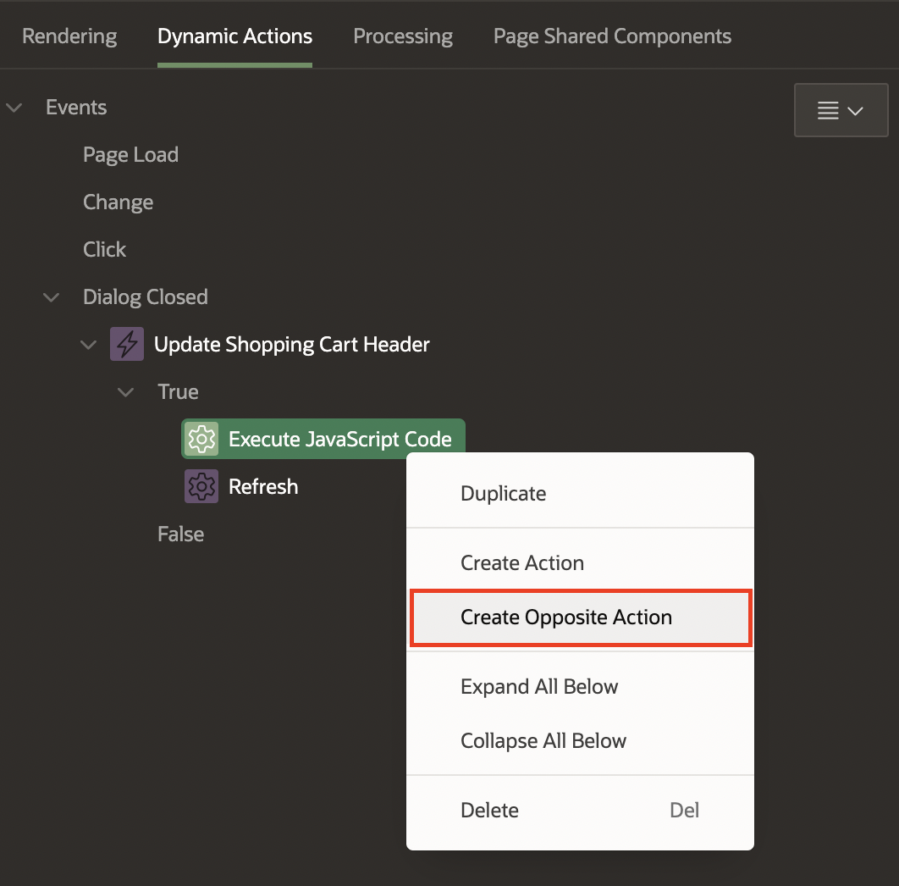

9. Navigate to **Execute JavaScript Code** Action.
    - Under Identification section:
        - For Action - select **Execute JavaScript Code**
    - Under Settings section:        
        - For Code - enter the following JavaScript Code:

            ```
            <copy>
            // Update Badge Text
            apex.jQuery(".js-shopping-cart-item .t-Button-badge").text('');

            // Update Icon
            apex.jQuery(".js-shopping-cart-item .t-Icon").removeClass('fa-cart-full').addClass('fa-cart-empty');
            </copy>
            ```

    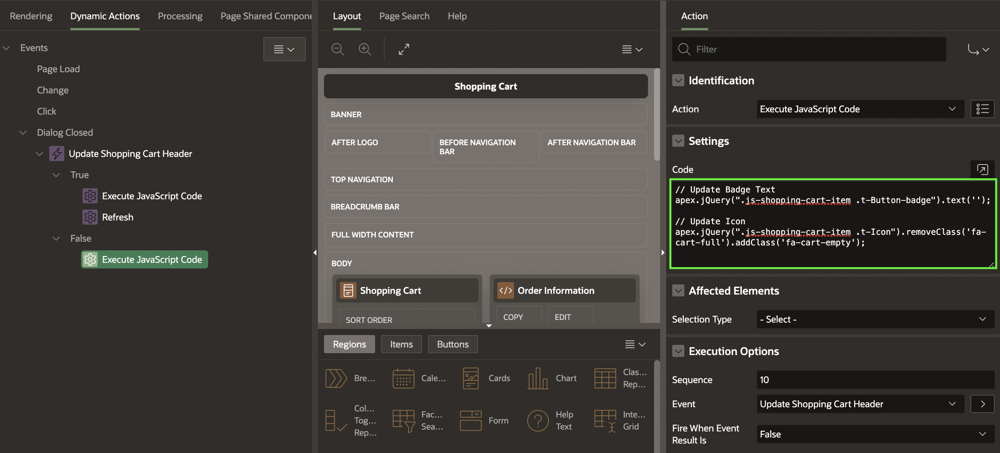

10. Create a second action. In the Dynamic Actions tab (left pane), navigate to **False** under **Update Shopping Cart Header** Dynamic Action.

    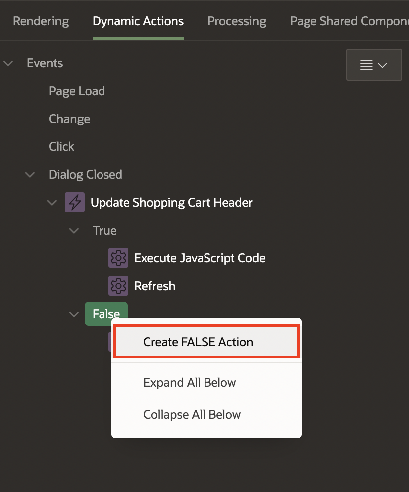

11. In the Property Editor, enter the following:  
    - Under Identification section:
        - For Action - select **Refresh**
    - Under Affected Elements section:          
        - For Selection Type - select **Region**
        - For Region - select **Shopping Cart**    

## Task 6: Format Products Image Size

1. In the Rendering tree (left pane), navigate to **Page 16: Shopping Cart**.
2. In the Property Editor (right pane), do the following:
    - Under CSS section.
        -   For Inline - enter the following:

            ```
            <copy>    
            img {
                width: 150px;
                height: 150px;
            }
            </copy>
            ```

  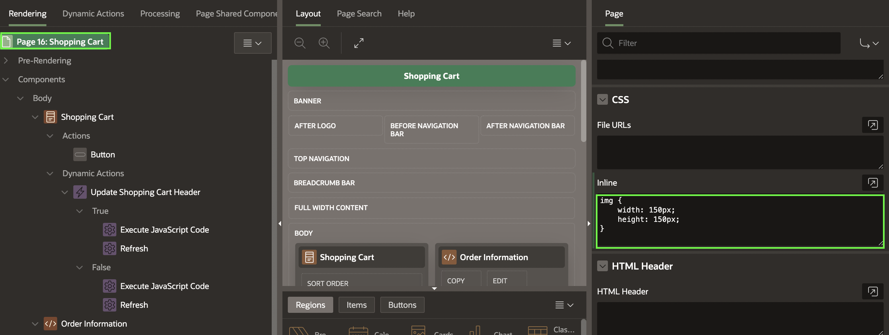             

3. Click **Save**.


You now know how to add validations, processes, branches, and dynamic actions to your APEX page. You may now **proceed to the next lab**.

## **Acknowledgments**

- **Author** - Mónica Godoy, Principal Product Manager
- **Contributors** - Shakeeb Rahman, Architect
- **Last Updated By/Date** - Arabella Yao, Database Product Manager, October 2021
