# Adding Computations and Processes to Add to Cart Page

## Introduction

In this lab, you will create a new modal page to add or edit existing items in the Shopping Cart.

Once you have finished the workshop and updated all the products as described in the steps, your page will look like the following image:


Customers will be able to:
- Review the product details
- Add, edit, or remove the product from the shopping cart
- Read the customer reviews

Estimated Time: 20 minutes

Watch the video below for a quick walk through of the lab.

[](youtube:8HoOOhY8omU)

### Objectives
In this lab, you will:
- Create a page that allows users to add and edit products in the Shopping Cart

### Downloads

- Did you miss out trying the previous labs? Don’t worry! You can download the application from [here](Online-shopping-cart-4.sql) and import it into your workspace. To run the app, please run the steps described in **Hands-on-lab-01** and **Hands-on-Lab-02**.

## Task 1: Add Computation to Calculate the Number of Items for a Product
1. Navigate to **Page Finder** and click on **File symbol**. Then in the popup  **Page Finder**, Select **Page 17**.

    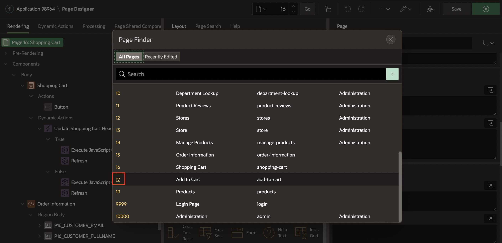

2. In the Rendering tree (left pane), expand the **Pre-Rendering**.
3. Right-click **Before Regions** and click **Create Computation**.

     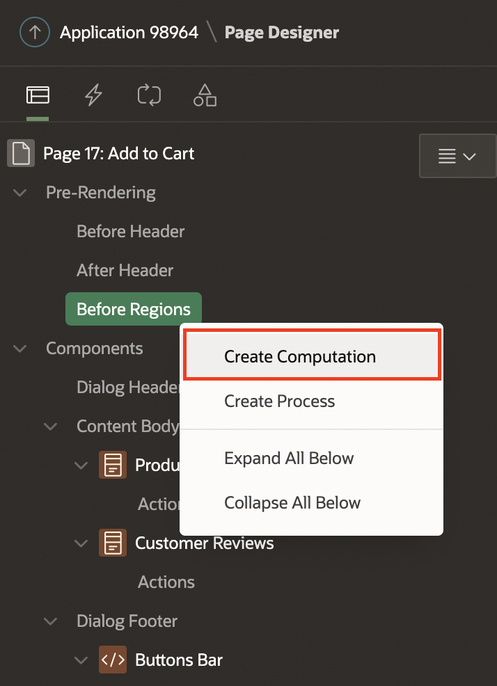  

3. In the Property Editor, enter the following:
    - Under Identification section:
        - For Item Name - select **P17_QUANTITY**
    - Under Computation:
        - For Type - select **Function Body**
        - For PL/SQL Function Body - enter the following PL/SQL Code:

        ```
        <copy>
        RETURN manage_orders.product_exists(p_product => :P17_PRODUCT_ID);
        </copy>
        ```

    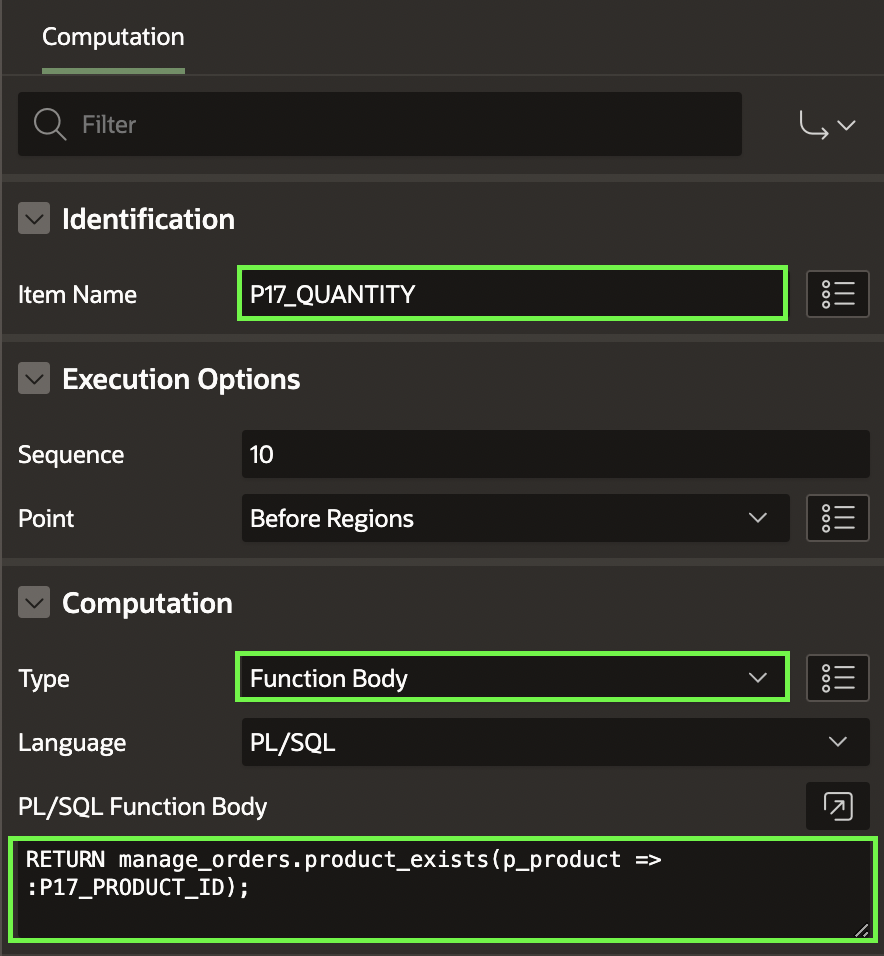          

## Task 2: Create a Process to Add Products to the Shopping Cart
In this Task, you call the *manage\_orders.add_product* procedure that will add a product temporarily in the APEX collection.

1. In the Rendering tree (left pane), navigate to **Processing** tab.  

     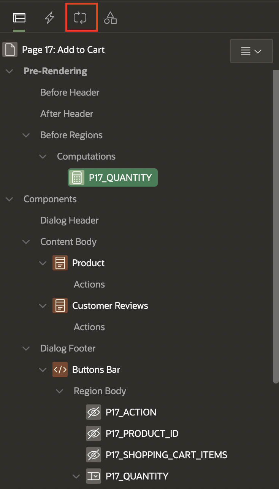    

2. Right click **Processing** and click **Create Process**.

     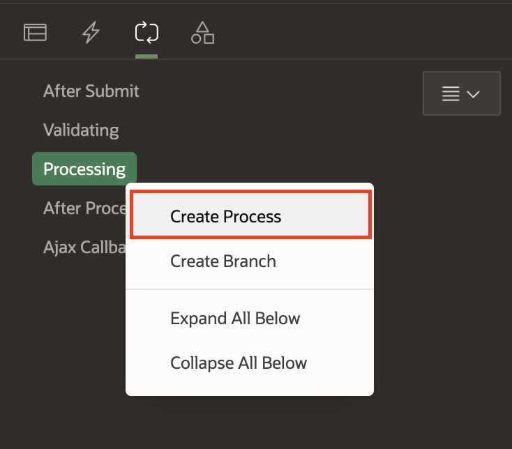   

3. In the Property Editor, enter the following:
    - For Name - enter **Add product**
    - For Type - select **Execute Code**
    - For PL/SQL Code - enter the following code:

        ```
        <copy>
        BEGIN
            IF manage_orders.product_exists(p_product => :P17_PRODUCT_ID) = 0 THEN
                manage_orders.add_product (p_product  => :P17_PRODUCT_ID,
                                        p_quantity => :P17_QUANTITY);
            END IF;
            :P17_ACTION := 'ADD';
        END;
        </copy>
        ```

  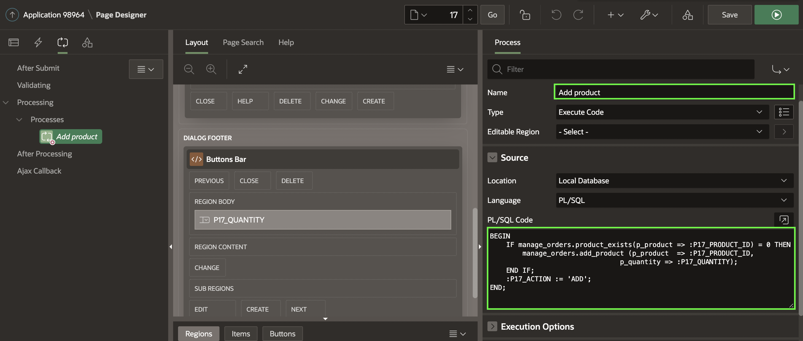  

 - Under Server-side Condition section:
   - For When Button Pressed - select **Add**      

## Task 3: Create a Process to Edit Products in the Shopping Cart
In this Task, you call the *manage\_orders.remove\_product* and *manage\_orders.add\_product* procedures to remove a product from the shopping cart and add it again with the updated quantity.

1. In the **Processing** tab.    
2. Right click **Processing** and click **Create Process**.

  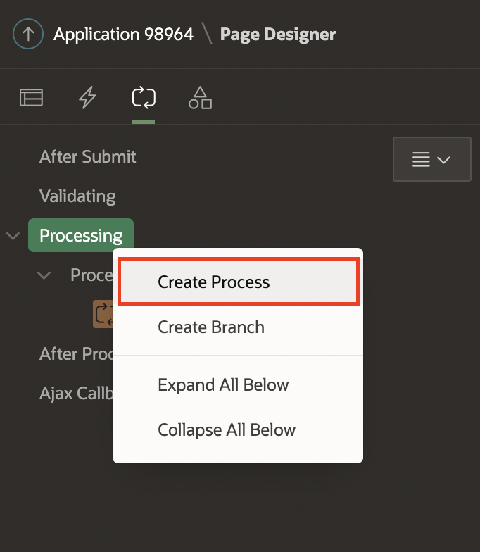

3. In the Property Editor, enter the following:
    - For Name - enter **Edit product**
    - For Type - select **Execute Code**
    - For PL/SQL Code - enter the following PL/SQL code:

        ```
        <copy>
        BEGIN
            IF manage_orders.product_exists(p_product => :P17_PRODUCT_ID) > 0 THEN
                manage_orders.remove_product(p_product => :P17_PRODUCT_ID);
                manage_orders.add_product (p_product  => :P17_PRODUCT_ID,
                                        p_quantity => :P17_QUANTITY);
            END IF;
            :P17_ACTION := 'EDIT';
        END;
        </copy>
        ```

   - Under Server-side Condition section:
    - For When Button Pressed, select **Edit**

  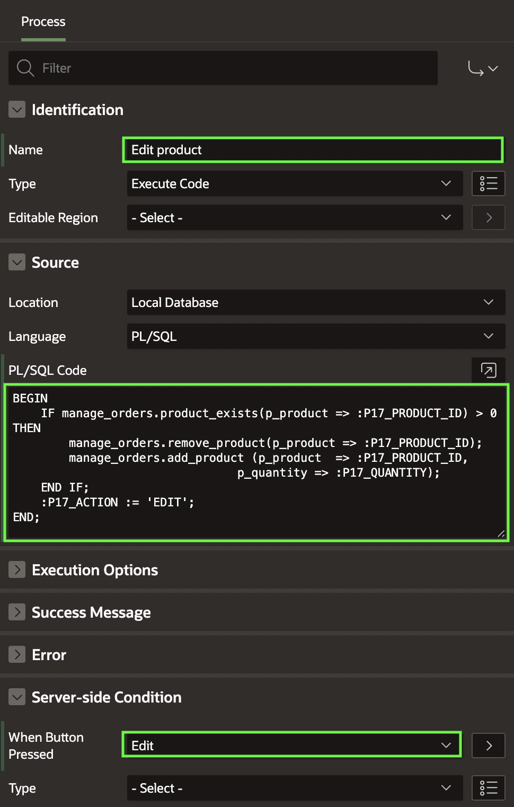

## Task 4: Create a Process to Delete Products from the Shopping Cart
In this Task, you call the *manage\_orders.remove\_product* to remove a product from the shopping cart.

1. In the **Processing** tab.    
2. Right click **Processing** and click **Create Process**.

     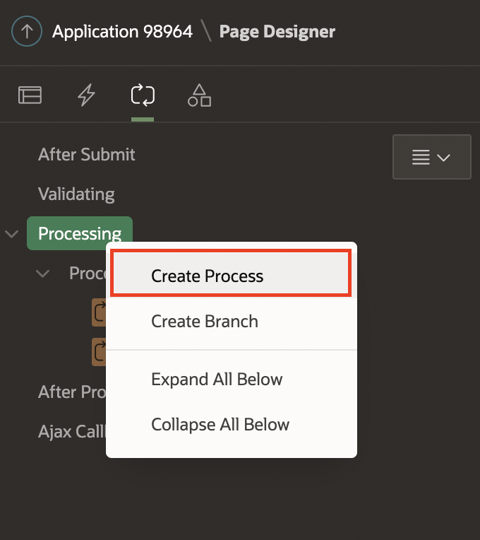  

3. In the Property Editor, enter the following:
    - For Name - enter **Delete product**
    - For Type - select **Execute Code**
    - For PL/SQL Code - enter the following code:

        ```
        <copy>
        BEGIN
            IF manage_orders.product_exists(p_product => :P17_PRODUCT_ID) > 0 THEN
                manage_orders.remove_product(p_product => :P17_PRODUCT_ID);
            END IF;
            :P17_ACTION := 'DELETE';
        END;
        </copy>
        ```

    - Under Server-side Condition section:
        - For When Button Pressed - select **Delete**   

  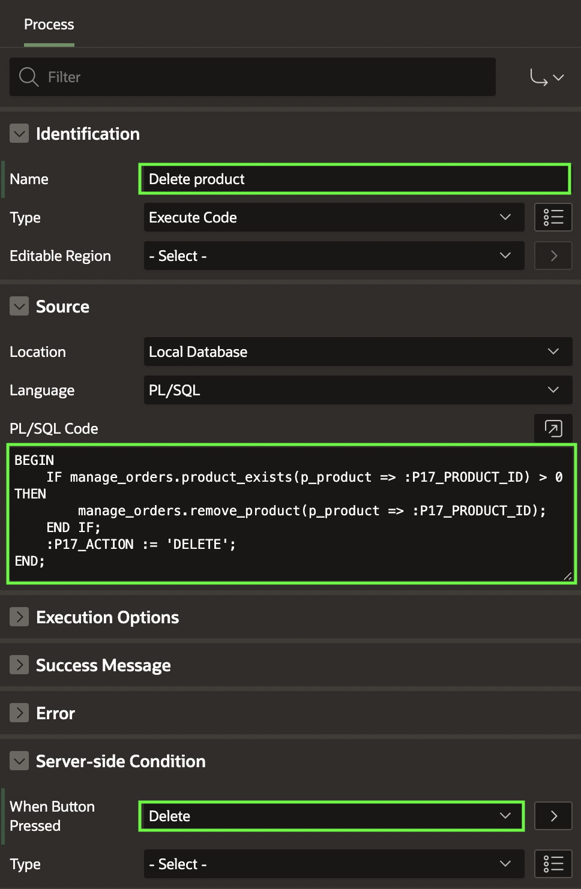

## Task 5: Create a Process to Calculate the Shopping Cart Items
In this task, you call the *manage\_orders.get\_quantity* to get the total number of products in the shopping cart.

1. In the **Processing** tab.    
2. Right click **Processing** and click  **Create Process**.
       
3. In the Property Editor, enter the following:
    - For Name - enter **Calculate Shopping Cart Items**
    - For Type - select **Execute Code**
    - For PL/SQL Code - enter the following PL/SQL code:

        ```
        <copy>
        BEGIN
            :P17_SHOPPING_CART_ITEMS := manage_orders.get_quantity;
        END;  
        </copy>
        ```

  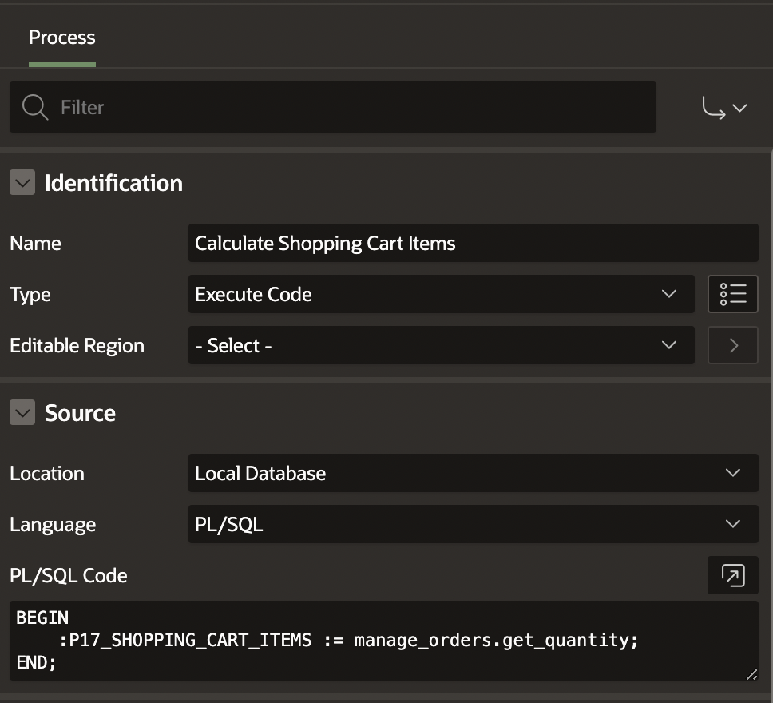


## Task 6: Create a Process to Close the Modal Page
After the customer has taken an action (add/edit/delete) about the product, the modal page will close and continue the shopping process.

1. In the **Processing** tab.    
2. Right click **Processing** and click **Create Process**.
       
3. In the Property Editor, enter the following:
    - Under Identification section:
        - For Name - enter **Close Dialog**
        - For Type - select **Close Dialog**
    - Under Settings section:
        - For Items to Return - enter **P17\_SHOPPING\_CART\_ITEMS,P17\_PRODUCT\_ID,P17\_ACTION,P18\_QUANTITY**


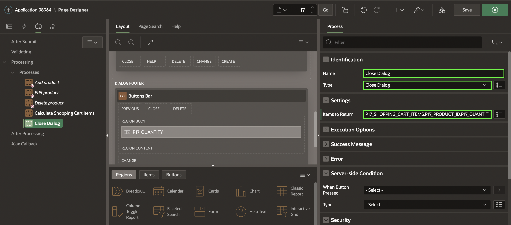

## Task 7: Enhance the Modal Page

1. Navigate to **Rendering** tab (left pane).

     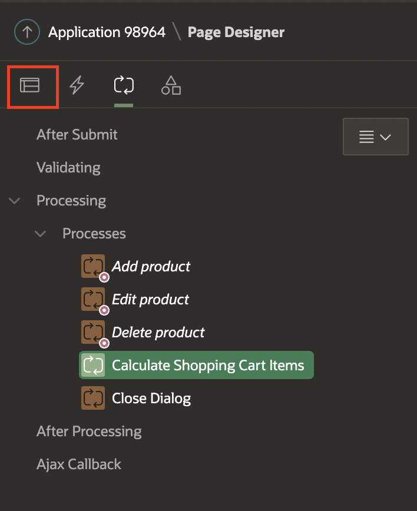  

2. Navigate to **Page 17: Add to Cart**
3. In the Property Editor, do the following changes:
    - Under Identification section:
        For Title, enter **Manage your Cart**
    - Under Dialog section:
        - For Width, enter **600**
        - For Height, enter **600**

  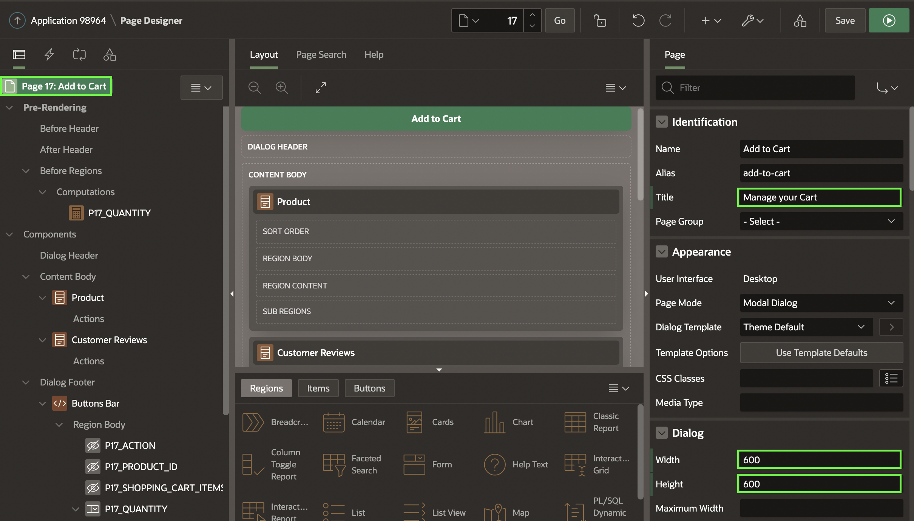     

4. Click **Save**.


You now know how to customize and enhance the APEX page. You may now **proceed to the next lab**.

## **Acknowledgments**

- **Author** - Mónica Godoy, Principal Product Manager
- **Contributors** - Shakeeb Rahman, Architect
- **Last Updated By/Date** - Arabella Yao, Database Product Manager, October 2021
