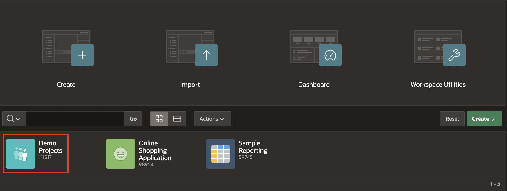
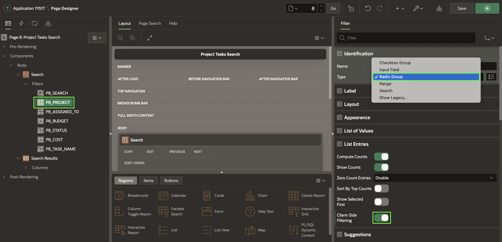
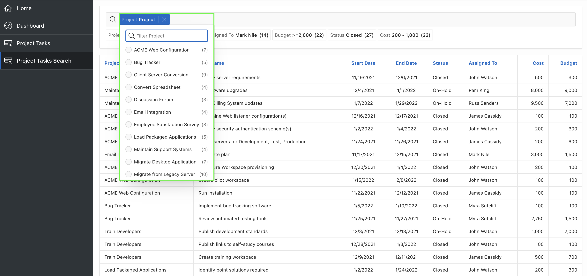

# Improving the Report and Form

## Introduction
In this lab, you will gain an insight into the abilities of Smart Filters, and learn how to add **New Filters** and Edit existing Filters

Estimated Time: 20 minutes

## Task 1: Enhancing Smart Filters

In this Lab, you are going to customize the **Smart Filters** page in **Demo Projects** application.
The **Project Tasks Search** page utilizes Smart Filters to display the records.

1. Navigate to the **App Builder**. Then Click on **Demo Projects** application.

    

2. Now, you run the application using **Run Application** icon.

    

3. Navigate to **Project Tasks Search** page and click **Page 8** in the **Developer toolbar**

    

4. Now, Update **P8_PROJECT**, Change type to **Radio Group** and enable the **Client-Side Filtering** attribute.  
In the Rendering tab, select the P8_PROJECT filter (if not already selected).
In the Property Editor, under **Identification** change type to **Radio Group**, then find **List Entries** and enable **Client-Side Filtering**. Enabling this option renders a search field above the list entries.

    

5. Click **Save and Run Page** in the upper right corner. If prompted, enter your workspace username and password and click Sign In.
The revised page appears.

    

## Task 2: Adding New Smart Filter

Add new filters in Page Designer by right-clicking filter and selecting Create Filter from the context menu.

Filters map to specific database column. When creating a new filter, you can create the following types: Checkbox Group, Input Field, Radio Group, and Range.

1. View the smart filters page in Page Designer. In the Rendering tab, right-click Filters and select **Create Filter**.

    

2. Select the new filter and edit the following filter attributes in the Property Editor:
  - Under **Identification**:
    - For Name, Enter **P8_TASK_NAME**.
    - For Type,  Select **Checkbox Group**.

  - Under **List of Values**:
    - For Type, Select **Distinct Values**.

  

3. Click **Save and Run Page** in the upper right corner. If prompted, enter your workspace username and password and click Sign In.
The revised page appears.

  

## **Summary**

You now know how to create smart filters and customize them for the Interactive Reports.

## **Acknowledgements**

 - **Author/Contributors** -  Roopesh Thokala, Product Manager
 
