# Using Themes and Theme Styles

## Introduction

In this lab, you use the Theme Roller to save a new Theme Style. Then, you enable end users to apply this style while running the application.

Estimated Time: 10 minutes

<!--
Watch the video below for a quick walk through of the lab.

-->
### Objectives
<!--
In this lab, you will:
- Set the following pages as public pages:
    - Products
    - Shopping Cart
    - Order Information

- Disable the Navigation Menu

- Enhance the Navigation Bar -->

## Task 1: Using Themes and Theme Styles.

In this hands-on lab, you use the Theme Roller to save a Theme Style. Then, you enable end users to apply this style while running the application.

1. Navigate to **App Builder** and then run the **Online Shopping Application**. In the Developer Toolbar, click **Customize** and then select **Theme Roller**.

  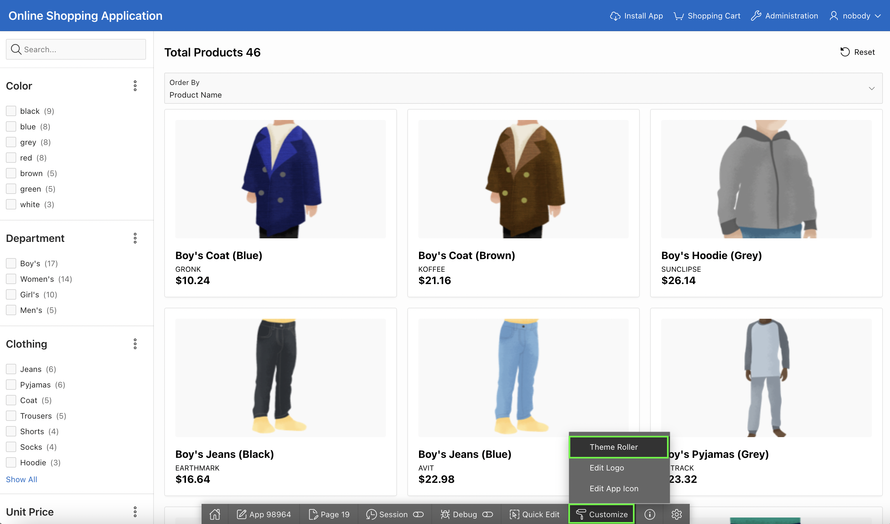

2. The current Theme Style is **Vita**.
  Under **Global Colors**, click the color swatch to select new colors.
To edit a specific component, expand a group and select new colors or styling of the component you wish to edit.
Modify the look by specifying colors of your choice and preview the changes. Once you are done, click Save As.  

  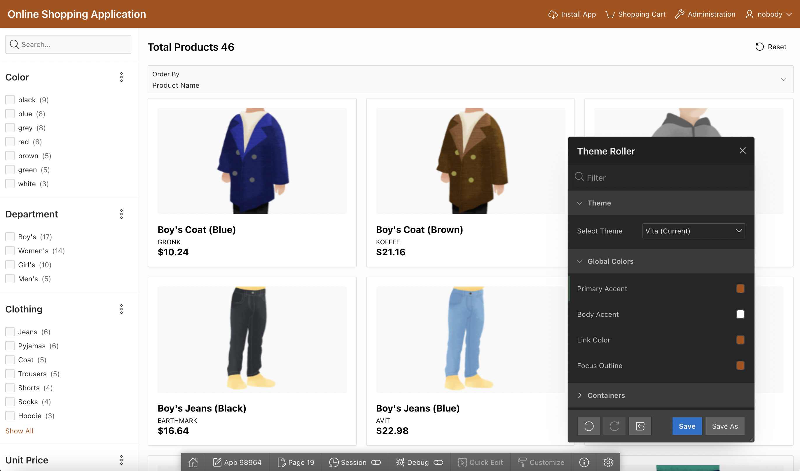

3. Under **Theme**, change the **Select Theme** to **Redwood Light**

  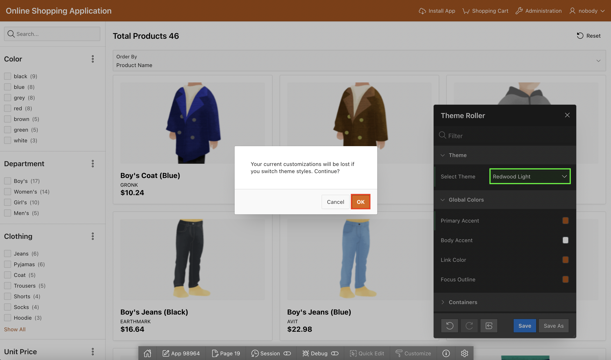

4. For Theme Attributes, enter the following:  
  Under **Redwood Options**:
    - For Layout, select **Floating**.  

  Under **Appearance**:
  - For Header, Select **Dark**.
  - For Body Header, Select **Dark**.
  - For Body Background, Select **Dark**.  

  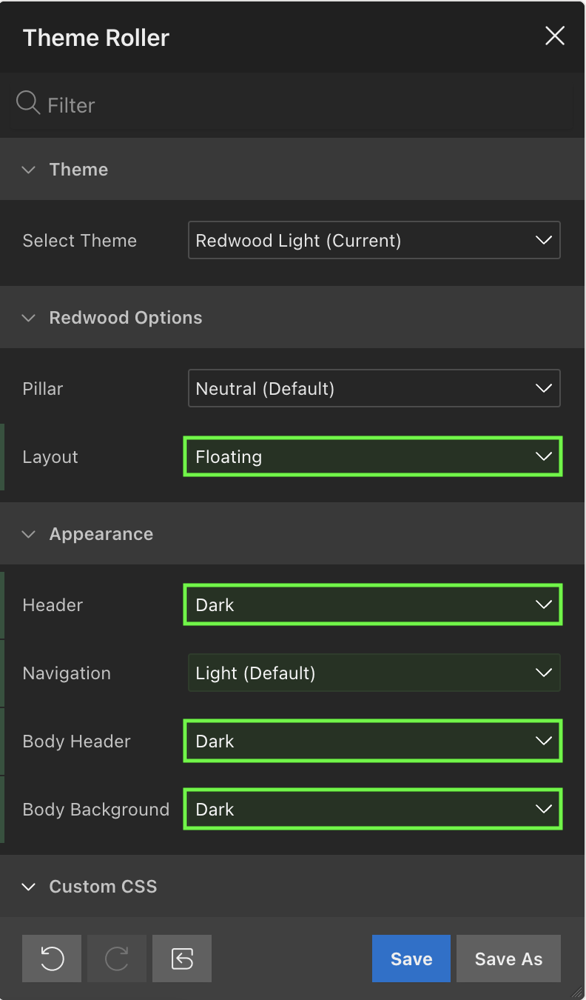

5. In the Save As dialog, enter **Redwood Light (Copy_1)** for Style Name and click **Save**.

  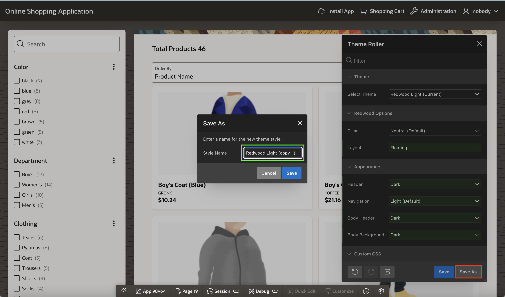

6. Click **App < n >** in the Developer Toolbar.

  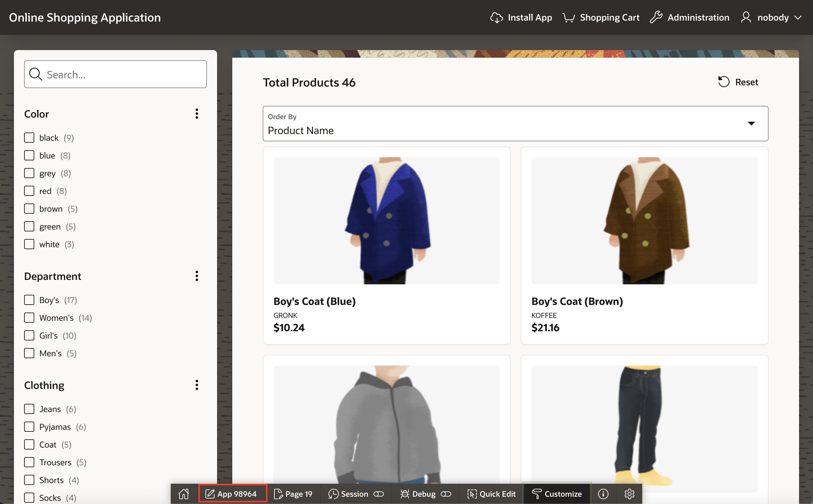

7. In the application home page, click **Shared Components**. Under User Interface, click **User Interface Attributes**.

  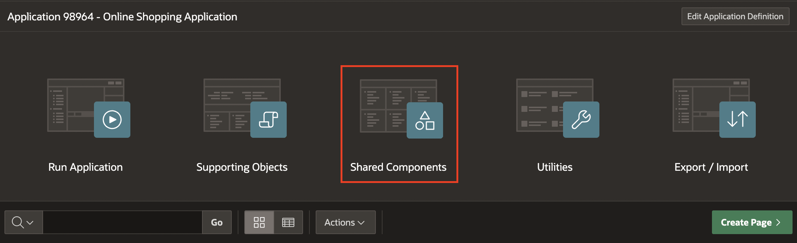

  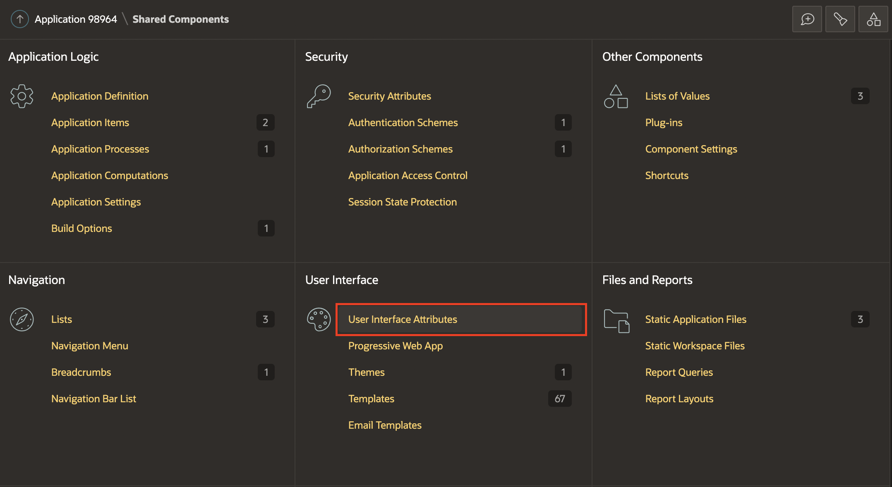

8. Under **Attributes**, click **Enable End Users to Choose Theme Style**. Make sure this attribute is set to **On**.
Notice that the new Theme Style you saved is displayed under Theme Style list. Click **Apply Changes**.

  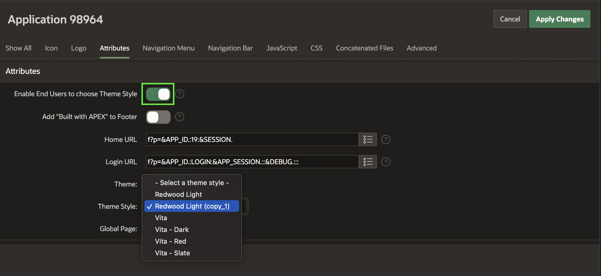

9. Now, run the application. At the bottom of the page, click the **Customize** link.

  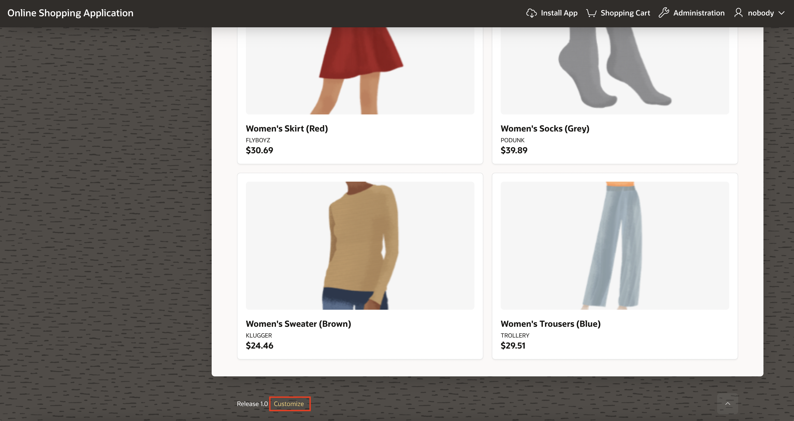

10. Using the Customize dialog, users can specify their Theme Style while running the application. Select the Theme Style that you saved in step 3 above and click Apply Changes.

  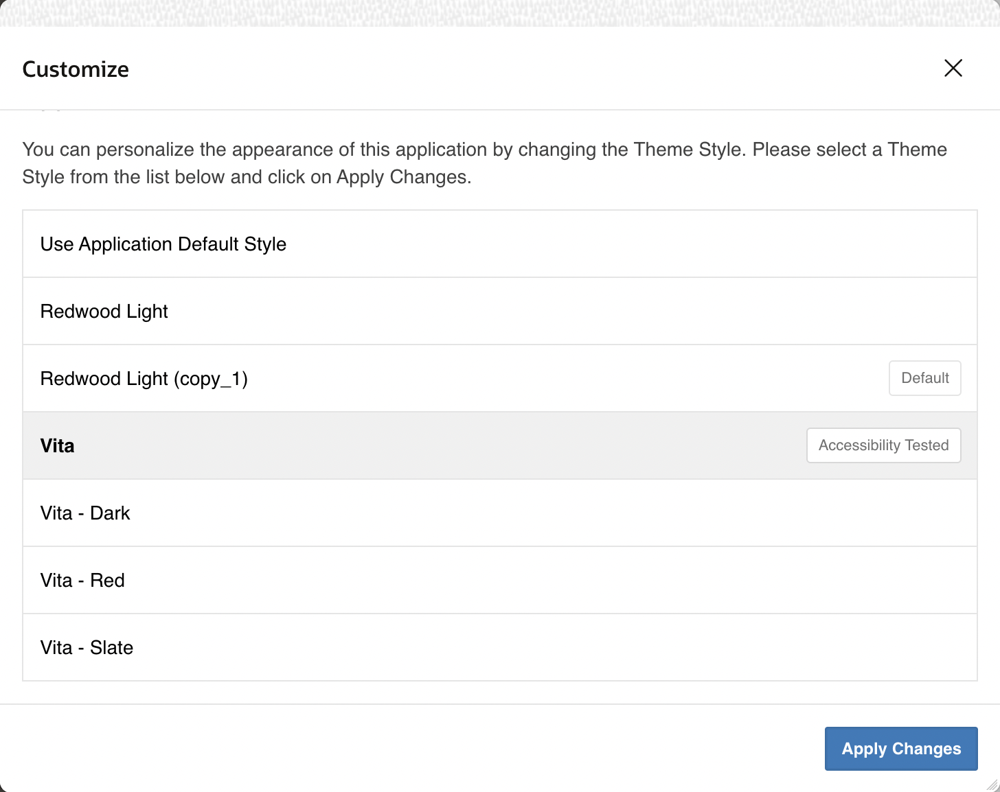

11. The Theme Style is applied, and you see a message that says Preferences changed for user < username >.

  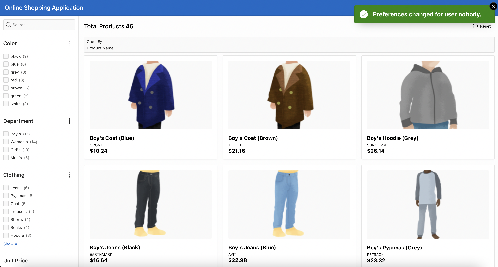

## **Acknowledgments**

- **Author** - Roopesh Thokala, Product Manager
- **Last Updated By/Date** - Roopesh Thokala, Product Manager, May 2021
