# Improve the application

## Introduction

In this lab, you will learn how to make some pages publicly accessible.

Estimated Time: 10 minutes

<!--
Watch the video below for a quick walk through of the lab.

-->
### Objectives
In this lab, you will:
- Set the following pages as public pages:
    - Products
    - Shopping Cart
    - Order Information

- Disable the Navigation Menu

- Enhance the Navigation Bar

### Downloads

- Did you miss out trying the previous labs? Don’t worry! You can download the application from [here](online-shopping-cart-7.sql) and import it into your workspace. To run the app, please run the steps described in **Hands-on-lab-01** and **Hands-on-Lab-02**.

## Task 1: Set Products page as the Home Page.

In this Lesson, you will set the products page as Home page and then you will remove the **Home** page under Navigation Menu.

1. Navigate to the **App Builder**. Then Click on **Online Shopping Application**.

    

    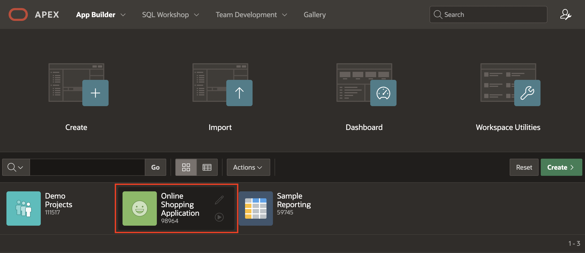

2. Now, select **Shared Components**.

    

3. Under User Interface, click **User Interface Attributes**.

    

4. Now, Under **Attributes**, Select **≡** next to **Home URL**. Then, in the popup window, select **19 PRODUCTS** and click **Apply Changes**.

    

5. Since you have changed the **Home Page** to **Products** page. you now need to remove **Home** Page under Navigation Menu.  
Navigate to **Shared Components**.

    

    

6. Under **Navigation**, Select **Navigation Menu**.

    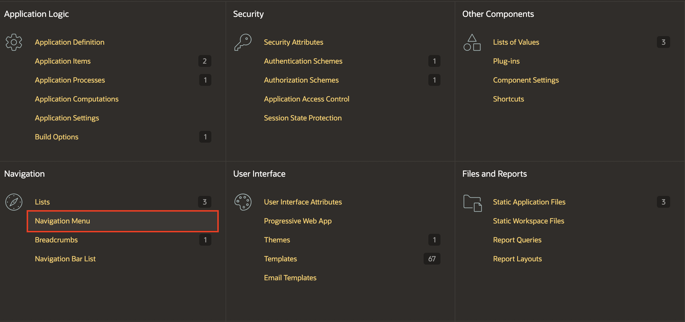

7. Select **Navigation Menu**, then select **Pencil Icon** before **Home**.

    

    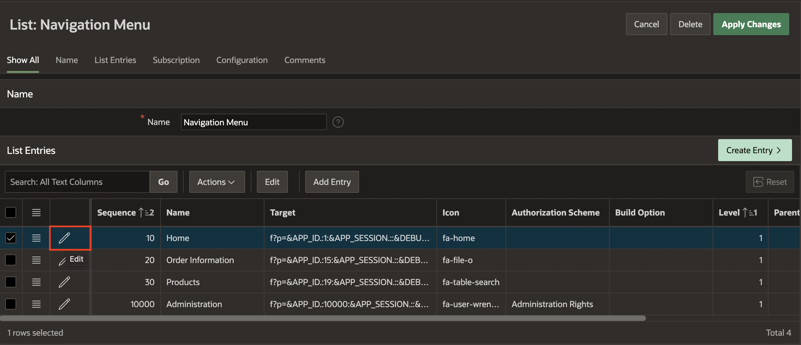

8. In the **List Entry** page, Click **Delete** button and then Confirm Delete by clicking **OK**.

  

## Task 2: Set Pages to Public
Your customers don't need to log in the app to shop the products, so let's set the following pages as public:
- Page 19: Products
- Page 15: Order Information
- Page 16: Shopping Cart
- Page 17: Add to Cart

Follow these steps for the four listed pages:

1. From the runtime application, navigate to the **Products** page.

    In the Developer Toolbar click **Edit Page 19**.

    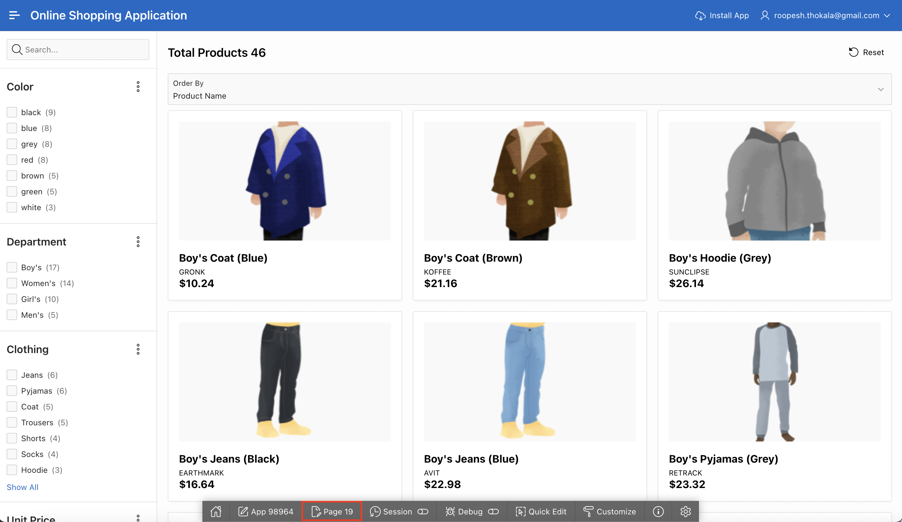

2. Within Page Designer, in the Rendering tree (left pane), navigate to  **Page 19: Products**.

    In the Property Editor (right pane), apply the following change:
    - Under Security section:
        - For Authentication - select **Page Is Public**  

      

3. Click **Save**.

4. Navigate to Page Finder and select **Page 15** from Dialog Page.

    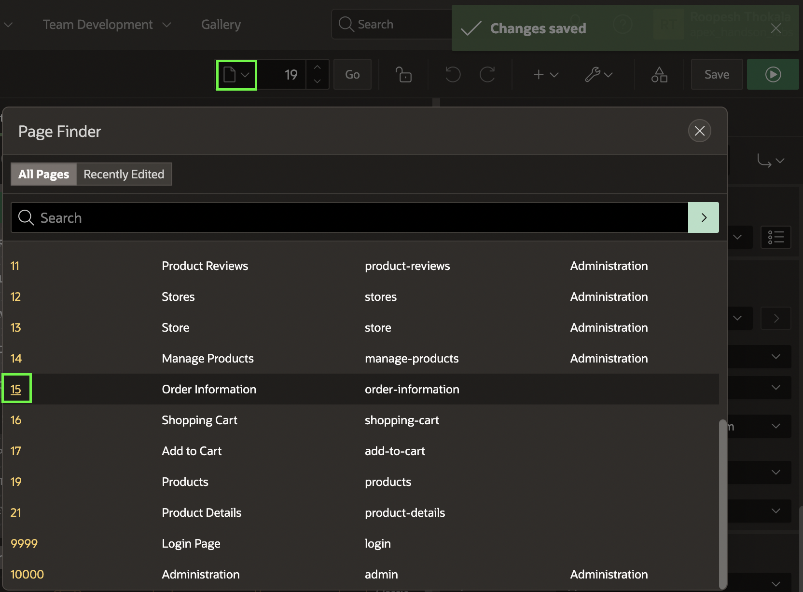

5. Repeat steps 2-4 for **Page 16: Shopping Cart** and **Page 17: Add to Cart**.

## Task 3: Remove the Navigation Menu
Since the home page is the Products page and this is a public access page, we do not need a navigation menu.
In this task, you will turn off displaying the navigation menu.

1. Within Page Designer, click the Shared Components icon at the top right.

    

   Alternatively, if you are in the App Builder, click Shared Components.

   

2. Under User Interface, click **User Interface Attributes**.

    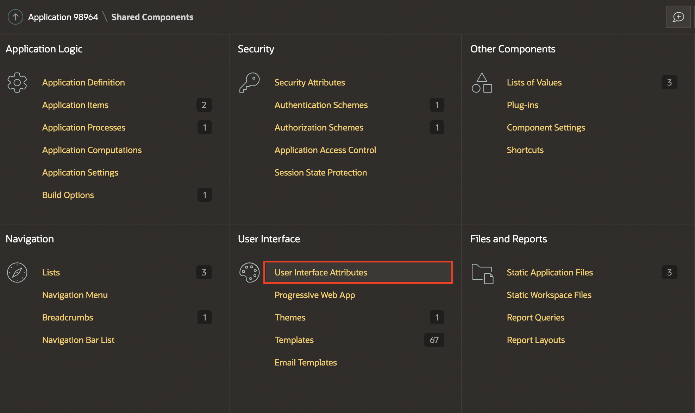

3. Click **Navigation Menu**.

4. Set Display Navigation to **Off**.

    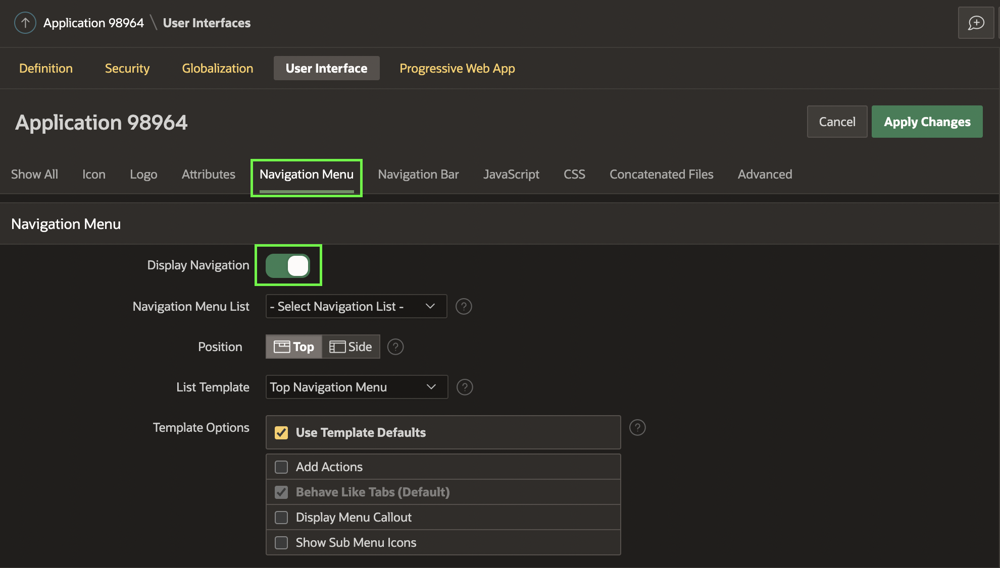

5. Click **Apply Changes**.

## Task 4: Enhance the Navigation Bar List

Add a new navigation bar entry to allow:
- Customers to go directly to the Shopping Cart
- Administrators to login and access to administration page

1. Click the Shared Components icon at the top right.

    
2. Under Navigation, click **Navigation Bar List**.

    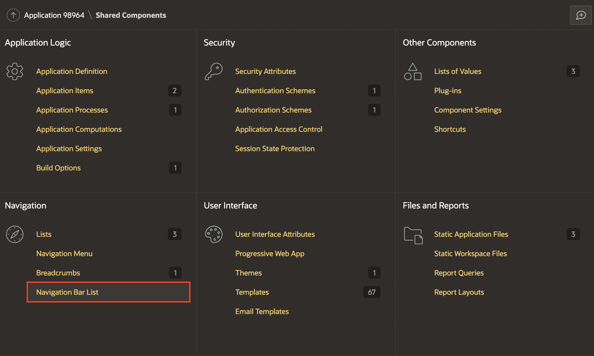

3. Click **Navigation Bar**.

    

4. Click **Create Entry**.

  

5. In the **List Entry** page, enter the following and click **Create List Entry**.
  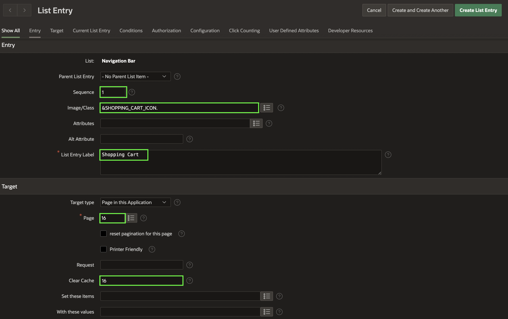

   - For Sequence - enter **1**
   - For Image/Class - **&SHOPPING\_CART\_ICON.**
   - For List Entry Label - **Shopping Cart**
   - For Page - select **16**
   - For Clear cache - enter **16**

6. Scroll under **User Defined Attributes** and enter the following:
    - For 1. Badge Value - enter  **&SHOPPING\_CART\_ITEMS.**
    - For 2. List Item CSS Classes - enter **js-shopping-cart-item**

7. Click **Create List Entry**.
    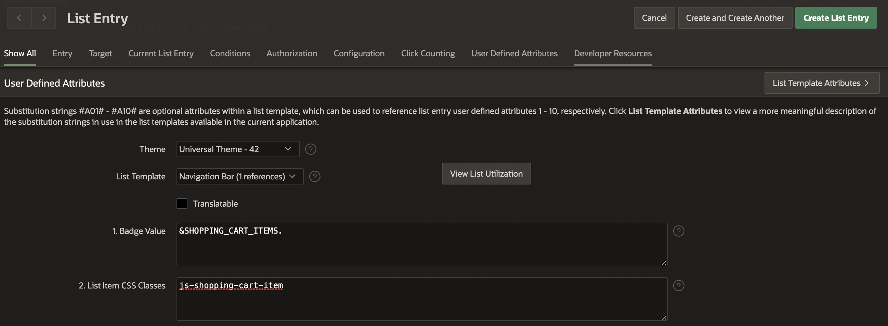

8. Click the **Pencil Icon** before **&APP_USER.**

    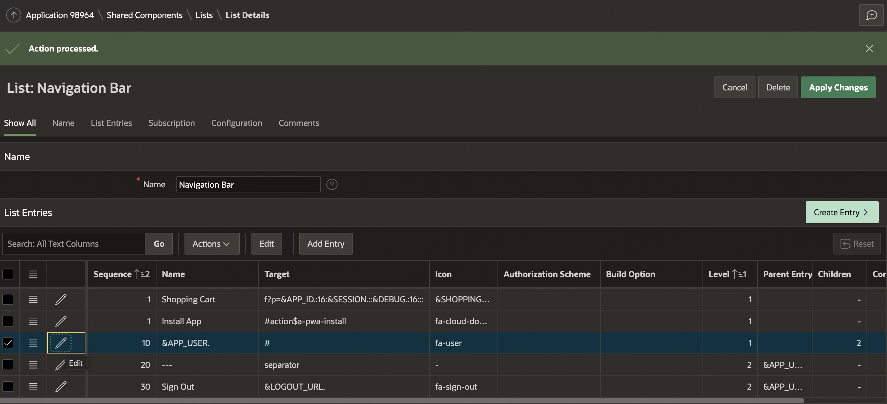

9. Under Authorization, for Authorization Scheme, select **Administration Rights**.

10. Click **Apply Changes**.
    

11. Click **Create Entry**  and enter the following:

    

    - For Sequence - enter **5**
    - For Image/Class - enter **fa-wrench**
    - For List Entry Label - enter **Administration**
    - For Page - select **10000**

12. Click **Create List Entry**.

    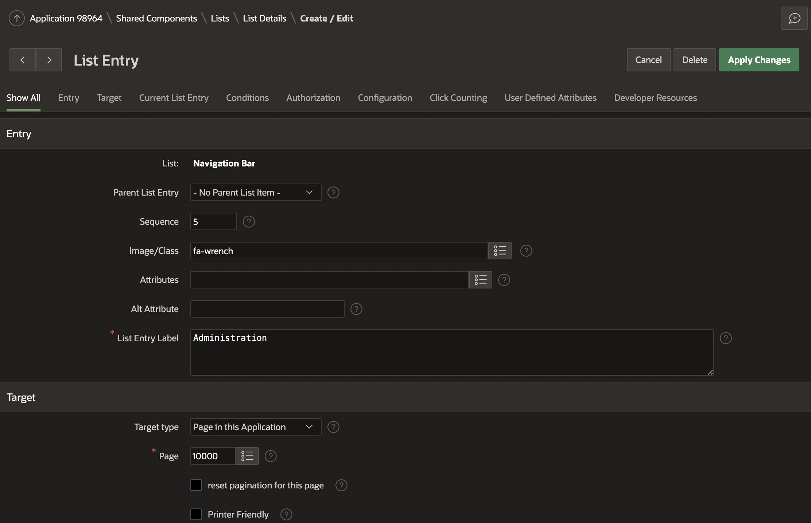
<!--
You now know how to enhance and mantain both navigation menu and navigation bar. You may now **proceed to the next lab**.-->
## **Acknowledgments**

- **Author** - Roopesh Thokala, Product Manager
- **Last Updated By/Date** - Roopesh Thokala, Product Manager, April 2021
