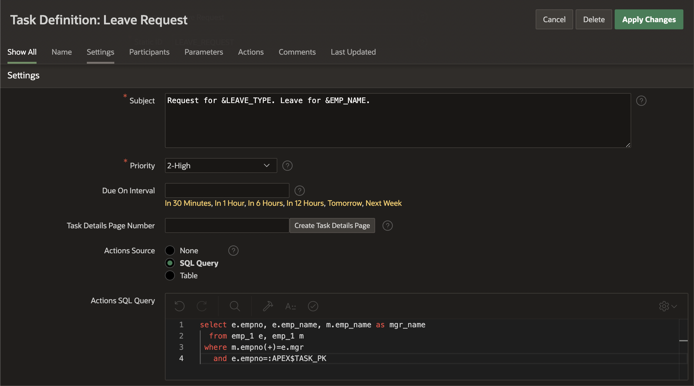
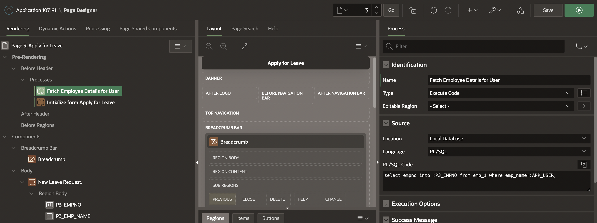
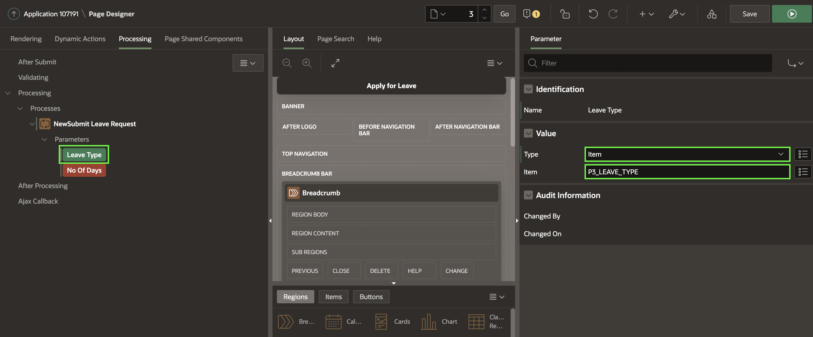
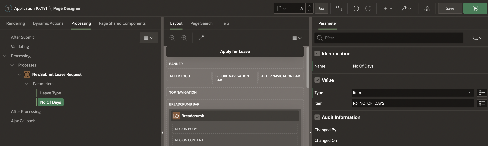
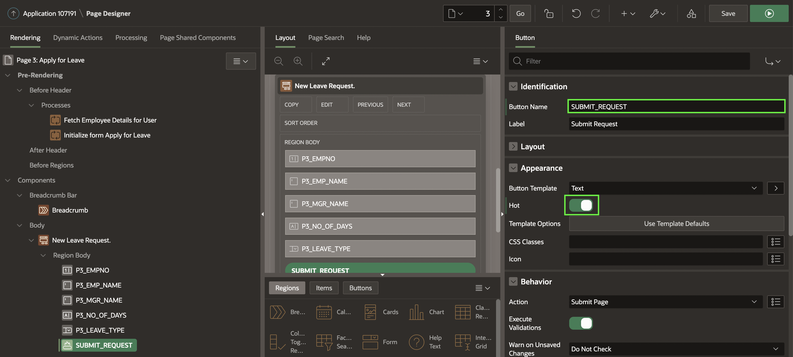
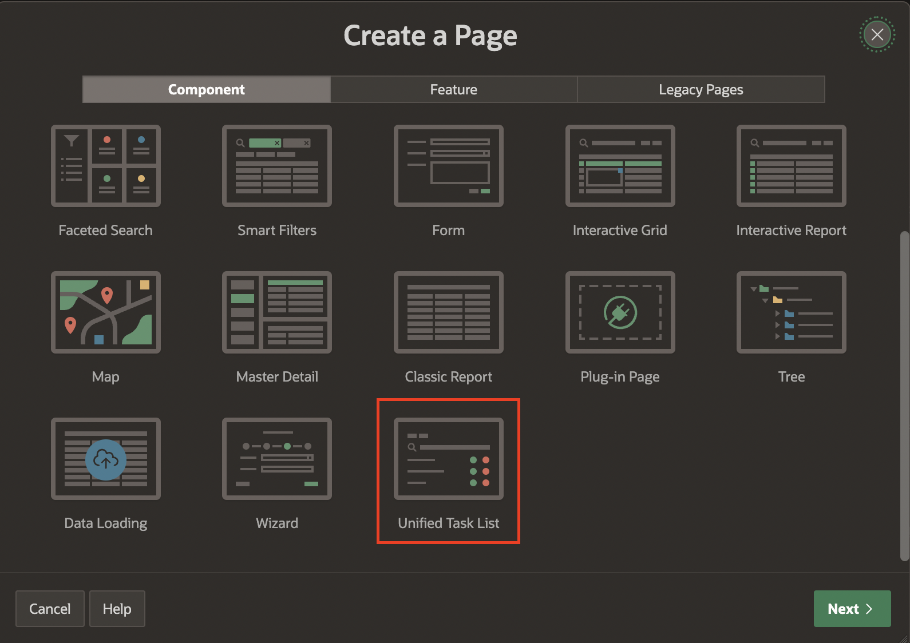

# Managing Application data and Using Approvals and Unified Tasks Lists

## Introduction

Oracle APEX allows you to build robust, feature-rich applications against remote, web, and REST data sources. In this lab, you login to a remote database, create a database table and then **Register a schema with RESTful Services**.

<!--
 you build a web application on top of the Apple iTunes Search API, which is a simple API over HTTP that takes input arguments via parameters in the URL. First, you create a report against the iTunes music video catalog. Next, you simplify the report to include a preview of the music video and a link to watch a clip of the music video.


Estimated Time: 20 minutes

<!--
Watch the video below for a quick walk through of the lab.

[](youtube:lwQ3lvul9iE)
-->

### Objectives

In this lab, you will:
- Set the following pages as public pages:
    - Products
    - Shopping Cart
    - Order Information

- Disable the Navigation Menu

- Enhance the Navigation Bar 

## Task 1: Enable Remote Database schema to Oracle REST Data Services.

Before starting this lab, you need to Provision a new **APEX instance** or **Workspace**.

In this hands-on lab, you will login to New Remote APEX workspace, create a Table and then **Register Schema with ORDS**.

1. Login to the new Workspace you created.

  

2. Under **SQL Workshop**, select **SQL Commands**.

  

3. Now, Copy the below statements and execute them one by one.

```
<copy>
CREATE TABLE "EMP_1"
   (    "EMPNO" NUMBER GENERATED BY DEFAULT ON NULL
     AS IDENTITY MINVALUE 1 MAXVALUE 9999999999999999999999999999
     INCREMENT BY 1 START WITH 8000 CACHE 20 NOORDER  NOCYCLE  NOKEEP  NOT NULL ENABLE,
    "EMP_NAME" VARCHAR2(10),
    "MGR" NUMBER(4,0),
    CONSTRAINT "EMP_1_PK" PRIMARY KEY ("EMPNO"))
insert into emp_1(empno, emp_name, mgr) values (10, 'JOHN', 30);
insert into emp_1(empno, emp_name, mgr) values (20, 'CLARA',30);
insert into emp_1(empno, emp_name, mgr) values (30, 'JANE', 40);
insert into emp_1(empno, emp_name, mgr) values (40, 'MATT', null);
</copy>
```

  

    


4. Select **RESTful Services** under **SQL Workshop**.

  

5. Click on the button **Register Schema with ORDS**.

  

6. In the next window, leave the Attributes to default and then click **Save Schema Attributes**.

  

7. Now, Select **Object Browser** under **SQL Workshop**.

  


8. Under **Tables**, select **EMP_1** and then click on **REST**.  

    Under REST Attributes:
      - Set **REST Enable Object** to **Yes**.
      - Set **Authorization Required** to **No**.  

   Then Click **Apply**.

  

9. You need to copy the **RESTful URI** and paste it in your Note pad.

  

## Task 2: Creating an application and Integrating Application Data from REST Data Source

In this Lab, you create a **New Application** and then consume the **REST Data Source** we created in the previous task. Then, you will **Synchronise** the Data from REST Data Source to the Local Database table using **REST Data Synchronization**.

1. Log in to the first Workspace, where we have already created multiple applications.

  

2. Select **App Builder** under Workspace Home Page.

  

3. Now select **Create** button to create a new application.

  

4. Under **Create an Application**, select **New Application**.

  

5. Enter the following and click **Create Application**.
  - Page Name - enter **Leave Request Approval**

  

6. Navigate to **Shared Components** and then Select **REST Data Sources**.

  

  

7. Under **REST Data Sources**, Click **Create** button.

  

8. Under **Create REST Data Source - Method**, Leave the settings to default and select **Next**.

  

9.  Under **Create REST Data Source**, Enter the following and click **Next**.
  - For Name - enter **Employee Details API**
  - For URL Endpoint - Enter the URI we **copied** in **Task 1**.

  

10. Now, under **Create REST Data Source - Remote Server** leave all fields to **Default** and then click **Next**.

  

11. For Pagination Type, leave the default as **No Pagination** and click **Next**.

11. For Authentication, Set **Authentication Required** to **No**. Click **Discover**.

  

12. Click on the button **Create REST Data Source**.

  

## Task 3: Synchronizing Data from REST Data Sources to a Local Table.

In this lab, you will **Synchronize data** from the **REST Data source** you have created in Task 2 to a **Local table**.

**Data Synchronization** feature enables developers to automatically sync the contents of a local table with the data from an external REST service. Basically, APEX invokes the REST Service defined in the REST Data Source, downloads all data and synchronizes to a local table.

1. Now that you have created a **REST Data Source**, Under **REST Data Sources** select **No** under **Synchronized** column for **Employee Details API**.

  

2. **Synchronization** is not configured yet. In this step, you provide the name of a new table or an existing table.
In this example, select New Table for Synchronize To and enter **EMP_1** for Table Name. Then, click **Save**.

  

3. The synchronization table is not created yet. You can view the SQL that is used to create the table. Click **Show SQL**.

4. Under Table Status, click **Create Table**. The table **EMP_1** is now ready for synchronization. Notice the message **The synchronization table exists and matches the Data Profile**.

  

6. You will define a **synchronization schedule** now. In the Synchronization Schedule field, you can use the Database Scheduler calendaring syntax to define repeating synchronization schedules, such as "every Tuesday and Friday at 4:00 p.m." or "the second Wednesday of every month." This calendaring syntax can be provided manually.

  

7. The Interval Builder dialog displays. In this example, for Frequency select **Minutely** and enter **10** for Interval. Then, click **Set Execution Interval**.

  

8. You are now ready to test the data synchronization. Click **Save and Run**.

  

9. You can see that **the data synchronization is triggered**.

  


## Task 4: Creating and Customising Tasks in Leave Request Approval application

In this task, you design a simple Leave Request Application where an Employee can make a request to apply for leave and the Manager of the Employee either approves or rejects the leave.

1. Navigate to the **Leave Request Approval** application you created in the previous Task and then click **Shared Components**.

  

2. Now under **Workflows and Automations**, select **Task Definitions**.

  

3. Click **Create**.

  

4. Fill in the Create Task Definition Wizard fields as shown below, and hit Create. Under **Create Task Definition** enter the following:  
  - For **Name**, Enter **Leave Request**.
  - For **Subject**, enter **Request for &LEAVE_TYPE. Leave for &EMP_NAME**.
  - For **Static ID**, enter **LEAVE_REQUEST**.
  - For **Priority**, select **2-High**  

  

  

5. Now, you will add the **Action source**.  

  For **Action Source** Select **SQL Query** as the action source and add the following SQL statement in the Actions SQL Query editor.       

    ```
    <copy>
    select e.empno, e.emp_name, m.emp_name as mgr_name
      from emp_1 e, emp_1 m
     where m.empno(+)=e.mgr
       and e.empno=:APEX$TASK_PK
    </copy>
    ```

  

6. Notice that the **Task Details Page Number is empty**. Click on the **Create Task Details Page** button to generate the details page for this task.

  

7. You will get a popup dialog asking if the next available page number should be used. Click **OK**.

  

8. You will find that the Task Details Page Number is replaced by the Task Details Page URL containing the link to the generated Details Page.

  

9. In the **Participants** section, Click on **Add Row** and select Participant Type as **Potential Owner** and Value Type as **SQL Query**. In the Value field, add the following SQL query.

  ```
  <copy>
  select emp_name from emp_1 where empno=(select mgr from emp_1 where empno=:APEX$TASK_PK)
  </copy>
  ```

10. Add another row to the Participants section . Select Participant Type as **Business Administrator**, Value Type as **STATIC**. In the Value field, type **'MATT'**.

  

11. Add the following entries to the Task **Parameters** section.
    - Click **Add Row** and then for **Static ID**, enter **LEAVE_TYPE**
    - Click **Add Row** and then for **Static ID**, enter **NO_OF_DAYS**

  

12. You will now add additional actions when an event occurs on a task. Click on **Add Action** as shown below. This will take you to the Task Definition Actions **Edit Action** Page

  

13. You will now set up an action that sends an email to the applicant of the leave, when his/her Leave Request is approved.  
Under **Action**:
  - For **Name**, Enter **On Approval**.
  - For **Type**, Select **Send E-Mail**.
  - For **On Event**, Select **Complete**.
  - For **Outcome**, click **Approved**.  

Under **Send Email Settings**:
  - For **From**, Enter **&APP_EMAIL**.
  - For **To**, Enter **Your E-Mail**.
  - For **Subject**, Enter **Leave Approval**.
  - For **Body Plain Text**, enter **Your Text**.

Click **Create**.

  

14. Your task definition for Leave Request is complete. **Apply Changes** and come back to your application.

  

## Task 5: Creating the Apply for Leave page

1. Click  **Create Page** in your **Leave Request Approvals** application.

  

2. Under **Create a Page**, Select **Blank Page**.

  

3. In the **Left Pane**, Right click on **Body** and click **Create Region**.

  

4. Now, In the property editor, enter the following:  
Under Identification:
  - For **Title**: Enter **New Leave Request**.
  - For **Type** : Select **Form**.  

  Under **Source**:
  - For **Type** : Select **SQL Query**.
  - For **SQL Query**, **Copy** and **Paste** the below SQL

  ```
  <copy>
  select e.empno, e.emp_name, m.emp_name as mgr_name
    from emp_1 e, emp_1 m
   where m.empno(+)=e.mgr
     and e.empno=:P3_EMPNO
  </copy>
  ```

  

5. Right click on **Create Page Item** and click **Create Page Item**. Add two new page items **P3_NO_OF_DAYS** and **P3_LEAVE_TYPE**.

  

6. Select **P3_LEAVE_TYPE** and then in the **Property Editor**:  

  - Under Identification **Type** to **Select List**.
  - Under **List of Values**,
      - For **Type** Select **Static Values**
      - For **Static Values**, enter from the following Table.
          | Display Value      | Return Value |
          | ----------- | ----------- |
          | Bereavement      | BEREAVEMENT       |
          | Paternal   | PATERNAL        |
          | Maternity  | MATERNAL        |
          | Sick   | SICK        |
          | Casual   | CASUAL        |
          | Vacation   | VACATION        |

  

7. In the **Rendering** tab in the left pane, Expand **Pre-Rendering** and then right click on **Process**, Click **Create Process**.

8. Now, In the Property Editor, Enter the following Information.  
  Under **Identification**:
    - For **Name**, Enter **Fetch Employee Details for User**.
    - For **Type**, Select **Execute Code**.

  Under **Source**:
    - For **Language**, Select **PL/SQL**
    - For **PL/SQL** Code, Copy and Paste the below Query.

    ```
    <copy>
    select empno into :P3_EMPNO from emp_1 where emp_name=:APP_USER;
    </copy>
    ```  

  

9. Navigate to **Processing** in Left Page and right click on **Processing**, then select **Create Process**.

  

10. In the Property Editor, Enter the following Information.  
  Under **Identification**:
    - For **Name**, Enter **Submit Leave Request**.
    - For **Type**, Select **Human Task - Create**.

  Under **Settings**:
    - For **Definition**, Select **Leave Request**
    - For **Details Primary Key Item**, Select **P3_EMPNO**.

  Under **Success Message**:
    - For **Success Message**, Enter **Leave request submitted successfully**.

  

  

11. You will notice Leave Type and Number Of Days under the Parameters on the Left pane to be highlighted in RED. Click on each parameter and set it to the corresponding page item (P3_NO_OF_DAYS and P3_LEAVE_TYPE) you had created earlier.

  

  

12. Navigate back to the Rendering Section. Right Click on **Region Body** under **New Leave Request** and click **Create Button**.

  

13. In the Property Editor:  
    - For **Button Name**, enter **SUBMIT_REQUEST**.
    - Under **Appearance**, Set **Hot** to **Yes**.

  

14. Navigate back to **Processing** in the left pane and select **Submit Leave Request**. In the **Property Editor**, Under **Server-side Condition**, for **When Button Pressed** select **SUBMIT_REQUEST**.

  

## Task 6: Creating the My Approvals and My Requests Pages

In this lab, you will create pages where :  
a) The manager of the employee can go to approve or reject a leave request  
b) The employee can go and check the status of his request. For this we will create two Unified Task Lists.  

1. Navigate to Create button **+** and click **Page**.

  

2. In the **Create a Page** tab, Select **Unified Task List**.

  

3. In the **Create Unified Task List** enter the following and click **Create Page**.

    Under **Page Definition**:
    - For **Name**, Enter **My Approvals**.
    - For **Report Context**, select **My Tasks**.

  

4. Navigate to Create button **+** and click **Page**.

  

5. In the **Create a Page** tab, Select **Unified Task List**.

  

6. In the **Create Unified Task List** enter the following and click **Create Page**.

    Under **Page Definition**:
    - For **Name**, Enter **My Requests**.
    - For **Report Context**, select **Initiated by Me**.

  

In this lab, you have created a Sample Leave Approvals Application. Please go through the below blog which talks about how to create different users and run the application.
https://blogs.oracle.com/apex/post/introducing-approvals-component-in-oracle-apex

## **Acknowledgments**

- **Author** - Roopesh Thokala, Product Manager
- **Last Updated By/Date** - Roopesh Thokala, Product Manager, May 2021
