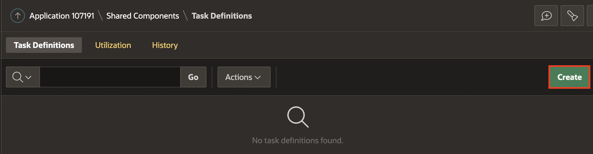
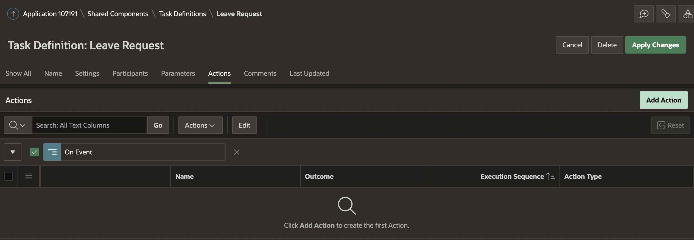
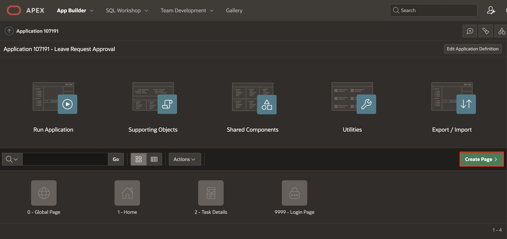
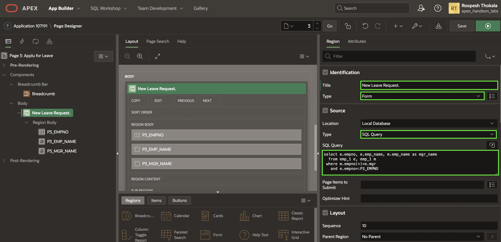
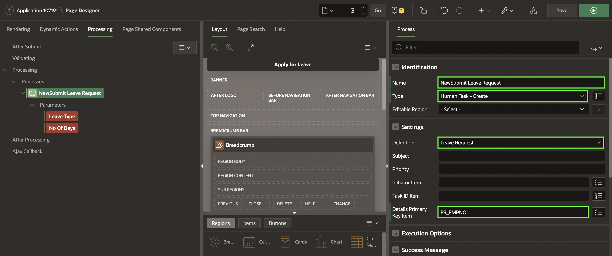
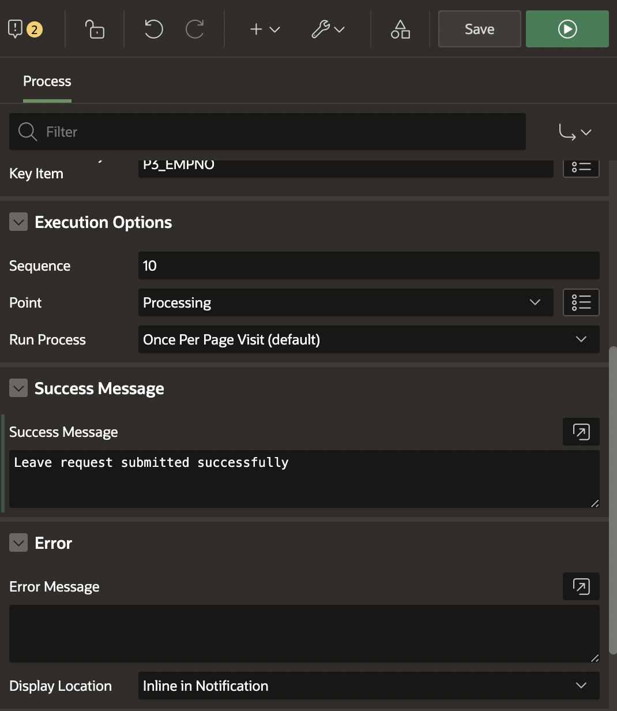
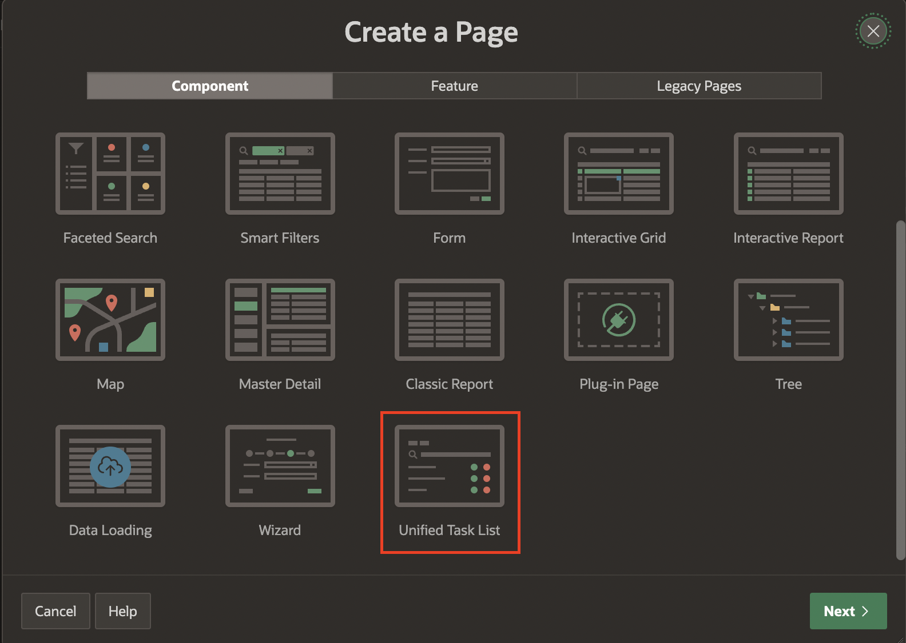
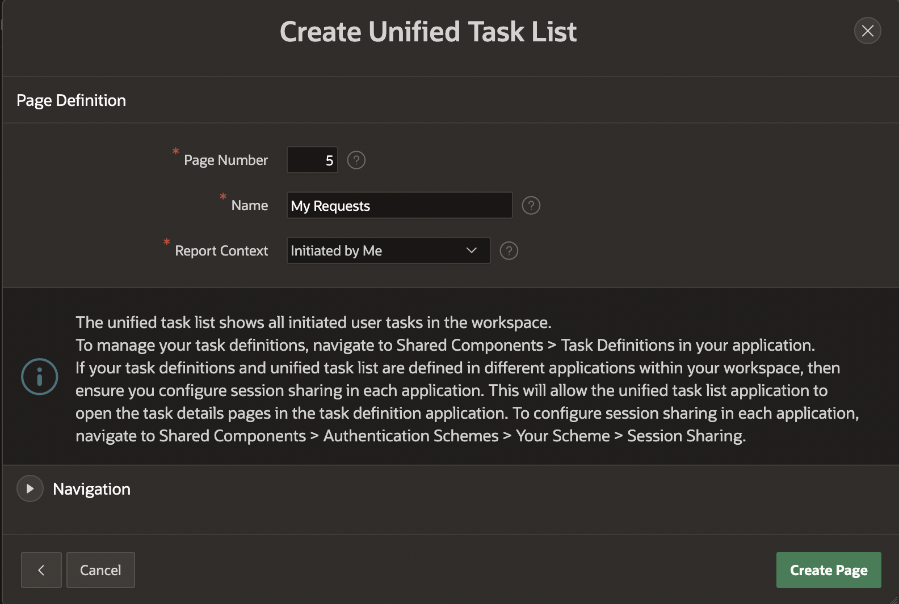

# Use Approvals and Unified Tasks Lists

## Introduction

In this lab, You will create a new **Leave Request Application** where an Employee can make a request to apply for leave and the Manager of the Employee either approves or rejects the leave.

## Task 1: Creating and Customizing Tasks in Leave Request Approval application

In this task, you design a simple Leave Request Application where an Employee can make a request to apply for leave and the Manager of the Employee either approves or rejects the leave.

1. Navigate to the **Leave Request Approval** application you created in the previous Task and then click **Shared Components**.

  

2. Now under **Workflows and Automations**, select **Task Definitions**.

  

3. Click **Create**.

  

4. Fill in the Create Task Definition Wizard fields as shown below, and click **Create**. Under **Create Task Definition** enter the following:  
  - For **Name**, Enter **Leave Request**.
  - For **Subject**, enter **Request for &LEAVE_TYPE. Leave for &EMP_NAME.**
  - For **Static ID**, enter **LEAVE_REQUEST**.
  - For **Priority**, select **2-High**  

  

  

5. Now, you will add the **Action source**.  

  For **Action Source** Select **SQL Query** as the action source and add the following SQL statement in the Actions SQL Query editor.       

  ```
    <copy>
    select e.empno, e.emp_name, m.emp_name as mgr_name
      from emp_1 e, emp_1 m
     where m.empno(+)=e.mgr
       and e.empno=:APEX$TASK_PK
    </copy>
  ```

  

6. Notice that the **Task Details Page Number is empty**. Click on the **Create Task Details Page** button to generate the details page for this task.

  

7. You will get a popup dialog asking if the next available page number should be used. Click **OK**.

  

8. You will find that the Task Details Page Number is replaced by the Task Details Page URL containing the link to the generated Details Page.

  

9. Navigate to the **Participants** tab in the Leave Request task definition, click **Add Row** and select Participant Type as **Potential Owner** and Value Type as **SQL Query**. In the Value field, add the following SQL query.

  ```
  <copy>
  select emp_name from emp_1 where empno=(select mgr from emp_1 where empno=:APEX$TASK_PK)
  </copy>
  ```

10. Add another row to the Participants section . Select Participant Type as **Business Administrator**, Value Type as **STATIC**. In the Value field, type **'MATT'**.

  

11. Add the following entries to the Task **Parameters** section.
    - Click **Add Row** and then for **Static ID**, enter **LEAVE_TYPE**; for data type, select **String**.
    - Click **Add Row** and then for **Static ID**, enter **NO_OF_DAYS**; for data type, select **String**.

  

12. You will now add actions when an event occurs on a task. Navigate to **Actions Tab** under **Task Definition: Leave Request**. Click on **Add Action** as shown below. This will take you to the Task Definition Actions **Edit Action** Page.

  

13. You will now set up an action that sends an email to the applicant of the leave, when his/her Leave Request is approved.  
Under **Action**:
  - For **Name**, Enter **On Approval**.
  - For **Type**, Select **Send E-Mail**.
  - For **Event Sequence**, enter **10**.
  - For **On Event**, Select **Complete**.
  - For **Outcome**, click **Approved**.  

Under **Send Email Settings**:
  - For **From**, Enter **&APP_EMAIL.**
  - For **To**, Enter **Your E-Mail**.
  - For **Subject**, Enter **Leave Approval**.
  - For **Body Plain Text**, enter **Your leave request has been approved. No further action is required**.

Click **Create**.

  

14. Your task definition for Leave Request is complete. **Apply Changes** and come back to your application.

  

## Task 2: Creating the Apply for Leave page

1. Navigate back to Application **Home Page**. Click  **Create Page** in your **Leave Request Approvals** application.

  

2. Under **Create a Page**, Select **Blank Page**.

  

3. For Page Number, set it to **3**. For Name, enter **Apply for Leave** and click **Create Page**.

4. In the **Left Pane**, Right click on **Body** and click **Create Region**.

  

5. Now, In the property editor, enter the following:  
Under Identification:
  - For **Title**: Enter **New Leave Request**.
  - For **Type** : Select **Form**.  

  Under **Source**:
  - For **Type** : Select **SQL Query**.
  - For **SQL Query**, **Copy** and **Paste** the below SQL

  ```
  <copy>
  select e.empno, e.emp_name, m.emp_name as mgr_name
    from emp_1 e, emp_1 m
   where m.empno(+)=e.mgr
     and e.empno=:P3_EMPNO
  </copy>
  ```

  

6. Right click on **New Leave Request** and click **Create Page Item**. Add two new page items **P3_NO_OF_DAYS** and **P3_LEAVE_TYPE**.

  

7. Select **P3_LEAVE_TYPE** and then in the **Property Editor**:  

  - Under Identification **Type** to **Select List**.
  - Under **List of Values**,
      - For **Type** Select **Static Values**
      - For **Static Values**, enter from the following Table.
          | Display Value      | Return Value |
          | ----------- | ----------- |
          | Bereavement      | BEREAVEMENT       |
          | Paternal   | PATERNAL        |
          | Maternity  | MATERNITY        |
          | Sick   | SICK        |
          | Casual   | CASUAL        |
          | Vacation   | VACATION        |

  

8. In the **Rendering** tab in the left pane, Expand **Pre-Rendering** and then right click on **Process**, Click **Create Process**.

9. Now, In the Property Editor, Enter the following Information.  
  Under **Identification**:
    - For **Name**, Enter **Fetch Employee Details for User**.
    - For **Type**, Select **Execute Code**.

  Under **Source**:
    - For **Language**, Select **PL/SQL**
    - For **PL/SQL** Code, Copy and Paste the below Query.

    ```
    <copy>
    select empno into :P3_EMPNO from emp_1 where emp_name=:APP_USER;
    </copy>
    ```  

  

10. Navigate to **Processing** in Left Page and right click on **Processing**, then select **Create Process**.

  

11. In the Property Editor, Enter the following Information.  
  Under **Identification**:
    - For **Name**, Enter **Submit Leave Request**.
    - For **Type**, Select **Human Task - Create**.

  Under **Settings**:
    - For **Definition**, Select **Leave Request**
    - For **Details Primary Key Item**, Select **P3_EMPNO**.

  Under **Success Message**:
    - For **Success Message**, Enter **Leave request submitted successfully**.

  

  

12. You will notice Leave Type and Number Of Days under the Parameters on the Left pane to be highlighted in RED. Click on each parameter, Change the **Type** to **Item** and set it to the corresponding page item (**P3_NO_OF_DAYS** and **P3_LEAVE_TYPE**) you had created earlier.

  

  

13. Navigate back to the Rendering Section. Right Click on **Region Body** under **New Leave Request** and click **Create Button**.

  

14. In the Property Editor:  
    - For **Button Name**, enter **SUBMIT_REQUEST**.
    - Under **Appearance**, Set **Hot** to **Yes**.

  

15. Navigate back to **Processing** in the left pane and select **Submit Leave Request**. In the **Property Editor**, Under **Server-side Condition**, for **When Button Pressed** select **SUBMIT_REQUEST**.

  

16. Click **Save**.

## Task 3: Creating the My Approvals and My Requests Pages

In this lab, you will create pages for the following tasks:  
a) The manager of the employee can approve or reject a leave request .
b) The employee can go and check the status of his request. For this, we will create two Unified Task Lists.  

1. Navigate to Create button **+** and click **Page**.

  

2. In the **Create a Page** tab, Select **Unified Task List**.

  

3. In the **Create Unified Task List** enter the following and click **Create Page**.

    Under **Page Definition**:
    - For **Name**, Enter **My Approvals**.
    - For **Report Context**, select **My Tasks**.

  

4. Navigate to Create button **+** and click **Page**.

  

5. In the **Create a Page** tab, Select **Unified Task List**.

  

6. In the **Create Unified Task List** enter the following and click **Create Page**.

    Under **Page Definition**:
    - For **Name**, Enter **My Requests**.
    - For **Report Context**, select **Initiated by Me**.

  

<!--
In this lab, you have created a Sample Leave Approvals Application. Please go through the below blog which talks about how to create different users and run the application.
https://blogs.oracle.com/apex/post/introducing-approvals-component-in-oracle-apex
-->
## **Acknowledgments**

- **Author** - Roopesh Thokala, Product Manager
- **Last Updated By/Date** - Roopesh Thokala, Product Manager, May 2021
