# Implementing Security in your Application

## Introduction

Application security is very important for majority of the applications. You must ensure that users enter valid credentials, generally username and password (Authentication), and the logged in user has appropriate rights within the application (Authorization).
This exercise includes three hands-on-labs.
<!--
 you build a web application on top of the Apple iTunes Search API, which is a simple API over HTTP that takes input arguments via parameters in the URL. First, you create a report against the iTunes music video catalog. Next, you simplify the report to include a preview of the music video and a link to watch a clip of the music video.

Estimated Time: 20 minutes

Watch the video below for a quick walk through of the lab.

-->
### Objectives
<!--
In this lab, you will:
- Set the following pages as public pages:
    - Products
    - Shopping Cart
    - Order Information

- Disable the Navigation Menu

- Enhance the Navigation Bar -->

## Task 1: Implementing Social Sign In(Facebook) Authentication in Online Shopping Cart Application.

 In this hands-on lab, you create a Social Sign-in authentication scheme to enable Facebook Authentication. You test the authentication scheme.

 1. Log in to Facebook’s developer [console](https://developers.facebook.com/).  Login to the Meta for Developers using your **Facebook Credentials** and then select **My Apps**.

  

2. Click **Create App**.

  

3. Under **Select an app type**, Select **Business** and then click **Next**.

  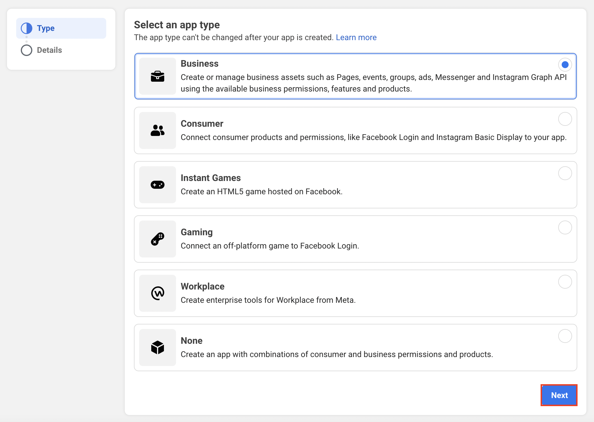

4. Now, Under **Provide Basic Information**, enter the following and click **Create App**.
  - For **Display Name**, enter **APEX Authentication**
  - For **App contact email**, enter **Your email address**.

  

5. You will now verify your Facebook account by **Re-entering** your password.

  

6. Navigate to **Settings** and then select **Basic**. There, you can see the App ID and App Secret. Copy the **App ID** and **App secret** and paste in your Notepad, It will be used to create the **web credential** in your **APEX application** later.

  

7. In the **Left Navigation Menu**, click on **Add Product**.

  

8. Under **Add products to your app**, select **Set up** in **Facebook Login** card.

  

9. Navigate to **Settings** under **Facebook Login** in the navigation menu. You have to enable Client OAuth Login and add https://apex.oracle.com/pls/apex/apex_authentication.callback (If you are using apex.oracle.com) Valid OAuth Redirect URIs. Then click on **Save Changes**.

  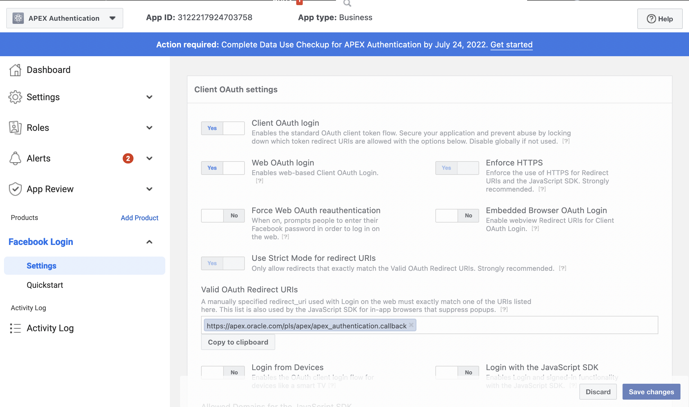

10. Login to your APEX workspace and click **Workspace Utilities**.

  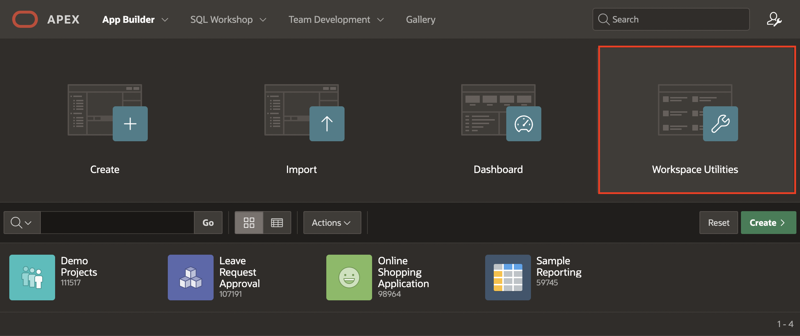

11. Under **Workspace Utilities**, Select **Web Credentials**.

  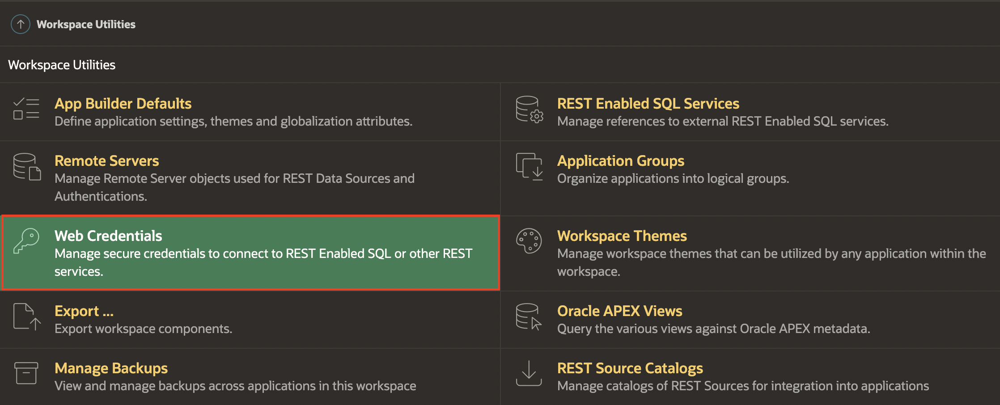

12. Click **Create**.

  

13. In the **Web Credentials** enter the following and click **Create**.

    Under **Attributes**:
    - For **Name**, Enter **FB_LOGIN_DEMO**.
    - For **Authentication Type**, select **OAuth2 Client Credentials Flow**.
    - For **Client ID or Username**, Enter the **APP ID** you copied in **Step 6**.
    - For **Client Secret or Password** and **Verify Client Secret or Password**, Enter the **App Secret** you copied in **Step 6**.

  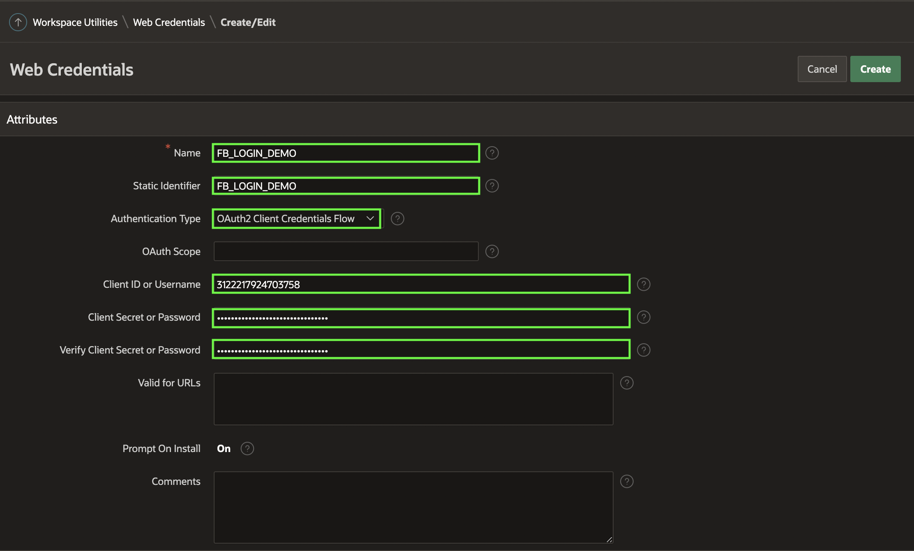

14. Navigate to **App Builder** and select **Online Shopping Application**.

  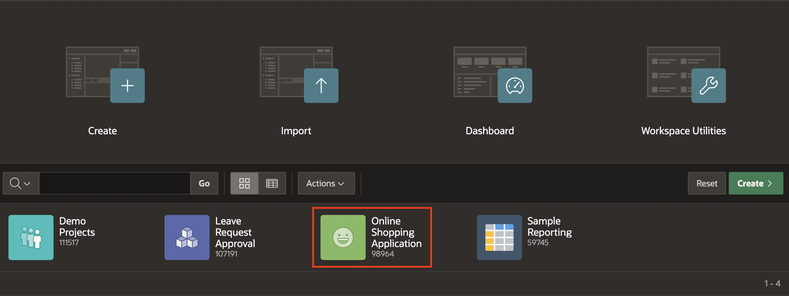

15. Click **Shared Components**.

  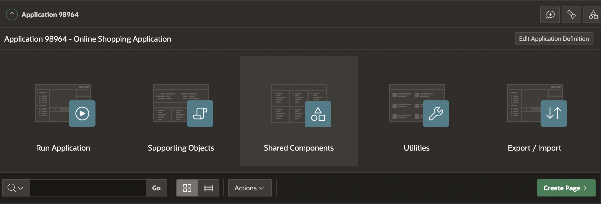

16. Under **Security**, Select **Authentication Schemes**.

  

17. In the **Authentication Schemes** page, click **Create**.

  

18. Under **Create Authentication Scheme** Page, leave the settings to default and click **Next**.

  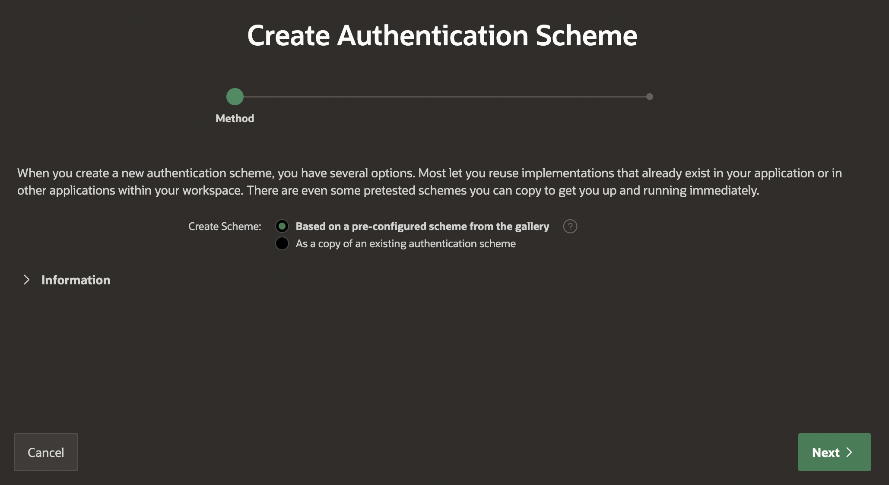

19. In the **Authentication Scheme** enter the following and click **Apply Changes**.

    Under **Name**:
    - For **Name**, Enter **FB Authentication**.
    - For **Scheme Type**, select **Social Sign-In**.  

    Under **Settings**:
    - For **Credential Store**, Enter **FB_LOGIN_DEMO**.
    - For **Authentication Provider**, select **Facebook**.
    - For **Scope**, Enter **email**.
    - For **Username**, Enter **name**.

  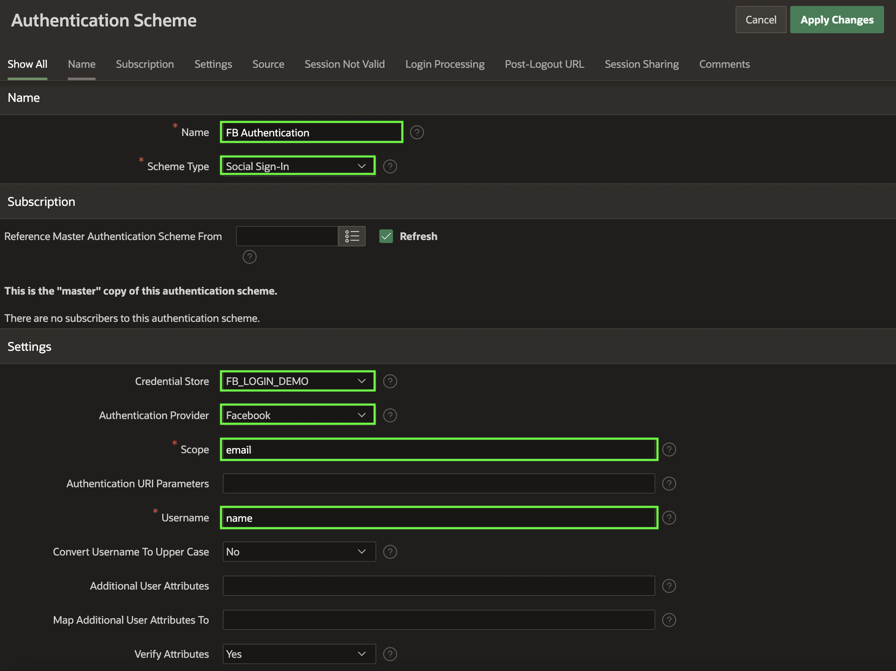

20. Notice that a new **Authentication Scheme** you created is displayed as **FB Authentication - Current**.

  

21. Run the application by navigating to **Online Shopping Application** and click **Run**.

22. In the **User Interface**, click **Administration**.

  

23. Now, Login to the application using your **Facebook Credentials**.

  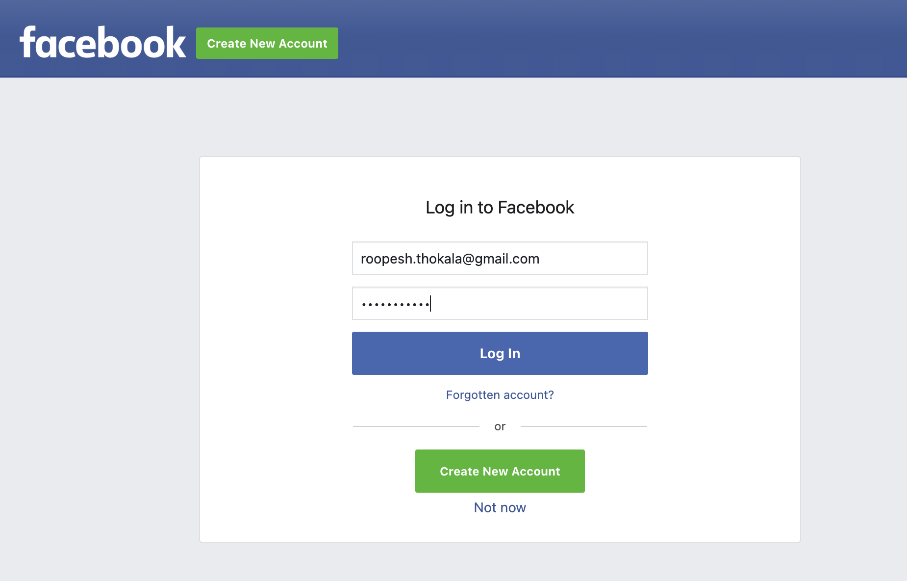

24. You are now logged in to the **Online Shopping Application**. Check the user name on the top right of the **Navigation Bar**.  

  

## Task 2: Creating and Using an Authorization Scheme

In this task, you create an **Authorization Scheme** to ensure only people entered as Team Members can log into the **Online Shopping Application**. You apply the authorization scheme to the application properties.

1. Navigate to App Builder and select **Online Shopping Application**.

  

2. In the application home page, click **Shared Components**.

  

3. Under Shared Components > Security, click **Application Access Control**.

  

4. Under **Roles**, Select **Add Role**.

  

5. In the **Role** Page, enter the following and click **Create Role**.

    - For **Name**, Enter **Administrator**
    - For **Static Identifier**, select **ADMINISTRATOR**

  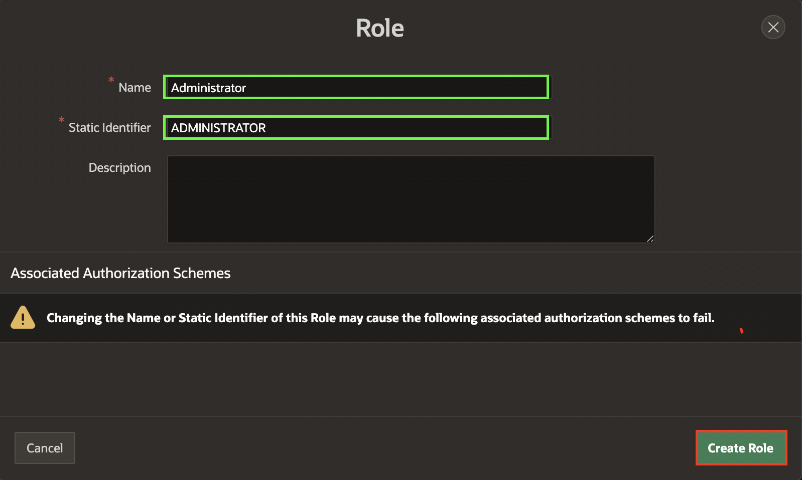

6. In the **User Role Assignments**, Click **Add User Role Assignment**.

  

7. In the **User Assignment** Page, enter the following and click **Create Assignment**.

    - For **User Name**, Enter **AUTHORIZED USER**.
    - For **Application Role**, Check **ADMINISTRATOR** to **Yes**.

  

8. Navigate back to **Shared Components** and then select **Authorization Schemes**.

  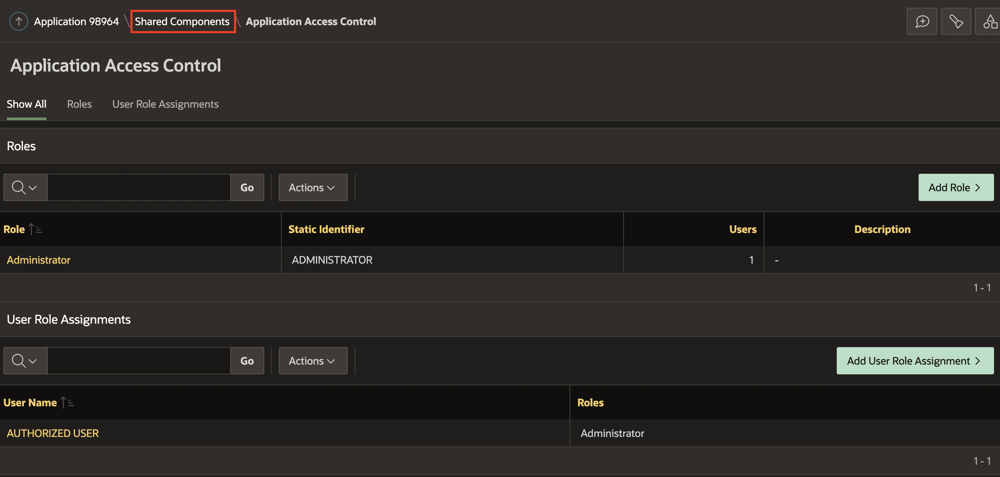

  

9. Under **Authorization Scheme**, Click **Create**.

  

10. For **Create Authorization Scheme**, Leave the settings to default and then click **Next**.

  

11. In the **Details** section of Create Authorization Scheme, enter the following and click **Create Authorization Scheme**.

  - For **Name**, Enter **Admin**.
  - For **Scheme Type**, Select **Is In Role or Group**.
  - For **Type**, select **Application Role**
  - For **Name(s)**, Select **Administrator**.
  - For **Identify error message displayed**, enter **You are not Authorized to view this.**

  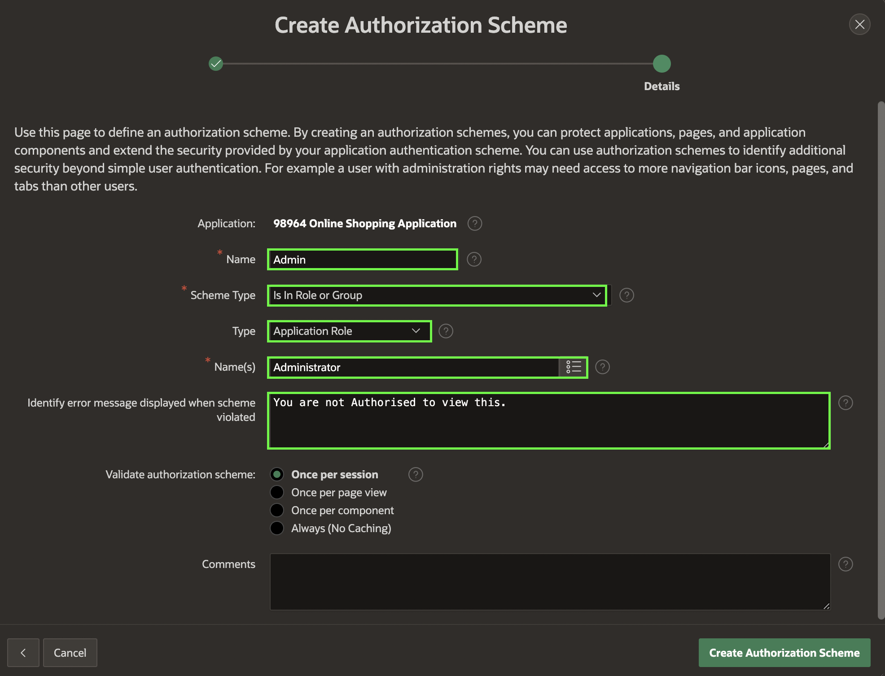

12. Navigate to **Shared Components** and then under **Security**, Select **Security Attributes**.

  

  

13. In the **Edit Security Attributes** Page, under **Authorization**, select **Admin** for **Authorization Scheme**. Click **Apply Changes**.

  

14. Navigate to the runtime environment (tab or window). Click Sign Out in the navigation bar (top right).

15. Run the application by navigating to **Online Shopping Application** and click Run. In the User Interface, click **Administration**.

  

16. Since your name is not **Authorized User**, verify the access denied message is displayed.

  

## **Acknowledgments**

- **Author** - Roopesh Thokala, Product Manager
- **Last Updated By/Date** - Roopesh Thokala, Product Manager, May 2021
