# Adding additional pages to your Application

## Introduction

In this Hands-on-lab, you will add Calendars, Charts, Tree pages and Maps to Demo Projects application and to Online Shopping Application.
<!--
 you build a web application on top of the Apple iTunes Search API, which is a simple API over HTTP that takes input arguments via parameters in the URL. First, you create a report against the iTunes music video catalog. Next, you simplify the report to include a preview of the music video and a link to watch a clip of the music video.


Estimated Time: 20 minutes

<!--
Watch the video below for a quick walk through of the lab.

[](youtube:lwQ3lvul9iE)
-->

### Objectives
<!--
In this lab, you will:
- Set the following pages as public pages:
    - Products
    - Shopping Cart
    - Order Information

- Disable the Navigation Menu

- Enhance the Navigation Bar -->

## Task 1: Creating a Calendar

1. Navigate to **App Builder** and in the **Home Page**, click **Demo Projects**. application.

  

  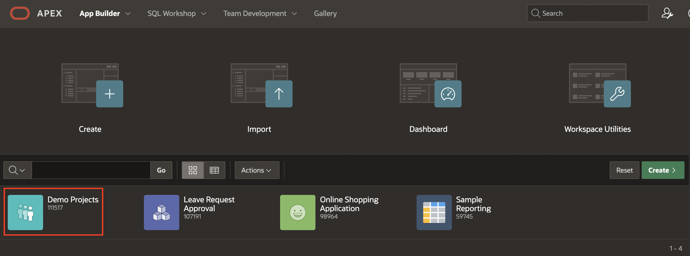


2. In the application home page, click **Create Page**.

  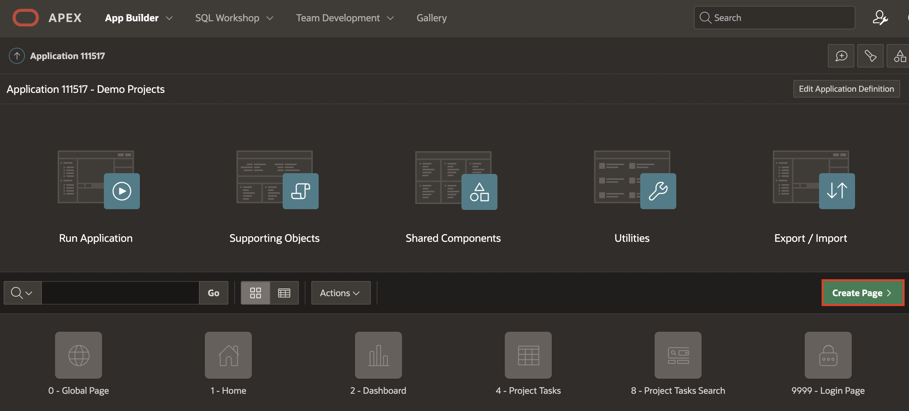


3. Select **Calendar** page type.

  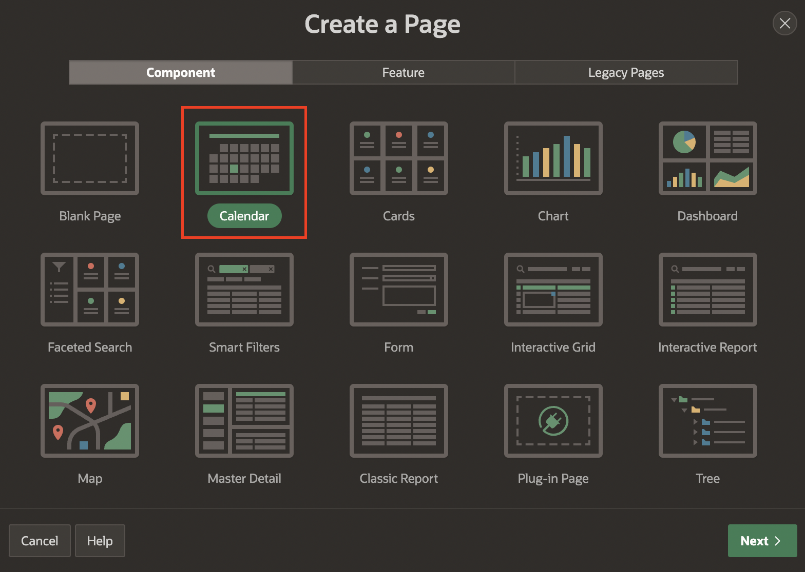

4.  In the **Create Calendar** enter the following and click **Next**.

    Under **Page Definition**:
    - For **Name**, Enter **Calendar**.

    Under **Data Source**:
    - For **Table/View Name**, select **DEMO_PROJECTS**.

    Under **Navigation**:
    - For **Breadcrumb** and **Navigation**, Set it to **Yes**.

    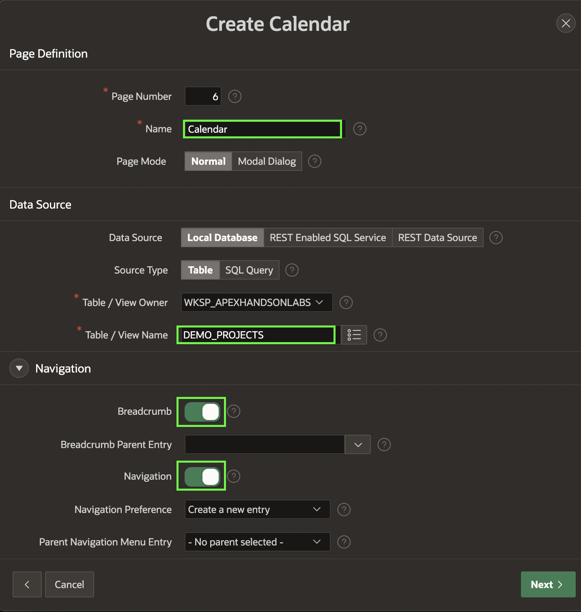

5. In the **Create Calendar** page, enter the following and click **Create Page**.
    - For **Display Column**, enter **TASK_NAME**.
    - For **Start Date Column**, enter **START_DATE**.
    - For **End Date Column**, enter **END_DATE**.

    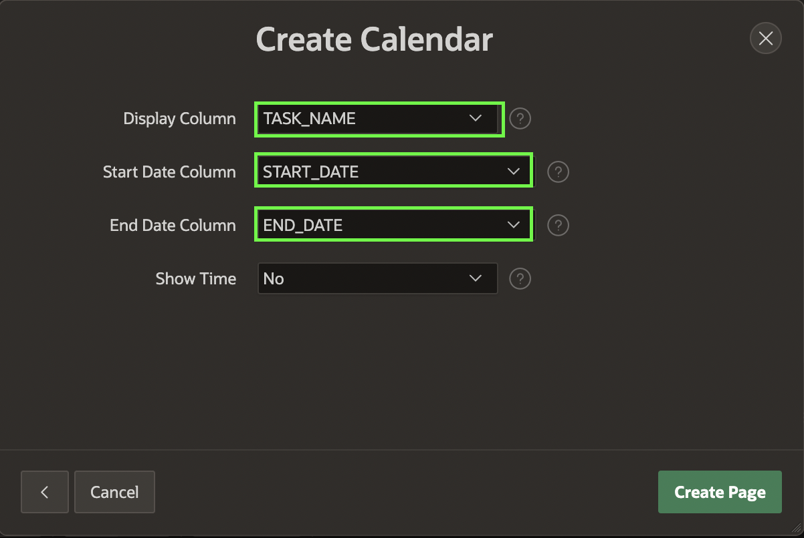

6. Click **Save** and **Run Page**. Enter your credentials. In the Developer Toolbar, click **Edit Page <n>**.

    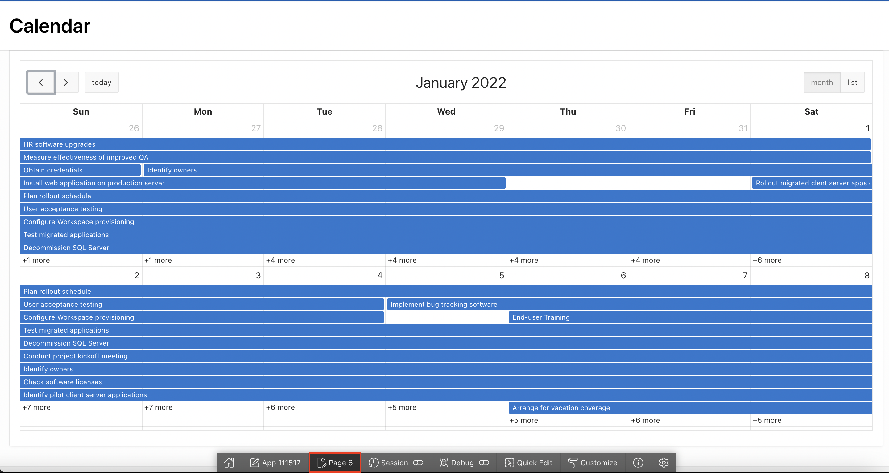

7. The Calendar page displays the **region title Calendar**, and also has a border around the region. In the Rendering tree, locate the Calendar region. Click **Calendar**. In the **Property Editor**, under **Appearance**, click the **Template Options** button.

    

8. In the Template Options dialog, input the following:
  - Header - select **Hidden but accessible**  
  - Style - select **Remove UI Decoration**  

   Click **OK**.

    

## Task 2: Creating a Form page on DEMO_PROJECTS Tables.

In this Lab, you will create a Form Page on DEMO_PROJECTS Tables, then in the next labs you will link the form to the Calendar Page.

1. Navigate to **App Builder** and in the **Home Page**, click **Demo Projects**. application. Then, click **Create Page**.

 

2. Select **Form** page type.

  

3. In the **Create Form** enter the following and click **Next**.

    Under **Page Definition**:
    - For **Name**, Enter **Form on Projects**.
    - For **Page Mode**, Select **Modal Dialog**.

  Under **Data Source**:
    - For **Table/View Name**, select **DEMO_PROJECTS**.

  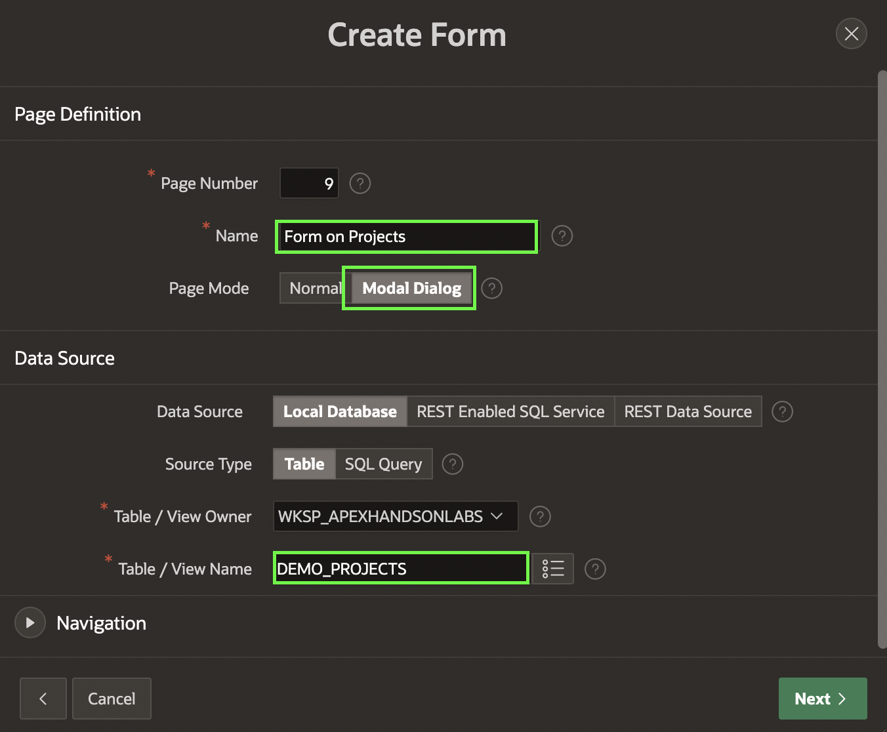

4. In the **Create Form** page, enter the following and click **Create Page**.
    - For **Primary Key Column 1**, Select **ID (Number)**.

    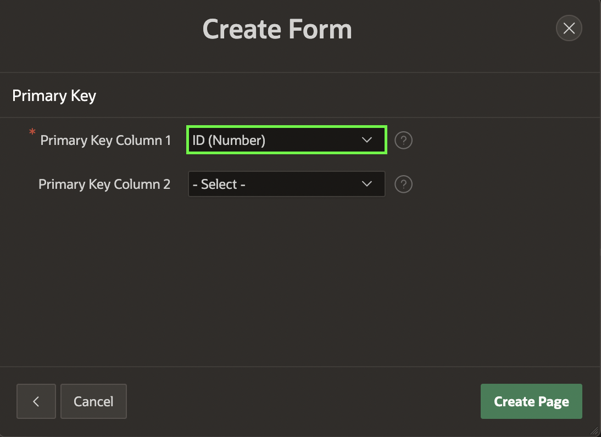

## Task 3: Customizing the Calendar Page.

In this lab, You will link the form page you created in Task 2 with the Calendar page.

1. Navigate to **Calendar** in the runtime environment and then click **Page <n>**

  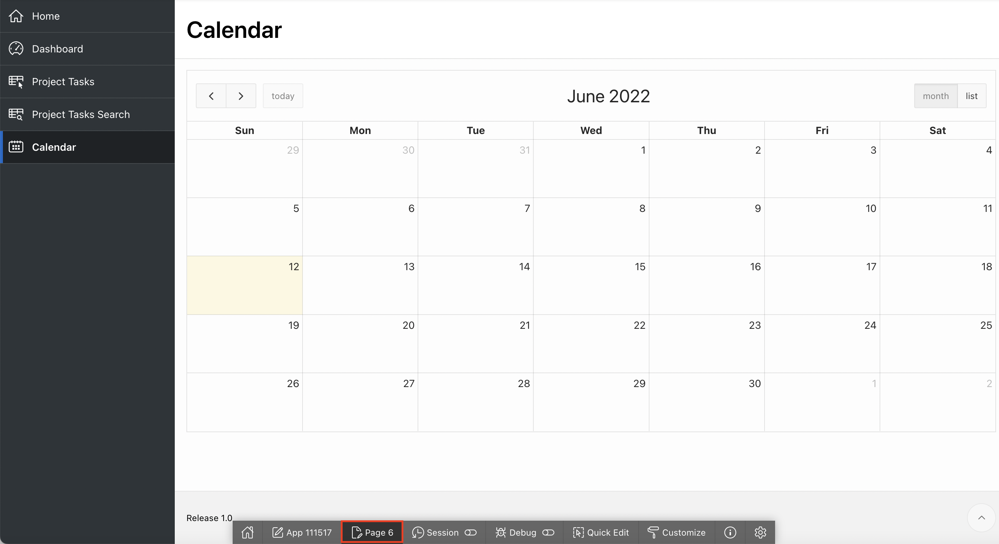

2. You need to add the **Create** and **View / Edit** links. In the Rendering tree, locate and select the **Calendar** region. In the **Property Editor**, Click **Attributes**. Then, Under Settings, Select **ID** for **Primary Key** and then locate **Create Link** and click **No Link Defined**.

  

3. In the Link Builder – Create Link dialog, select **9** for Page, and enter **9** for **Clear Cache**. Click **OK**.

    

4. In the Property Editor, locate **View/Edit Link** and click **No Link Defined**.

5. In the Link Builder – View / Edit Link dialog, input the following:
    - Page - select **9**
    - Name - select **P9_ID**
    - Value - select **ID** or enter **&ID**.
    - Clear Cache - enter **9**  

  Click **OK**.

  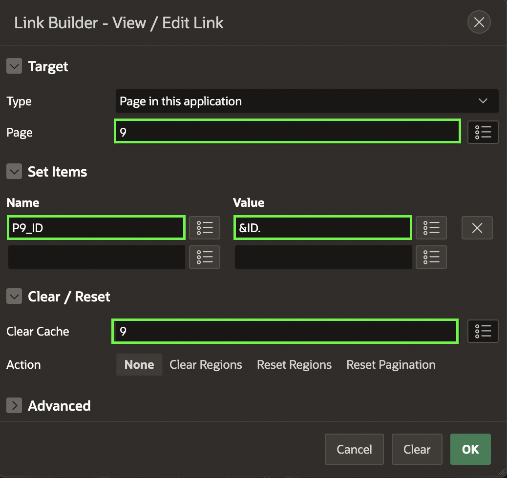  

6. You can enable calendar drag and drop by using the component attribute **Drag and Drop**. Your SQL query must select a primary key column and you must have set the Primary Key Column calendar attribute. Then enter the PL/SQL code to update the event row in the database in the Drag and Drop PL/SQL Code attribute. That PL/SQL code typically performs a SQL update on the database table - the bind variables **:APEX$PK_VALUE.**, **:APEX$NEW_START_DATE** and **:APEX$NEW_END_DATE** contain the dragged events primary key value as well as the new start and new end timestamp.  

  Under **Settings**:
  - For **Drag and Drop**, Set it to **Yes**.
  - For **Drag and Drop PL/SQL Code**, Copy and paste the below code.

  ```
  <copy>
  begin
  update DEMO_PROJECTS
     set start_date = to_date(:APEX$NEW_START_DATE,
  'YYYYMMDDHH24MISS'),
         end_date = to_date(:APEX$NEW_END_DATE,
  'YYYYMMDDHH24MISS')
   where ID = :APEX$PK_VALUE;
  end;
  </copy>
  ```

  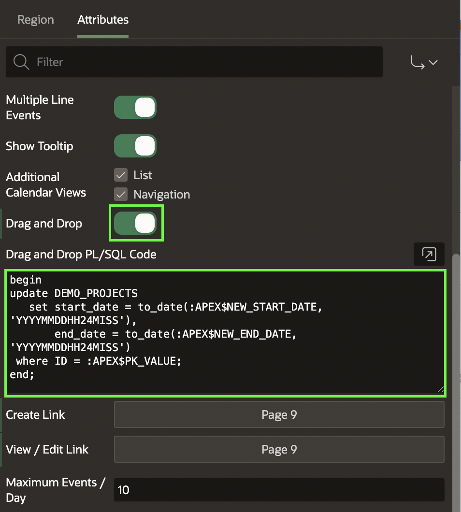  

7. Click **Save** and **Run Page**.
Notice that you can now drag and drop tasks in the calendar. In the Developer Toolbar, click **Application< n >**.

  


## Task 4: Creating and Customizing a Tree Page.

In this hands-on lab, you create the **Employee** Tree. You also create a **blank page** and then add the **Tree region**.

1. First, create a blank page in the **Demo Projects** application. In the application home page, click **Create Page**.

  

2. Select **Blank Page**.

  

3. Enter **Tree Page** for **Name** and then Click **Create Page**.

  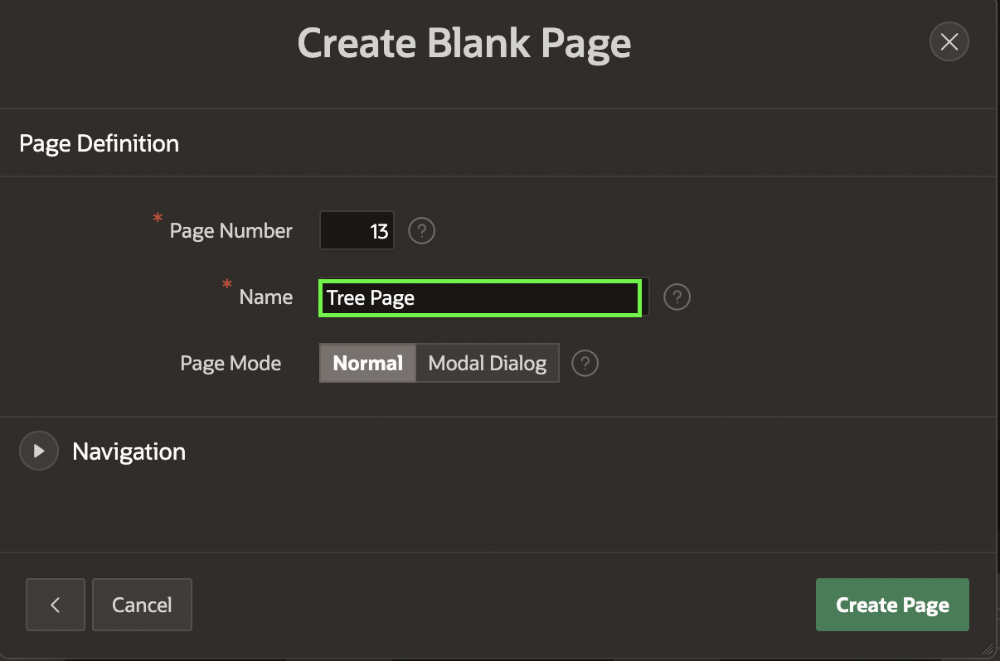

4. Now you create a **Tree region**. In the page designer, under Rendering, right-click **Body** and select **Create Region**.

  

5. In the property editor, enter the following:  
  Under **Identification**:
    - For **Name**, Enter **Tree**
    - For **Type**, Select **Tree**

  Under **Source**:
    - For **Type**, Select **SQL Query**
    - For **Sql Query**, Copy the following code and paste it.

    ```
    <copy>
    begin
    update DEMO_PROJECTS
       set start_date = to_date(:APEX$NEW_START_DATE,
    'YYYYMMDDHH24MISS'),
           end_date = to_date(:APEX$NEW_END_DATE,
    'YYYYMMDDHH24MISS')
     where ID = :APEX$PK_VALUE;
    end;
    </copy>
    ```

  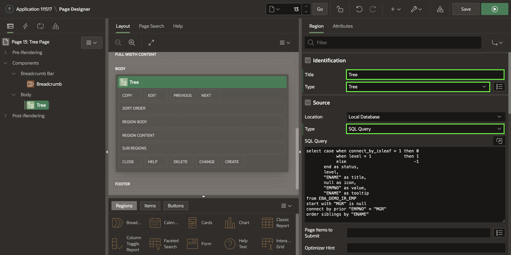

6. In the page designer, navigate to **Appearance** and then click the **Template Options** button.

  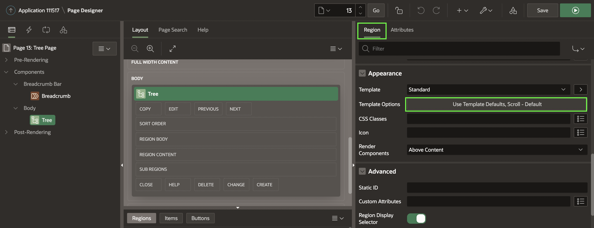

7. In the Template Options dialog:
  - General: Select the **Remove Body Padding** check box.
  - Header: Select **Hidden but accessible**
  - Style: Select **Remove UI Decoration**

  Click **OK**.

  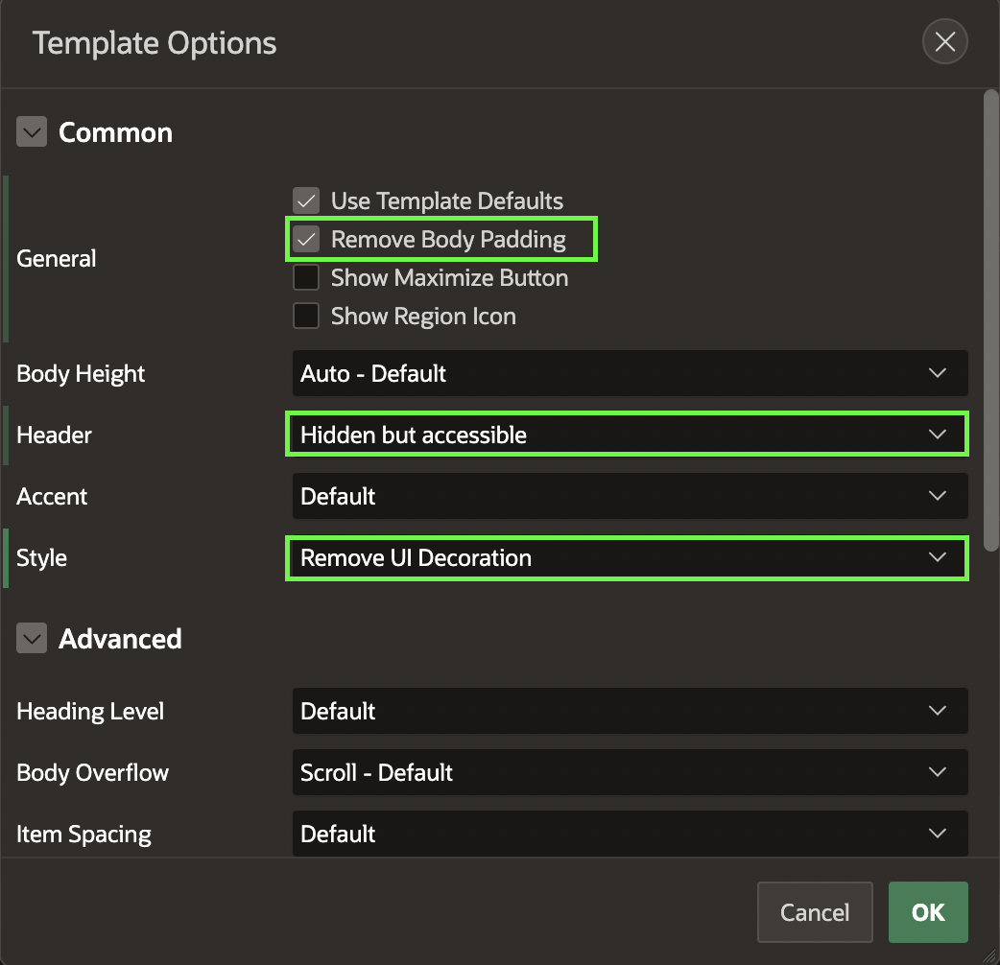

8. In the **Property Editor**, Select **Attributes**. Navigate to **Settings** and select / enter the following:
  - Node Label Column: **TITLE**
  - Node Value Column: **VALUE**
  - Hierarchy: **Not Computed**
  - Node Status Column: **STATUS**
  - Hierarchy Level Column: **LEVEL**
  - Tooltip: **Database Column**
  - Tooltip Column: **TOOLTIP**

  Then, click **Save** and **Run Page**.

  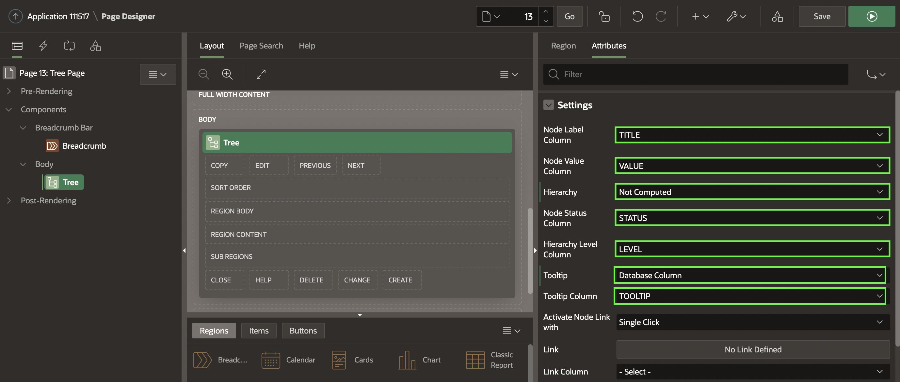

9. The **Tree Page** is now displayed.

 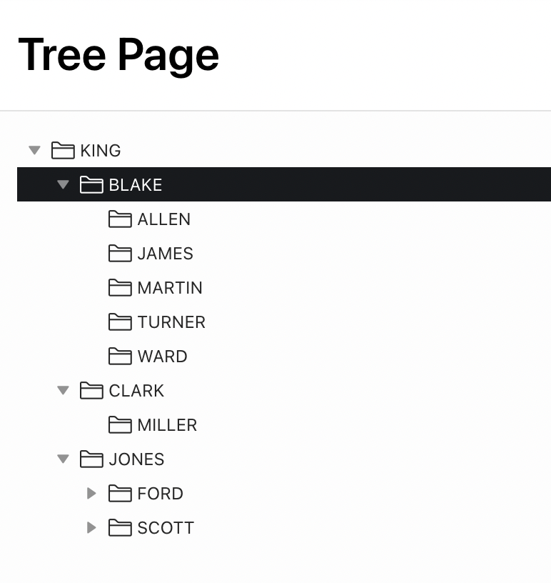


## Task 5: Creating a Store Details Map page and adding it to Desktop Navigation Bar.

In this Lab, You will first create a Map Page with Store Details and then you will create an entry for Store Details Map in the navigation Menu Entry.

1. Navigate to **App Builder** and in the **Home Page**, click **Online Shopping Application**.

  

  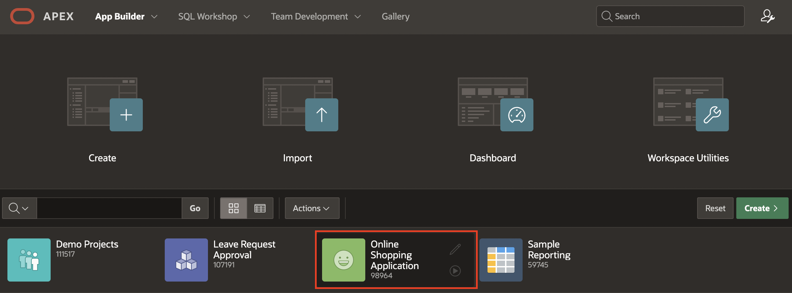

2. In the application home page, click **Create Page**.

  

3. Select **Map** page type.

  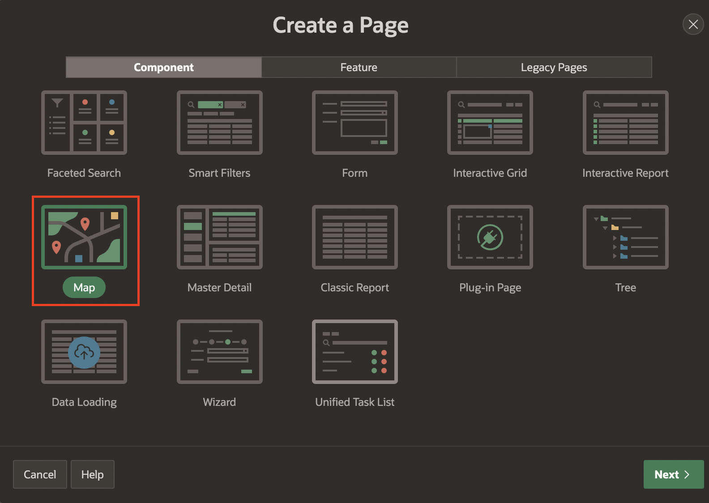

4. In the **Create Map** enter the following and click **Next**.

    Under **Page Definition**:
    - For **Name**, Enter **Store Locations Map**.

    Under **Data Source**:
    - For **Table/View Name**, select **STORES**.

    Under **Navigation**:
    - For **Breadcrumb**, Set it to **No**.

  

5. For **Create Map**, enter the following and click **Create Page**. For **Map Style**, Select **Points**.  
  Under **Map Attributes**:
    - For **Geometry column Type**, Select **Two Numeric Columns**.
    - For **Longitude Column**, Select **LONGITUDE**.
    - For **Latitude Column**, Select **LATITUDE**.
    - For **Tooltip Column**, Select **STORE_NAME**.

  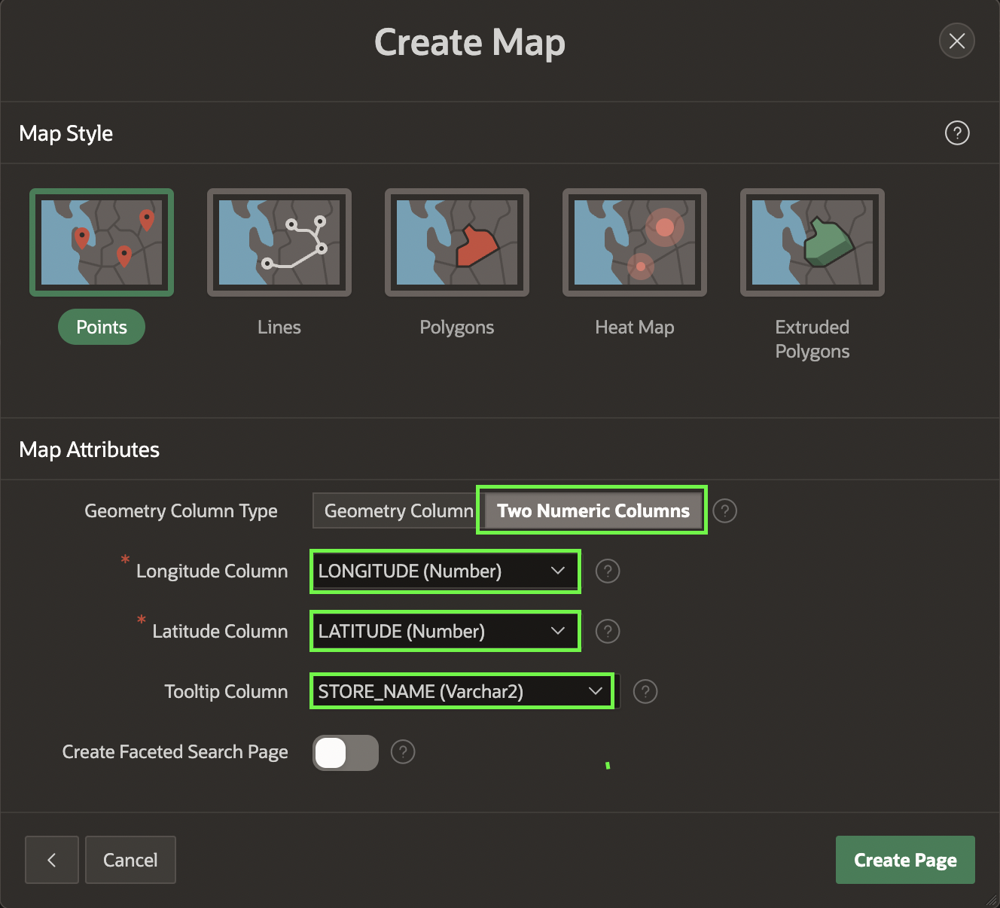

6. Then, click **Save** and **Run Page**.

  

7. The **Store Details Map** Page is now displayed. Now, in the developer toolbar select **App < n >**.

  

8. Navigate to **Shared Components**

  

9. In the **Shared Components** page, Under **Navigation**, select **Navigation Bar List**.

  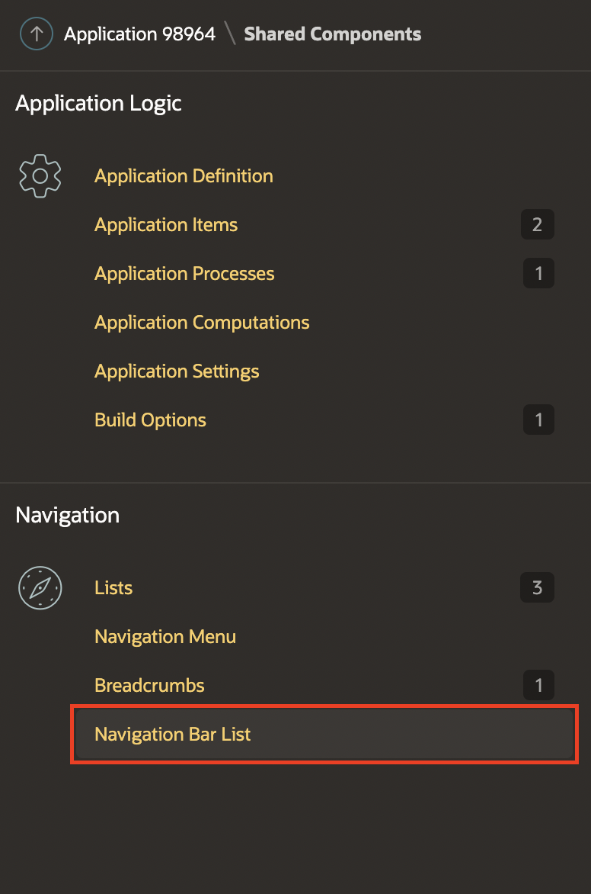

10. Select **Navigation Bar**, Under **Lists**.

  

11. Click **Create Entry**.

  

12. For **List Entry**, enter the following and click **Create List Entry**.  

 Under **Entry**:
    - For **List Entry Label**, enter **Store Locations Map**.

  Under **Target**:
    - For **Page**, Select **20**

    

13. Then, click **Save** and **Run Page**.

  

14. You can now see that **Store Locations Map** is now displayed in **Navigation Bar**.

  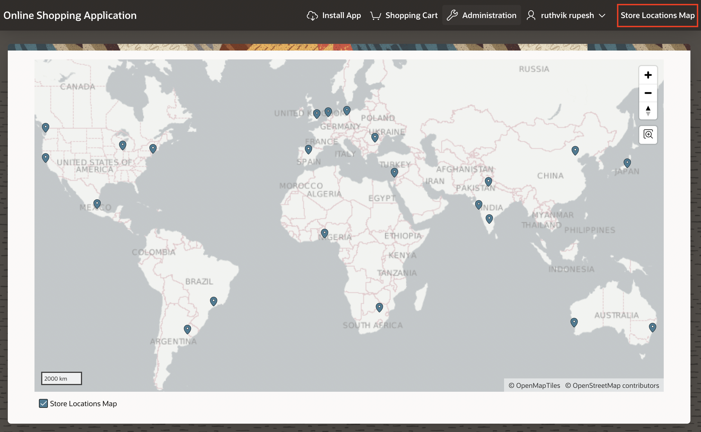  

## **Acknowledgments**

- **Author** - Roopesh Thokala, Product Manager
- **Last Updated By/Date** - Roopesh Thokala, Product Manager, May 2021
